>作者GitHub：[https://github.com/gitboyzcf](https://github.com/gitboyzcf)  有兴趣可关注！！！
>

## 目录

# 介绍

ReactJS 是一种由Facebook开发的JavaScript库，旨在提供一种高效、灵活的方式来构建用户界面。

中文官网：[https://react.dev/](https://react.dev/)
英文官网：[https://react.docschina.org/](https://react.docschina.org/)

## 特点

1. **声明式UI**
写UI界面就和写普通的html一样，抛弃命令式的繁琐实现
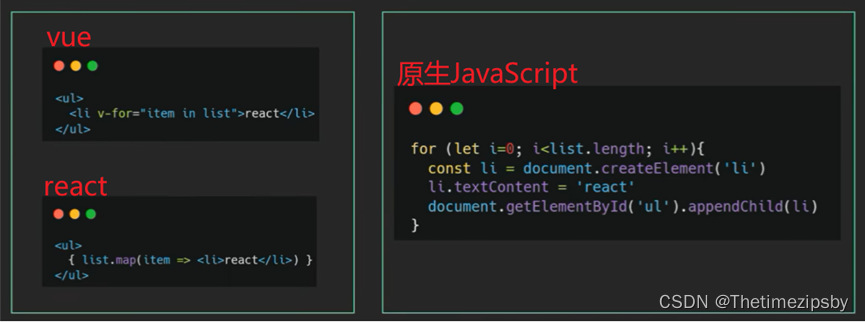

1. **组件化**
组件是react中最重要的内容，组件可以通过搭积木的方式拼成一个完整的页面，通过组件的抽象可以增加复用能力和提高可维护性
1. **跨平台**
ReactJS可以使用React生态得 [React Native](https://www.reactnative.cn/) 构建  [Native应用程序](https://baike.baidu.com/item/Native%20App/4491953?fr=ge_ala)，这使得ReactJS成为一种灵活的解决方案，同时适用于Web和移动应用开发。

# JSX

JSX是JavaScript XML (HTML)的缩写，表示在JavaScript代码中书写HTML结构（也可以理解为JavaScript和html放在一起写）

<font color=red>注：在React框架中采用该风格创建HTML进行开发web页面</font>
<font color=red>注：jsx练习可在看完本章 入门 中的 创建项目 创建好的项目中练习，或使用 [codesandbox](https://codesandbox.io/p/github/codesandbox/codesandbox-template-vite-react/main?file=/src/App.tsx:15,37) 在线练习</font>

## 使用js表达式

格式：{ js表达式 }

```js
const name = '张三';
function fn () { 
  return '里斯'
}
const flag = true;

function App() {
  return (
    <div className="App">
      app
      》常用js表达式：
      》引用变量：{ name }
      》调用函数：{ fn() }
      》使用三元运算：{ flag ? '真' : '假' }
    </div>
  );
}
export default App;
```

## 渲染列表

```js
const phones = [
  { id: 1, name: "华为" },
  { id: 2, name: "三星" },
  { id: 3, name: "苹果" },
];

function App() {
  return (
    <div className="App">
      <ul>
        {
          // JSX语法最终是要return返回html标签或对应内容的，而数组的遍历方法中forEach没有返回值，重在执行；map可以设置返回值。
          // 跟vue一样循环需要绑定key，提高diff性能
          phones.map((item) => {
            return <li key={item.id}>{item.name}</li>;
          })
        }
      </ul>
    </div>
  );
}

export default App;
```

## 样式控制

```js
import './app.css'
const style = { color: 'red' }

function App() {
  return (
    <div className="App">
      <span style={ style }>行内样式</span>
      // 外链样式
      <span className="active">类名样式</span>
      <span id="active">id样式</span>
    </div>
  );
}

export default App;
```

## 注意事项

1. JSX必须有一个根节点包裹，如果没有根节点，可以使用```<></>```(幽灵节点，react独有）替代
2. 所有标签必须形成闭合，成对闭合或者自闭合都可以
3. JSX中的语法更加贴近JS语法，属性名采用驼峰命名法class -> className
4. JSX支持多行(换行)，如果需要换行，需使用()包裹，防止bug出现

# 入门

## 脚手架创建react项目

### create-react-app 创建安装

<font color=red>注：安装的前提需要node V14版本以上，可通过node -v命令查看</font>

1. 打开命令行窗口
2. 执行命令

 ```js
 npx create-react-app my-app
 or
 npx --registry=https://registry.npmmirror.com/ create-react-app my-app
 ```

 **说明**👇
 ```npx create-react-app```是固定命令，```create-react-app```是**React脚手架**名称
 ```my-app```是**项目名称**，可以自定义，保持语义化
 ```npx```命令会帮助我们临时安装```create-react-app```包，然后初始化项目完成之后会自自动删掉，所以不需要全局安装```create-react-app```

 命令执行后可能会出现👇
 是否下载临时create-react-app的npm包 选择 y
 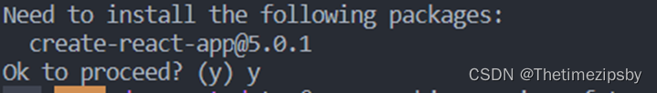
3. 启动命令
 命令行窗口进入新创建的项目根目录下，执行下面命令

 ```js
 npm start
 or
 yarn start
 ```

6. 成功
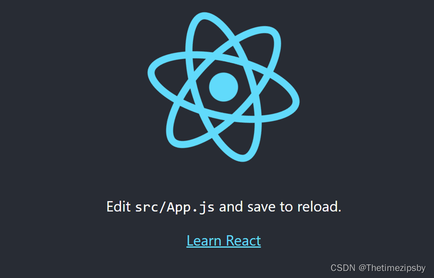

### 目录介绍

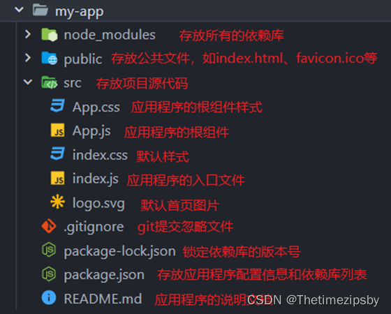

### 入口文件解析

```js
// React：框架的核心包
import React from "react";
// ReactDOM：专门做渲染相关的包
import ReactDOM from "react-dom/client";
// 应用的全局样式文件
import "./index.css";
// 引入根组件
import App from "./App";

// 渲染跟组件App 到一个id为 root 的 DOM 节点上，在public》index.html中
// React.StrictMode组件是 React中StrictMode严格模式（详解可看https://blog.csdn.net/wu_xianqiang/article/details/113521191）
const root = ReactDOM.createRoot(document.getElementById("root"));
root.render(
 <React.StrictMode>
    <App />
 </React.StrictMode>
);
```

### create-vite 创建安装

```bash
npm create vite@latest
```

根据项目需求 选择即可完成创建

更多请看vite官网介绍➡️ [https://vite.dev/guide/#scaffolding-your-first-vite-project](https://vite.dev/guide/#scaffolding-your-first-vite-project)

## 组件解析

### 介绍

**组件**是 React 的核心概念之一。它们是构建用户界面（UI）的基础。
 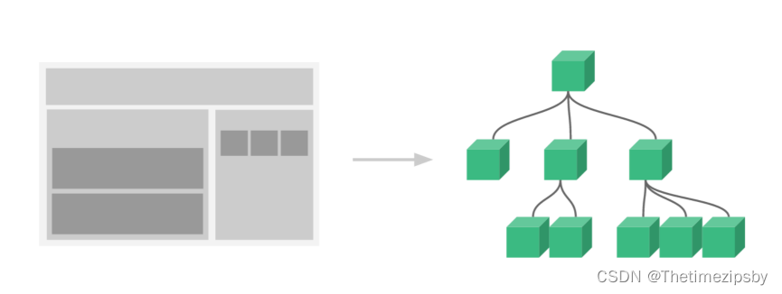
从上图可看出组件之间的关系，从根组件延伸出其他组件来形成页面，组成组件树。

### 函数式组件

在react中使用 JS 的**函数**（**或箭头函数**）创建的组件，就叫做函数组件

```javascript
// 定义函数组件
function HelloFn () {
  return <div>这是我的第一个函数组件!</div>
}

function App () {
  return (
    <div className="App">
      {/* 渲染函数组件 */}
      <HelloFn />
      <HelloFn></HelloFn>
    </div>
  )
}
export default App
```

**注意：**

1. 组件的名称**必须首字母大写**，react内部会根据这个来判断是组件还是普通的HTML标签
2. 函数组件**必须有返回值**，表示该组件的 UI 结构；如果不需要渲染任何内容，则返回 null
3. 组件就像 HTML 标签一样可以被渲染到页面中。组件表示的是一段结构内容，**对于函数组件来说，渲染的内容是函数的返回值就是对应的内容**
4. 使用函数名称作为组件标签名称，可以成对出现也可以自闭合

### 类组件

在react中**使用 ES6 的 class 创建的组件**，叫做类（class）组件。

```javascript
// 引入React
import React from 'react'

// 定义类组件
class HelloC extends React.Component {
  render () {
    return <div>这是我的第一个类组件!</div>
  }
}

function App () {
  return (
    <div className="App">
      {/* 渲染类组件 */}
      <HelloC />
      <HelloC></HelloC>
    </div>
  )
}
export default App
```

**注意：**

1. 类名称也必须以**大写字母开头驼峰式**
2. 类组件应该**继承 React.Component 父类**，从而使用父类中提供的方法或属性
3. 类组件**必须提供 render 方法，render 方法必须有返回值**，表示该组件的 UI 结构

## 事件绑定

使用 React 可以在 JSX语法中添加事件。其中事件处理函数为自定义函数，它将在响应交互（如点击、悬停、表单输入框获得焦点等）时触发。

### 注意点

在添加事件处理函数时尽量使用箭头函数，在使用普通function函数时因JavaScript自身特性问题可能会出现this指向问题，如果需要使用普通函数可以使用bind修改下this指向

就是将定义好的普通函数赋值给另一个变量就会出现this指向错乱问题

>**例如**：  
>function handleClick() {  }
> \<button onClick={this.handleClick.bind(this)}>示例\</button>

### 定义使用

格式：on + 事件名称 = { 事件处理程序函数 } ，比如：\<div onClick={ onClick }>\</div>
<font color=red>注：react事件采用驼峰命名法，比如：onClick，onMouseEnter、onFocus</font>

```javascript
// 函数组件
function HelloFn () {
  // 定义事件回调函数
  const clickHandler = () => {
    console.log('事件被触发了')
  }
  return (
    // 绑定事件
    <button onClick={clickHandler}>click me!</button>
  )
}
// 类组件
export class Hello extends React.Component {
  test = () => {
    console.log('类组件点击事件');
  }
  render() {
    return (
      <div onClick={this.test}>
        类组件
      </div>
    )
  }
}
```

### 事件对象

获取事件对象Event只需要在 事件的回调函数中 补充一个形参 e形参 即可拿到，事件对象里面有当前事件的信息，比如阻止元素默认行为、阻止冒泡等

```javascript
// 函数组件
function HelloFn () {
  // 定义事件回调函数
  const clickHandler = (e) => {
    console.log('事件被触发了', e)
  }
  return (
    // 绑定事件
    <button onClick={clickHandler}>click me!</button>
  )
}
```

### 事件处理函数接收额外参数

请看下面伪代码👇

- **传递自定义参数时**：

 ```javascript
 const delFn = (id) => {
  console.log('点击时接收到了传递的参数=>', id)
 }
 ```

 onClick={ delFn }  **改变为=》** onClick={ () => delFn(id) }

- **传递事件对象Event和自定义参数时**：

 ```javascript
 const delFn = (e, id) => {
  console.log('点击时接收到了传递的参数=>',  e,  id)
 }
 ```

 onClick={ delFn }  **改变为=》**  onClick={ (e) => delFn(e, id) }

<font color=red>注意: 一定不要在模板中写出函数调用的代码 onClick = { delFn(id) } 这样会出现页面渲染时就调用了，而不是什么时候触发事件什么时候调用</font>

## 组件状态

组件状态也就是定义一些属性，这些属性通过指定方式修改，属性会交由react进行响应式变化状态管理（状态就是在当前组件中用到的数据，与vue组件中data里定义的数据一样）

<font color=red>注：在React hook出来之前，函数式组件是没有自己的状态的，所以我们统一通过类组件来演示使用组件状态</font>

### 状态的定义使用

通过class的实例属性state来初始化
state的值是一个对象结构，表示一个组件可以有多个数据状态

```javascript
class Counter extends React.Component {
  // 初始化状态
  state = {
    count: 0
  }
  // 定义修改数据的方法
  setCount = () => {
    this.setState({
      count: this.state.count + 1
    })
  }
  render() {
 // 使用数据 并绑定事件
 return <button onClick={this.setCount}>计数器{this.state.count}</button>
  }
}
```

注：

1. 编写组件其实就是**编写原生js类或者函数**
2. 在类组件中定义状态**必须通过state实例属性，名字不可改变**
3. 修改state中的任何**属性都不可以通过直接赋值的方式，必须走setState()这个方法是通过继承得到的**
4. 注意this指向问题、**尽量用箭头函数**

## 组件通信

组件是独立且封闭的单元，**默认情况下组件只能使用自己的数据（state）**，组件之间相互传递数据就是组件通信

<font color=red>注：支持传入数据类型有string、number、boolean、object、array、jsx</font>

### 父传子

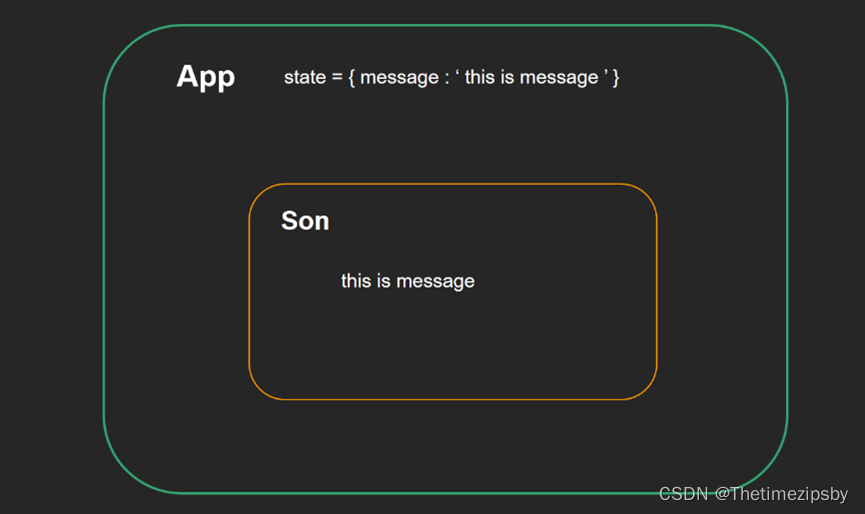

1. 通过props方式传值（通过函数式组件中的形参接收传入的值）

 ```javascript
 import React from 'react'
 
 // 函数式子组件（通过形参）
 function FSon(props) {
   console.log(props)
   return (
     <div>
       子组件1
       {props.msg}
     </div>
   )
 }
 // 类子组件（通过this）
 class CSon extends React.Component {
   render() {
     return (
       <div>
         子组件2
         {this.props.msg}
       </div>
     )
   }
 }
 
 // 父组件
 class App extends React.Component {
   state = {
     message: 'this is message'
   }
   render() {
     return (
       <div>
         <div>父组件</div>
         <FSon msg={this.state.message} />
         <CSon msg={this.state.message} />
       </div>
     )
   }
 }
 
 export default App
 ```

### 子传父

通过父传子传入的函数参数进行传递

```javascript
import React from 'react'

// 子组件
function Son(props) {
  function handleClick() {
    // 调用父组件传递过来的回调函数 并注入参数
    props.changeMsg('this is newMessage')
  }
  return (
    <div>
      {props.msg}
      <button onClick={handleClick}>change</button>
    </div>
  )
}


class App extends React.Component {
  state = {
    message: 'this is message'
  }
  // 提供回调函数
  changeMessage = (newMsg) => {
    console.log('子组件传过来的数据:',newMsg)
    this.setState({
      message: newMsg
    })
  }
  render() {
    return (
      <div>
        <div>父组件</div>
        <Son
          msg={this.state.message}
          // 传递给子组件
          changeMsg={this.changeMessage}
        />
      </div>
    )
  }
}

export default App
```

### 兄弟传值

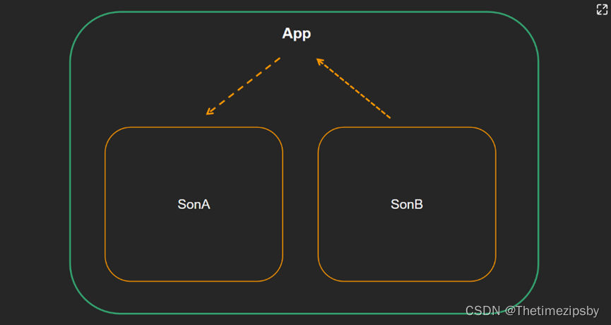
利用共同父组件的方式传递

```javascript
import React from 'react'

// 子组件A
function SonA(props) {
  return (
    <div>
      SonA
      {props.msg}
    </div>
  )
}
// 子组件B
function SonB(props) {
  return (
    <div>
      SonB
      <button onClick={() => props.changeMsg('new message')}>changeMsg</button>
    </div>
  )
}

// 父组件
class App extends React.Component {
  // 父组件提供状态数据
  state = {
    message: 'this is message'
  }
  // 父组件提供修改数据的方法
  changeMsg = (newMsg) => {
    this.setState({
      message: newMsg
    })
  }

  render() {
    return (
      <>
        {/* 接收数据的组件 */}
        <SonA msg={this.state.message} />
        {/* 修改数据的组件 */}
        <SonB changeMsg={this.changeMsg} />
      </>
    )
  }
}

export default App
```

### 深度组件传值（爷👉孙）

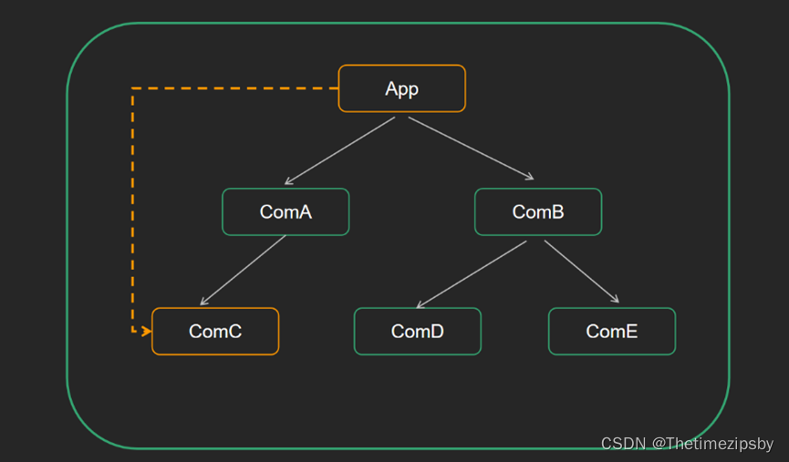
通过react提供的```createContext```方法实现
创建Context对象 导出 ```Provider```和 ```Consumer```组件（相当于vue中的provide，inject）

```javascript
import React, { createContext }  from 'react'

// 1. 创建Context对象 
const { Provider, Consumer } = createContext()

// 3. 消费数据
function ComC() {
  return (
    <Consumer >
      {value => <div>{value}</div>}
    </Consumer>
  )
}

function ComA() {
  return (
    <ComC/>
  )
}

// 2. 提供数据
class App extends React.Component {
  state = {
    message: 'this is message'
  }
  render() {
    return (
      <Provider value={this.state.message}>
        <div className="app">
          <ComA />
        </div>
      </Provider>
    )
  }
}

export default App
```

### props中的children属性

当使用组件时**组件标签中有内容** 就会自动放入这个函数式组件的形参props中的children属性
>children可以是什么?
>
>1. 普通文本
>2. 普通标签元素
>3. 函数 / 对象
>4. JSX

```js
import React from "react";

// 子组件
function Son(props) {
  console.log(props.children);// [div, p]
  return <>
    <div>子</div>
    {props.children}
  </>
}

// 父组件
class Parent extends React.Component {
  render() {
    return <div className="parent-box">
      <div>父</div>
      <Son>
        <div>
          children =》div
          <span>span</span>
        </div>
        <p>children =》 p</p>
      </Son>
    </div>
  }
}
```

### props校验

因组件传值需要规范传入数据值，避免传入其他数据导致错误

1. 安装属性校验npm包 ```npm install prop-types```
2. 导入 ```prop-types```包
3. 使用 ```comName.propTypes = {}```给组件添加校验规则

```js
import PropTypes from 'prop-types'

const List = props => {
  const arr = props.colors
  const lis = arr.map((item, index) => <li key={index}>{item.name}</li>)
  return <ul>{lis}</ul>
}

List.propTypes = {
  colors: PropTypes.array
}

```

具体校验规则：[https://zh-hans.legacy.reactjs.org/docs/typechecking-with-proptypes.html](https://zh-hans.legacy.reactjs.org/docs/typechecking-with-proptypes.html)

### props默认值

1. 函数组件
 直接使用函数参数默认值

 ```js
 function List({pageSize = 10}) {
   return (
     <div>
       此处展示props的默认值：{ pageSize }
     </div>
   )
 }
 
 // 不传入pageSize属性
 <List />
 ```

2. 类组件
使用类静态属性声明默认值，static defaultProps = {}

 ```js
 class List extends Component {
   static defaultProps = {
     pageSize: 10
   }
   render() {
     return (
       <div>
         此处展示props的默认值：{this.props.pageSize}
       </div>
     )
   }
 }
 <List />
 ```

## 生命周期

很多的事物都有**从创建到销毁的整个过程**，这个过程称之为是生命周期

React组件的生命周期是指组件从被创建到挂载到页面中运行起来，再到组件不用时卸载的过程，React生命周期可分为三个阶段：**挂载、渲染/更新、卸载**

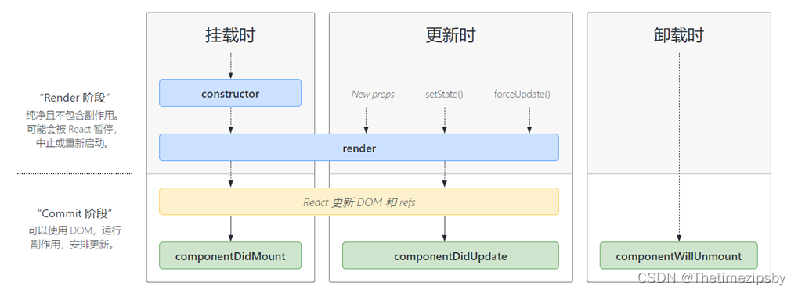
<font color=red>注意：只有**类组件**才有生命周期（类组件 实例化  函数组件 不需要实例化）</font>

(结合此图看下面详解👇)

1. **挂载阶段**
 constructor 创建类组件时，最先执行，初始化的时候只执行一次
render 每次组件渲染都会触发 注意： 因每次状态更新都会触发，不能在里面调用setState()
 componentDidMount 组件挂载（完成DOM渲染）后执行，初始化的时候执行一次，可以进行发送网络请求、DOM操作等
2. **渲染/更新阶段**
componentDidUpdate 组件更新后（DOM渲染完毕）执行
注意： 因每次状态更新都会触发，不能在里面调用setState()
3. **卸载阶段**
componentWillUnmount 组件卸载时执行（从页面中消失）

# Hooks
>
>**什么是hooks？**
>Hooks的本质：一套能够使函数组件更强大，更灵活的“钩子”（就是封装好的一些函数抛出使用）

在React类组件（class）写法中，有setState和生命周期对状态进行管理，但是在函数组件中不存在这些，故引入hooks（**react版本：>=16.8）**，使开发者在非class的情况下使用更多react特性

**注意点：**

1. 有了hooks之后，为了兼容老版本，class类组件并没有被移除，两者都可以使用
2. 有了hooks之后，不能在把函数成为无状态组件了，因为hooks为函数组件提供了状态
3. hooks只能在函数组件中使用

## useState

为函数组件提供响应式状态，与类组件中的state相似

格式：```const [stateA, setStateA] = useState(0)```

**注意点：**

1. 参数是初始state值（定义初始state最好给出初始值，方便后期维护， 例如：0/false/’ ’/[]/{}）
2. [stateA, setStateA] 这是解构赋值 useState返回值是数组，相当于返回 [ 0, ()=>{} ]
3. 解构里面的名字可以自定义但要保持语义化，解构里面的顺序是固定的，因为数组是有序列表
4. setStateA得到的函数是用来修改stateA的，只能用新值修改原值不能直接修改原值
5. 在组件的顶层调用

```js
import {useState} from 'react';

export default function HookComp(){
  const [count, setCount] = useState(0)
  const [list, setList] = useState([])
  return <>
    <button type="button" onClick={() => setCount(count+1)}>累加按钮{count}</button>
  </>
}
```

<font color=red>注意：每次进行状态值修改，函数组件会再次执行渲染</font>

### useState参数解析

参数可以是JavaScript的**基本数据类型和引用数据类型**，也可以是**函数**

1. **普通参数**
直接使用 useState(普通数据) 即可
2. **函数参数**
使用useState(()=>{})

 ```js
 const [name, setName] = useState(()=>{   
   // 编写计算逻辑    return '计算之后的初始值'
 })
 ```

 使用setName方法修改name状态值时参数也可以是函数，而函数中的第一个形参则是name未修改之前的值

 ```js
 import { useState } from 'react';
 
 export default function Counter() {
   const [age, setAge] = useState(42);
 
   function increment() {
  //a 就是age
     setAge(a => a + 3);
   }
 
   return (
     <>
       <h1>Your age: {age}</h1>
       <button onClick={ increment }>+3</button>
     </>
   );
 }
 ```

## useEffect

就是为函数组件执行的副作用代码
>**副作用**
>对于 React 组件来说，主作用就是根据数据（state/props）渲染 UI，除此之外都是副作用（比如，手动修改 DOM）（白话就是用于处理与当前函数组件功能不相关的代码）

```js

// 第一个参数是函数 必须，第二个是数组 可选，数组里可以是任意状态
useEffect( () => { }, [ ] ) 
```

**使用示例**：

```js
import { useEffect, useState } from 'react'
function App() {
  const [count, setCount] = useState(0)
 
  // 当第二个参数不写，首次组件渲染后执行，每次响应式数据改变渲染后都会执行
  useEffect(()=>{
    document.title = `当前已点击了${count}次`
  })
  // 当第二个参数为空数组时, 首次组件渲染后执行一次
useEffect(()=>{
    document.title = `当前已点击了${count}次`
}, [ ])
// 当第二个参数数组中添加了响应式状态，除首次组件渲染后执行，每次count状态改变都会执行当前useEffect
useEffect(()=>{
    document.title = `当前已点击了${count}次`
}, [ count ])

  return (
    <button onClick={() => { setCount(count + 1) }}>{count}</button>
  )
}

```

<font color=red>**注意点**：可以有多个useEffect按顺序依次执行</font>

### 清理副作用

如果想要清理副作用 可以在副作用函数中的末尾**return一个新的函数**，在新的函数中编写清理副作用的逻辑

**注意执行时机为**：

1. 组件卸载时自动执行
2. 组件更新时，下一个useEffect副作用函数执行之前自动执行

```js
import { useEffect, useState } from "react"
const App = () => {
  const [count, setCount] = useState(0)
  useEffect(() => {
    const timerId = setInterval(() => {
      setCount(count + 1)
    }, 1000)
    return () => {
      // 用来清理副作用的事情
      clearInterval(timerId)
    }
  }, [count])
  return (
    <div>
      {count}
    </div>
  )
}
export default App
```

### 发送网络请求

因```useEffect```是在组件渲染完毕后执行，与类组件的```componentDidMount```生命周期相似，可以在此阶段进行网络请求

```js
useEffect(()=>{   
    async function fetchData(){      
       const res= await axios.get('http://geek.itheima.net/v1_0/channels')                            console.log(res)   
    } 
},[])
```

<font color=red>**注意**：不可以直接在useEffect的回调函数外层直接包裹 async，因为异步会导致清理函数无法立即返回</font>

## useRef

在函数组件中可获取真实的dom元素对象或者是组件对象

**注意点**：

1. 函数组件由于没有实例，不能使用ref获取，如果想获取组件实例，必须是类组件
2. 需要操作真实dom必须在组件渲染完毕后使用

```js
import React, {useRef, useEffect} from 'react'

class Son extends React.Component {
  render() {
    return <div>
    子
  </div>
  }
}
export default function GetDom(){
  // 1. 定义容器
  const sonRef = useRef(null)
  const spanRef = useRef(null)
  useEffect(() => {
    // 3. 获取使用
    console.log(sonRef);
    console.log(spanRef);
  }, [])
  return (
    <div>
      {/* 2. 绑定对应ref对象 */}
      <Son ref={sonRef} />
      <span ref={spanRef} ></span>
    </div>
  )
}

```

## useContext

搭配createContext方法进行**爷孙**之间的数据的传递

```js
import { createContext, useContext } from 'react'
// 创建Context对象
const Context = createContext()

function Foo() {  
    return <div>Foo <Bar/></div>
}

function Bar() {  
    // 底层组件通过useContext函数获取数据  
    const name = useContext(Context)  
    return <div>Bar {name}</div>
}

function App() {  
    return (    
        // 顶层组件通过Provider 提供数据    
        <Context.Provider value={'this is name'}>     
            <div><Foo/></div>    
        </Context.Provider>  
    )
}

export default App
```

# ReactRouter

路由 就是每个浏览器地址栏中每个url就对应一个页面视图，React遵循SPA（单页面应用）[https://reactrouter.com/en/main](https://reactrouter.com/en/main)

## 准备

1. 利用```create-react-app```脚手架工具创建react项目
2. 利用```npm install react-router-dom```或```yarn add react-router-dom```或```cnpm、pnpm```等下载react router对应npm包

## 体验

```js
// 引入必要的内置组件
import { BrowserRouter, Routes, Route, Link } from 'react-router-dom'

// 准备俩个路由组件

const Home = () => <div>this is home</div>
const About = () => <div>this is about</div>

function App() {
  return (
    <div className="App">
      {/* 基于history模式的路由，还有hash模式路由 */}
      <BrowserRouter>
        {/* 指定跳转的组件 to用来配置路由地址 */}
        <Link to="/">Home</Link>
        <Link to="/about">About</Link>

        {/* 路由出口 路由对应的组件会在这里进行渲染 */}
        <Routes>
          {/* 路由匹配显示对应组件 path匹配跳转的路径 element渲染的组件 两个属性必须 */}
          <Route path="/" element={<Home />}></Route>
          <Route path="/about" element={<About />}></Route>
        </Routes>
      </BrowserRouter>    </div>
  )
}

export default App
```

## 核心内置组件

都是通过 ```react-router-dom```导入

### BrowerRouter / HashRouter

作用: 包裹整个应用，一个React应用只需要使用一次

| 模式 | 作用 | 表现 |
|--|--|--|
| BrowerRouter| h5的 history.pushState API实现 | <http://localhost:3000/about>|
| HashRouter        |监听url hash值实现| <http://localhost:3000/#/about>|

### Link

允许用户通过**单击或点击另一个页面导航到另一个页面**，Link组件最终会被渲染为原生的a链接，相当于vue-router中的 ```<router-link>```
**通过to属性进行指定跳转路径**

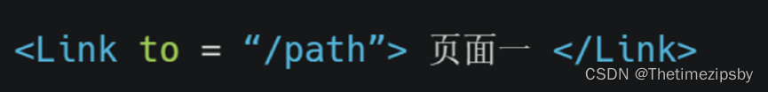

### Routers

提供一个**路由出口**，组件内部会存在多个内置的Route组件，满足条件的路由会被渲染到组件内部，相当于vue-router的```<router-view>```

### Route

用于定义路由路径和渲染组件的对应关系
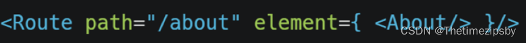 path属性用来指定匹配的路径地址
element属性指定要渲染的组件
图中配置的意思为: **当url上访问的地址为 /about 时，当前路由发生匹配，对应的About组件渲染**

## 编程式导航

### useNavigate

直接通过hooks函数的方式去实现跳转功能
useNavigate 钩子返回一个函数，该函数允许您以编程方式导航

返回函数中支持两个参数 :

- 第一个参数是跳转路径（与 <Link to> 的类型相同）
- 第二个是配置项 可选 { replace, state } ...

例如：```navigate('/about', { replace: true } )```

```js
import { useNavigate } from 'react-router-dom'
const Home = () => {
  // 执行函数
  const navigate = useNavigate()
  return (
    <div>
      Home
      <button onClick={ ()=> navigate('/about') }> 跳转关于页 </button>
    </div>
  )
}
```

## 路由传参

### useSearchParams

此钩子函数用来接收get请求传参方式的参数

比如此时跳转到当前函数式组件的页面
浏览器地址栏中是 ```http://localhost:3000/about?id=1001&name=zhangsan```
此时可使用```useSerchParams```函数去获取

例如下面伪代码

```js
import { useSerchParams } from 'react-router-dom'
let [ params ] = useSerchParams()
let id = params.get('id') //使用返回的params对象的get方法获取
```

### useParams

此钩子函数用来接收动态路由参数的方式```/:id/```

比如此时跳转到当前函数式组件的页面
浏览器地址栏中是 ```http://localhost:3000/about/1001```
获取参数的前提需要在匹配路由显示组件的的那个地方配置 :xxx （此配置与vue-router动态路由参数相似）

**例如**
使用内置组件Route匹配对应路由显示组件时配置

```html
<Route path="/about/:id" element={<About />}></Route>
```

上述不配置会出现找不到路由的警告
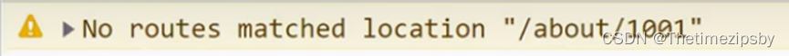

然后使用useParams钩子获取

例如下面伪代码

```js
import { useParams } from 'react-router-dom'
let params = useParams() // params对象的key是上面Route组件配置的冒号后面的id
let id = params.id
```

#

<br/><br/><br/><br/>

**到这里就结束了，后续还会更新 React 系列相关，还请持续关注！**
**感谢阅读，若有错误可以在下方评论区留言哦！！！**


<br/><br/>

**推荐文章**👇

[轻松学会 React 钩子：以 useEffect() 为例](https://www.ruanyifeng.com/blog/2020/09/react-hooks-useeffect-tutorial.html)
[React Hooks 入门教程](https://www.ruanyifeng.com/blog/2019/09/react-hooks.html)
[React Router 使用教程](https://www.ruanyifeng.com/blog/2016/05/react_router.html)
