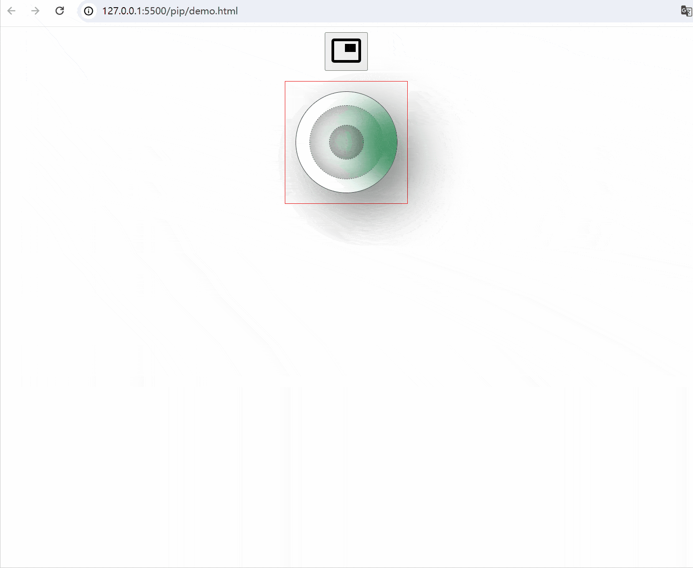
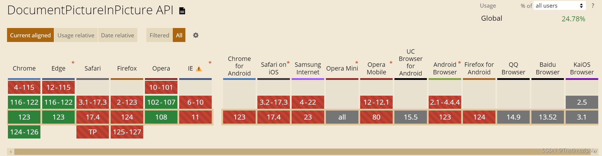

>作者GitHub：[https://github.com/gitboyzcf](https://github.com/gitboyzcf)  有兴趣可关注！！！
>
# 效果



尽管效果可以，但是api兼容性不理想🤦‍

# 步入正题
>
><font color=red>**安全上下文**：此功能仅在安全上下文（HTTPS）中可用，在某些或所有支持的浏览器中。</font>
>
## Document Picture-in-Picture API（文档画中画API）

文档画中画API（pip api）可以打开一个始终在顶部的窗口，**该窗口可以填充任意HTML内容**，它扩展了早期的 <video> 画中画API，专门支持将HTML <video> 元素放入始终在顶部的窗口中。

### 兼容性



### window 内置 pip API

- ```documentPictureInPicture```对象
它通过 ```window.documentPictureInPicture```属性访问。
**实例属性**：
  - ```window```返回一个 Window 实例，表示画中画窗口内的**浏览器上下文**。

 **实例方法**：

- ```requestWindow()```打开当前主浏览上下文的“画中画”窗口。返回一个 Promise ，返回结果就是一个“画中画”窗口Window实例。
- ```close()```关闭当前画中画窗口

 **事件**：

- ```enter```当画中画窗口成功打开时激发。
- ```unload```当画中画窗口关闭时触发。
- ```click```点击画中画文档时触发。

### 注意点（仔细阅读理解）

1. 网站一次只能打开一个画中画窗口，多个按钮触发画中画会进行替换。
2. 无法导航画中画窗口（更改为新文档的任何 window.history 或 window.location 调用将关闭PiP窗口）。
3. 画中画窗口永远不会超过打开的窗口。这意味着任何将打开器更改为新文档的导航（即使是同源导航）都将导致PiP窗口关闭。
4. 画中画窗口将浮在其他窗口的顶部。
5. 画中画窗口生命周期只存在于当前标签页。

# 演示代码

```html
<!DOCTYPE html>
<html lang="en">

<head>
  <meta charset="UTF-8">
  <meta name="viewport" content="width=device-width, initial-scale=1.0">
  <title>画中画</title>
  <style>
    body {
      display: flex;
      justify-content: center;
      align-items: center;
      flex-flow: column;
      gap: 15px;
    }

    #main-content {
      padding: 15px;
      border: 1px solid red;
    }

    .svg-icon {
      fill: var(--color);
      width: 48px;
      height: 48px;
      transition: fill 300ms;
    }

    .loader {
      position: relative;
      width: 150px;
      height: 150px;
      background: transparent;
      border-radius: 50%;
      box-shadow: 25px 25px 75px rgba(0, 0, 0, 0.55);
      border: 1px solid #333;
      display: flex;
      align-items: center;
      justify-content: center;
      overflow: hidden;
    }

    .loader::before {
      content: '';
      position: absolute;
      inset: 20px;
      background: transparent;
      border: 1px dashed#444;
      border-radius: 50%;
      box-shadow: inset -5px -5px 25px rgba(0, 0, 0, 0.25),
        inset 5px 5px 35px rgba(0, 0, 0, 0.25);
    }

    .loader::after {
      content: '';
      position: absolute;
      width: 50px;
      height: 50px;
      border-radius: 50%;
      border: 1px dashed#444;
      box-shadow: inset -5px -5px 25px rgba(0, 0, 0, 0.25),
        inset 5px 5px 35px rgba(0, 0, 0, 0.25);
    }

    .loader span {
      position: absolute;
      top: 50%;
      left: 50%;
      width: 50%;
      height: 100%;
      background: transparent;
      transform-origin: top left;
      animation: radar81 2s linear infinite;
      border-top: 1px dashed #fff;
    }

    .loader span::before {
      content: '';
      position: absolute;
      top: 0;
      left: 0;
      width: 100%;
      height: 100%;
      background: seagreen;
      transform-origin: top left;
      transform: rotate(-55deg);
      filter: blur(30px) drop-shadow(20px 20px 20px seagreen);
    }

    @keyframes radar81 {
      0% {
        transform: rotate(0deg);
      }

      100% {
        transform: rotate(360deg);
      }
    }
  </style>
</head>

<body>
  <button id="popupbtn" title="Toggle PIP Mode">
    <svg class="svg-icon" xmlns="http://www.w3.org/2000/svg" viewBox="0 0 48 48">
      <
        d="M38 14H22v12h16V14zm4-8H6c-2.21 0-4 1.79-4 4v28c0 2.21 1.79 3.96 4 3.96h36c2.21 0 4-1.76 4-3.96V10c0-2.21-1.79-4-4-4zm0 32.03H6V9.97h36v28.06z"/>
    </svg>
  </button>
  <div class="main">
    <div id="main-content">
      <div class="loader">
        <span></span>
      </div>
    </div>
  </div>

  <script>
    const isPip = () => "documentPictureInPicture" in window
    const pipActuator = (targetDomId, popupBtnDomId) => {
      if (!isPip()) {
        alert("您的浏览器不支持画中画模式！");
        return;
      }
      let targetContainer = null;
      let pipWindow = null;
      let pipTip = null;

      async function enterPiP() {
        const target = document.querySelector(targetDomId);
        targetContainer = target.parentNode;

        pipTip = document.createElement("div");
        pipTip.classList.add("pip-tip");
        pipTip.innerHTML = "画中画模式已开启";
        targetContainer.appendChild(pipTip);

        const pipOptions = {
          initialAspectRatio: target.clientWidth / target.clientHeight,
          lockAspectRatio: true,
          copyStyleSheets: true,
        };

        pipWindow = await documentPictureInPicture.requestWindow(pipOptions);

        // 从初始文档复制样式表
        // 使画中画里面的画面和初始文档保持一致
        [...document.styleSheets].forEach((styleSheet) => {
          try {
            const cssRules = [...styleSheet.cssRules].map((rule) => rule.cssText).join("");
            const style = document.createElement("style");

            style.textContent = cssRules;
            pipWindow.document.head.appendChild(style);
          } catch (e) {
            const link = document.createElement("link");

            link.rel = "stylesheet";
            link.type = styleSheet.type;
            link.media = styleSheet.media;
            link.href = styleSheet.href;
            pipWindow.document.head.appendChild(link);
          }
        });

        // 将目标添加到PiP窗口
        pipWindow.document.body.append(target);

        // 监听pip点击事件
        pipWindow.addEventListener('click', () => {
          console.log('点击了画中画文档');
        });
        // 监听PiP结束事件，将目标放回原位
        pipWindow.addEventListener("unload", onLeavePiP.bind(pipWindow), {
          once: true,
        });
      }

      // 当PiP窗口关闭时调用
      function onLeavePiP() {
        if (this !== pipWindow) {
          return;
        }

        // 将目标添加回目标窗口
        const target = pipWindow.document.querySelector(targetDomId);
        targetContainer.append(target);
        targetContainer.removeChild(pipTip)
        pipWindow.close();

        pipWindow = null;
        targetContainer = null;
      }
      document.querySelector(popupBtnDomId).addEventListener("click", () => {
        if (!pipWindow) {
          enterPiP();
        } else {
          onLeavePiP.bind(pipWindow)();
        }
      });
    }
    pipActuator("#main-content", "#popupbtn");
  </script>
</body>

</html>
```

<br/><br/><br/><br/>
**到这里就结束了，后续还会更新 前端 系列相关，还请持续关注！**
**感谢阅读，若有错误可以在下方评论区留言哦！！！**


**推荐文章**👇

[Document Picture-in-Picture Specification](https://wicg.github.io/document-picture-in-picture/#pip-support)
[Tomodoro](https://lazy-guy.github.io/tomodoro/index.html)
