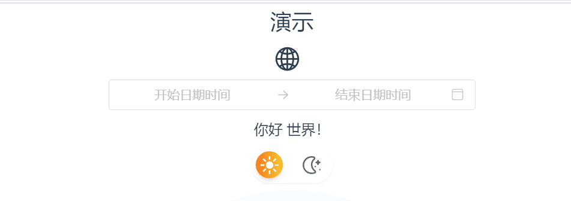
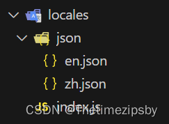

## 目标


动图中的示例模板代码👉[https://github.com/gitboyzcf/vue3-template?tab=readme-ov-file#vue3-template](https://github.com/gitboyzcf/vue3-template?tab=readme-ov-file#vue3-template)

## Vue I18n
>
>**什么是Vue I18n?**
Vue I18n是Vue.js的国际化插件（中英文切换）。它可以轻松地将一些本地化功能集成到Vue.js应用程序中。

官网[https://vue-i18n.intlify.dev/（英文）](https://vue-i18n.intlify.dev/)

## 安装

```sh
pnpm add vue-i18n@latest
or
npm install vue-i18n@latest
```

## 接入到Vue3中

**新建目录结构**


**写入内容**

```json
// zh.json
{
  "hello": "你好 世界！",
  "demo": "演示"
}

// en.json
{
  "hello": "Hello World!",
  "demo": "demo"
}
```

**index.js**

```js
import { createI18n, useI18n } from 'vue-i18n'
//状态管理 pinia
import { useOutsideSystemStore } from '@/stores/modules/system.js'
import zhCN from './json/zh.json'
import enUS from './json/en.json'

const useSystem = useOutsideSystemStore()

const i18n = createI18n({
  // 是否在vue应用程序上使用vue-i18n Legacy API（传统）模式
  legacy: false,
  // 默认当前语言
  locale: useSystem.language,
  // 是否为每个组件注入全局属性和函数（true 后 在template中可以直接使用$t('')）
  globalInjection: true,
  // 语言合集
  messages: {
    zh: zhCN,
    en: enUS
  }
})

const locale = i18n.global.locale

export { useI18n, locale, i18n }
```

**main.js**

```js
import App from './App.vue'
import { i18n } from '@/locales'

const app = createApp(App)
app.use(i18n)
app.mount('#app')
```

### 使用

```html
<template>
 <!-- 因配置全局注入属性和方法，可以直接使用vue-i18n内置的$t方法 -->
 <div>{{ $t('hello') }}</div>
</template>
<script>
 import { useI18n } from "vue-i18n";
 // 在js中可以引入vue-i18提供的hook
 const { t } = useI18n();
</script>
```

### 问题

切换后在不刷新浏览器的情况下不会响应式变化，请看下面回答👇
[https://segmentfault.com/q/1010000044993218](https://segmentfault.com/q/1010000044993218)

<br/><br/><br/><br/>
**到这里就结束了，后续还会更新 前端 系列相关，还请持续关注！**
**感谢阅读，若有错误可以在下方评论区留言哦！！！**


**推荐文章**👇
[vue-i18n的9以上的版本中@被用作特殊字符处理，直接用会报错](https://blog.csdn.net/xiaoxia188/article/details/124889531)
