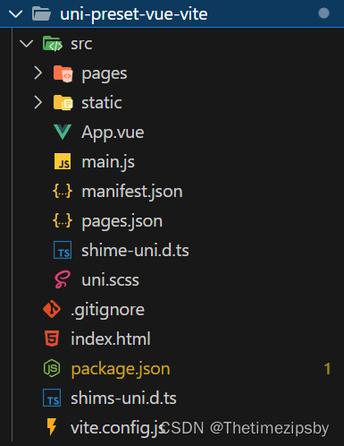
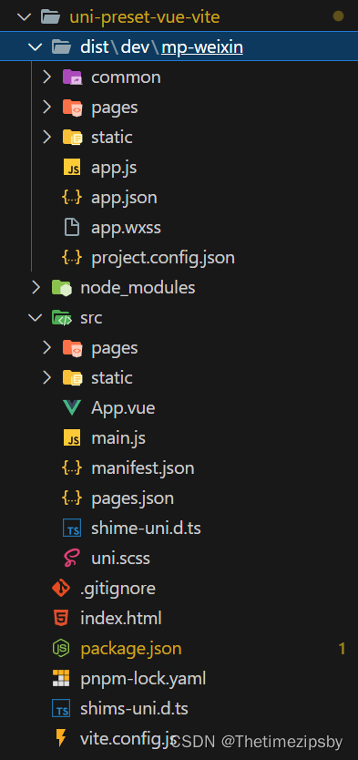
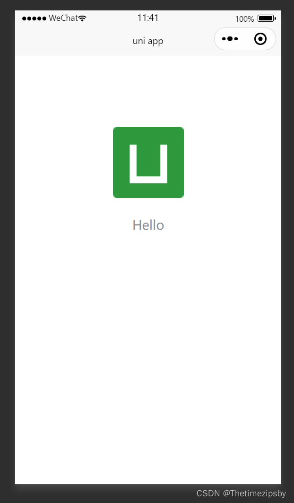
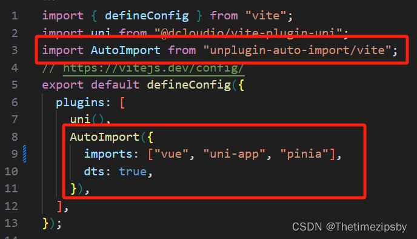
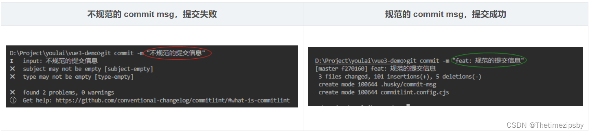
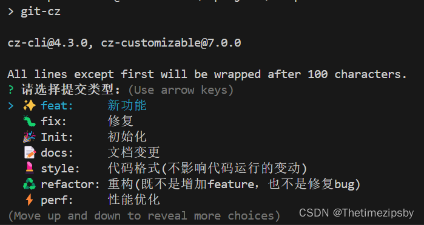
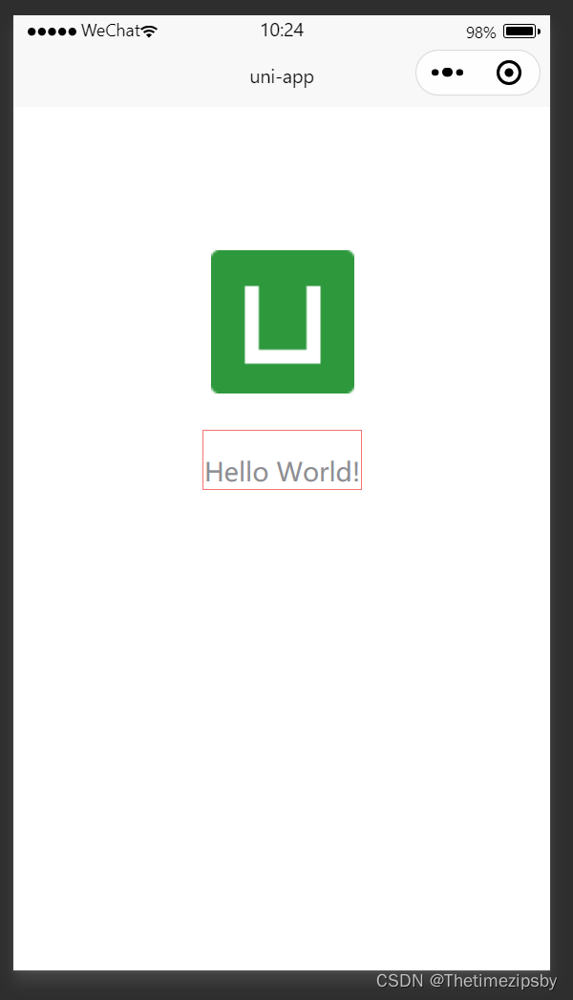
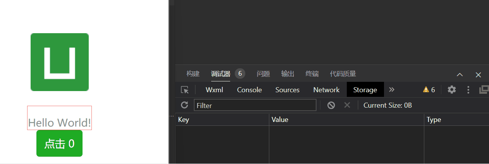
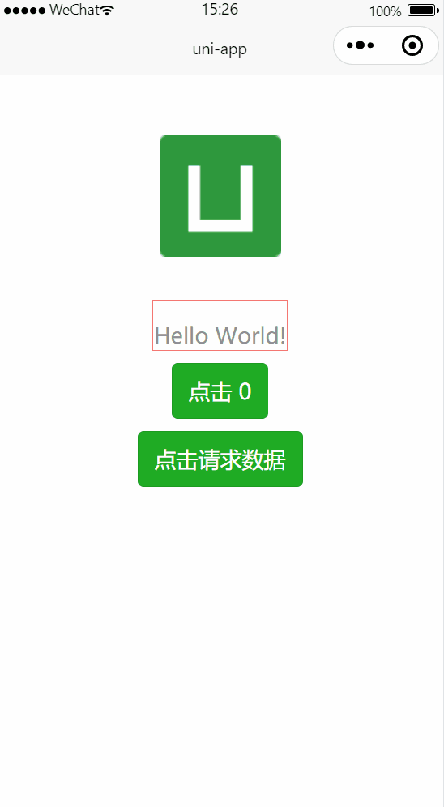

>无人扶我青云志，我自踏雪至山巅

>作者GitHub：[https://github.com/gitboyzcf](https://github.com/gitboyzcf)  有兴趣可关注！！！
>

## 目录

# 特色

- ⚡️[uni-app](https://github.com/dcloudio/uni-app), [Vue 3](https://github.com/vuejs/core), [Vite](https://github.com/vitejs/vite), [pnpm](https://pnpm.io/)

- 📦 [组件自动化引入](https://github.com/antfu/unplugin-vue-components)

- 🍍 [使用 Pinia 的状态管理](https://pinia.vuejs.org)

- 🎨 [UnoCSS](https://github.com/unocss/unocss) - 高性能且极具灵活性的即时原子化 CSS 引擎

- 😃 [各种图标集为你所用](https://icon-sets.iconify.design/)

- 🔥 使用 [新的 `<script setup>` 语法](https://github.com/vuejs/rfcs/pull/227)

- 📥 [API 自动加载](https://github.com/antfu/unplugin-auto-import) - 直接使用 Composition API 无需引入

- 🌍 [API 采用模块化自动导入方式](https://blog.csdn.net/qq_43775179/article/details/134811292) 根据demo.js文件设置接口，以API_xxx_method的方式命名，在请求时无需导入 直接使用useRequest()函数返回参数以解构的方式获取，拿到即为写入的接口

# 准备

Vue3/Vite版要求 node 版本```^14.18.0 || >=16.0.0```

## 拉取默认UniApp模板

[点击下载](https://gitee.com/dcloud/uni-preset-vue/repository/archive/vite.zip) 默认模板，或者通过下面命令行拉取

```bash
npx degit dcloudio/uni-preset-vue#vite my-vue3-project
```

得到下面目录结构👇



## 安装依赖

我这里使用[pnpm](https://pnpm.io/) ，可以使用如npm、[yarn](https://yarnpkg.com/)、...

```bash
pnpm install
```

如有报下面错误👇
>This modules directory was created using the following registries configuration:{"default":"<https://registry.npmjs.org/"}>. The current configuration is {"default":"<https://registry.npm.taobao.org/"}>. To recreate the modules directory using the new settings, run "pnpm install -g".

解决方案 下载源切换

```bash
pnpm config set registry https://registry.npmjs.org
```

## 启动项目测试

执行该命令 会将此项目编译成微信小程序项目，**该命令会持续监听修改并进行热更新**

```bash
pnpm dev:mp-weixin
```

执行后会出现 ```dist\dev\mp-weixin```文件夹结构



将此目录下的```mp-weixin```用**微信开发者工具**进行打开

**如未安装点击下面链接下载安装即可**👇
[https://developers.weixin.qq.com/miniprogram/dev/devtools/download.html](https://developers.weixin.qq.com/miniprogram/dev/devtools/download.html)

## 结果



# 配置自动化导入

## 安装依赖

```bash
pnpm i unplugin-auto-import -D
```

## 在vite.config.js中配置



```javascript
import AutoImport from 'unplugin-auto-import/vite'

AutoImport({
 imports: ["vue", "uni-app", "pinia"],
 dts: true,
})
```

配置完后 重新执行```pnpm dev:mp-weixin```此时会生成auto-imports.d.ts文件

此时在```pages/index/index.vue```中不用引入直接可以使用vue的api

```html
<script setup>
const title = ref('Hello World!')
</script>
```

# 引入 prerttier + eslint + stylelint

安装相关依赖包👇

```bash
pnpm add -D eslint @babel/eslint-parser eslint-config-airbnb-base eslint-config-prettier eslint-plugin-import eslint-plugin-prettier eslint-plugin-vue vue-global-api stylelint stylelint-scss stylelint-config-standard-scss stylelint-config-prettier
```

## .editorconfig

```javascript
# .editorconfig 文件
root = true

[*] # 表示所有文件适用
charset = utf-8 # 设置文件字符集为 utf-8
indent_style = space # 缩进风格（tab | space）
indent_size = 2 # 缩进大小
end_of_line = lf # 控制换行类型(lf | cr | crlf)
trim_trailing_whitespace = true # 去除行首的任意空白字符
insert_final_newline = true # 始终在文件末尾插入一个新行

[*.md] # 表示仅 md 文件适用以下规则
max_line_length = off # 关闭最大行长度限制
trim_trailing_whitespace = false # 关闭末尾空格修剪

```

## .prettierrc.cjs

```javascript
module.exports = {
  // 一行的字符数，如果超过会进行换行，默认为80，官方建议设100-120其中一个数
  printWidth: 100,
  // 一个tab代表几个空格数，默认就是2
  tabWidth: 2,
  // 启用tab取代空格符缩进，默认为false
  useTabs: false,
  // 行尾是否使用分号，默认为true(添加理由:更加容易复制添加数据,不用去管理尾行)
  semi: false,
  vueIndentScriptAndStyle: true,
  // 字符串是否使用单引号，默认为false，即使用双引号，建议设true，即单引号
  singleQuote: true,
  // 给对象里的属性名是否要加上引号，默认为as-needed，即根据需要决定，如果不加引号会报错则加，否则不加
  quoteProps: 'as-needed',
  // 是否使用尾逗号，有三个可选值"<none|es5|all>"
  trailingComma: 'none',
  // 在jsx里是否使用单引号，你看着办
  jsxSingleQuote: true,
  // 对象大括号直接是否有空格，默认为true，效果：{ foo: bar }
  bracketSpacing: true,
  proseWrap: 'never',
  htmlWhitespaceSensitivity: 'strict',
  endOfLine: 'auto',
}

```

## .eslintrc.cjs

```javascript
// .eslintrc.cjs 文件
module.exports = {
  env: {
    browser: true,
    es2021: true,
    node: true,
  },
  extends: [
    'eslint:recommended',
    'plugin:vue/vue3-essential',
    // eslint-plugin-import 插件， @see https://www.npmjs.com/package/eslint-plugin-import
    'plugin:import/recommended',
    // eslint-config-airbnb-base 插件， tips: 本插件也可以替换成 eslint-config-standard
    'airbnb-base',
    // 1. 接入 prettier 的规则
    'prettier',
    'plugin:prettier/recommended',
    'vue-global-api',
  ],
  overrides: [
    {
      env: {
        node: true,
      },
      files: ['.eslintrc.{js}'],
      parserOptions: {
        sourceType: 'script',
      },
    },
  ],
  parserOptions: {
    ecmaVersion: 'latest',
    parser: '@babel/eslint-parser',
    sourceType: 'module',
  },
  plugins: [
    '@babel/eslint-parser',
    'vue',
    // 2. 加入 prettier 的 eslint 插件
    'prettier',
    // eslint-import-resolver-typescript 插件，@see https://www.npmjs.com/package/eslint-import-resolver-typescript
    'import',
  ],
  rules: {
    // 3. 注意要加上这一句，开启 prettier 自动修复的功能
    'prettier/prettier': 'error',
    // turn on errors for missing imports
    'import/no-unresolved': 'off',
    // 对后缀的检测，否则 import 一个ts文件也会报错，需要手动添加'.ts', 增加了下面的配置后就不用了
    'import/extensions': [
      'error',
      'ignorePackages',
      { js: 'never', jsx: 'never', ts: 'never', tsx: 'never' },
    ],
    // 只允许1个默认导出，关闭，否则不能随意export xxx
    'import/prefer-default-export': ['off'],
    'no-console': ['off'],
    // 'no-unused-vars': ['off'],
    // '@typescript-eslint/no-unused-vars': ['off'],
    // 解决vite.config.ts报错问题
    'import/no-extraneous-dependencies': 'off',
    'no-plusplus': 'off',
    'no-shadow': 'off',
    'vue/multi-word-component-names': 'off',
    '@typescript-eslint/no-explicit-any': 'off',
  },
  // eslint-import-resolver-typescript 插件，@see https://www.npmjs.com/package/eslint-import-resolver-typescript
  settings: {
    'import/parsers': {
      '@typescript-eslint/parser': ['.ts', '.tsx'],
    },
    'import/resolver': {
      typescript: {},
    },
  },
  globals: {
    uni: true,
    UniApp: true,
    wx: true,
    WechatMiniprogram: true,
    getCurrentPages: true,
    UniHelper: true,
    Page: true,
    App: true,
  },
}

```

## .stylelintrc.cjs

```javascript
// .stylelintrc.cjs 文件
module.exports = {
  root: true,
  extends: [
    'stylelint-config-standard',
    'stylelint-config-standard-scss', // tips: 本插件也可以替换成 stylelint-config-recommended-scss
    'stylelint-config-recommended-vue/scss',
    'stylelint-config-html/vue',
    'stylelint-config-recess-order',
  ],
  overrides: [
    // 扫描 .vue/html 文件中的<style>标签内的样式
    {
      files: ['**/*.{vue,html}'],
      customSyntax: 'postcss-html',
    },
    {
      files: ['**/*.{css,scss}'],
      customSyntax: 'postcss-scss',
    },
  ],
  // 自定义规则
  rules: {
    // 允许 global 、export 、v-deep等伪类
    'selector-pseudo-class-no-unknown': [
      true,
      {
        ignorePseudoClasses: ['global', 'export', 'v-deep', 'deep'],
      },
    ],
    'unit-no-unknown': [
      true,
      {
        ignoreUnits: ['rpx'],
      },
    ],
    // 处理小程序page标签不认识的问题
    'selector-type-no-unknown': [
      true,
      {
        ignoreTypes: ['page'],
      },
    ],
    'comment-empty-line-before': 'never',
  },
}
```

# 引入 husky + lint-staged + commitlint
>
>**说明**
>[husky](https://github.com/typicode/husky) 用于git提交的钩子
>[lint-staged](https://github.com/lint-staged/lint-staged)  一个在 git 暂存文件上(也就是被git add后的文件)运行已配置的格式工具；比如eslint、stylelintrc、...
>[commitlint](https://commitlint.js.org/)  检查您的提交消息是否符合 **常规提交格式** (Conventional commit format)
>	的提交格式：<type>(<scope>): <subject> ，type 和 subject 默认必填
>

安装相关依赖包👇

```bash
pnpm i -D husky@6 lint-staged commitlint @commitlint/cli @commitlint/config-conventional
```

执行 ```npx husky install```
并且在 **package.json**的scripts里面增加 ```"prepare": "husky install"```,（其他人安装后会自动执行） 根目录会生成 ```.hushy```文件夹。

**package.josn 增加如下属性**👇：

```json
...
"scripts": {
 ...
 "prepare": "husky install",
},
"lint-staged": {
  "**/*.{html,vue,ts,cjs,json,md}": [
    "prettier --write"
  ],
  "**/*.{vue,js,ts,jsx,tsx}": [
    "eslint --fix"
  ],
  "**/*.{vue,css,scss,html}": [
    "stylelint --fix"
  ]
}
```

根目录新增 ```.commitlintrc.cjs```，内容如下👇

```javascript
module.exports = {
  extends: ['@commitlint/config-conventional'],
  rules: {
    'type-enum': [
      2,
      'always',
      [
        'feat',
        'fix',
        'perf',
        'style',
        'docs',
        'test',
        'refactor',
        'build',
        'ci',
        'init',
        'chore',
        'revert',
        'wip',
        'workflow',
        'types',
        'release',
      ],
    ],
    'subject-case': [0],
  },
}
```

通过下面命令在钩子文件中添加内容👇

```bash
npx husky add .husky/pre-commit "npx --no-install -- lint-staged"
npx husky add .husky/commit-msg "npx --no-install commitlint --edit $1"
```

## Commitizen & cz-git
>
>**说明**
>[commitizen](https://github.com/commitizen/cz-cli)  基于Node.js的 git commit 命令行工具，辅助生成标准化规范化的 commit message
>[cz-customizable](https://github.com/leoforfree/cz-customizable)  标准输出格式的 commitizen 适配器

安装依赖包👇

```bash
pnpm add -D commitizen cz-customizable
```

修改 ```package.json```指定使用的适配器

```json
...
"scripts": {
 ...
 "cz": "git-cz"
},
 "config": {
    "commitizen": {
      "path": "node_modules/cz-customizable"
    }
  }
```

### 更改提示消息模板 .cz-config.js

.cz-config.js

```javascript
module.exports = {
  types: [
    { value: 'feat', name: '✨ feat:     新功能' },
    { value: 'fix', name: '🐛 fix:      修复' },
    { value: 'init', name: '🎉 Init:     初始化' },
    { value: 'docs', name: '📝 docs:     文档变更' },
    { value: 'style', name: '💄 style:    代码格式(不影响代码运行的变动)' },
    {
      value: 'refactor',
      name: '♻️  refactor: 重构(既不是增加feature，也不是修复bug)',
    },
    { value: 'perf', name: '⚡️ perf:     性能优化' },
    { value: 'test', name: '✅ test:     增加测试' },
    { value: 'revert', name: '⏪️ Revert:   回退' },
    { value: 'build', name: '🚀‍ build:    构建过程或辅助工具的变动' },
    { value: 'ci', name: '👷 ci:       CI 配置' },
  ],
  // 消息步骤
  messages: {
    type: '请选择提交类型:',
    subject: '请简要描述提交(必填):',
    customScope: '请输入修改范围(可选):',
    body: '请输入详细描述(可选):',
    breaking: '列出任何BREAKING CHANGES(可选)',
    footer: '请输入要关闭的issue(可选):',
    confirmCommit: '确认使用以上信息提交吗?',
  },
  allowBreakingChanges: ['feat', 'fix'],
  skipQuestions: ['customScope'],
  subjectLimit: 72,
}
```

## 检测

在命令行中输入👇

```bash
git add .
pnpm cz
```

然后会出现本次提交选项


选择本次提交的类型，按要求写入然后回车即可

# 配置UnoCss

安装依赖👇

```bash
pnpm add -D unocss @unocss/preset-uno unocss-applet @unocss/preset-legacy-compat
pnpm add @uni-helper/unocss-preset-uni
```

然后配置 ```unocss.config.js```

```javascript
// uno.config.js
import {
  Preset,
  defineConfig,
  presetAttributify,
  presetIcons,
  transformerDirectives,
  transformerVariantGroup,
} from 'unocss'

import {
  presetApplet,
  presetRemRpx,
  transformerApplet,
  transformerAttributify,
} from 'unocss-applet'
import { presetUni } from '@uni-helper/unocss-preset-uni'

// @see https://unocss.dev/presets/legacy-compat
import presetLegacyCompat from '@unocss/preset-legacy-compat'

const isH5 = process.env?.UNI_PLATFORM === 'h5'
const isMp = process.env?.UNI_PLATFORM?.startsWith('mp') ?? false

const presets = []
if (!isMp) {
  /**
   * you can add `presetAttributify()` here to enable unocss attributify mode prompt
   * although preset is not working for applet, but will generate useless css
   * 为了不生产无用的css,要过滤掉 applet
   */
  // 支持css class属性化，eg: `<button bg="blue-400 hover:blue-500 dark:blue-500 dark:hover:blue-600" text="sm white">attributify Button</button>`
  presets.push(presetAttributify())
}
if (!isH5) {
  presets.push(presetRemRpx())
}
export default defineConfig({
  presets: [
    presetApplet({ enable: !isH5 }),
    ...presets,
    // 支持图标，需要搭配图标库，eg: @iconify-json/carbon, 使用 `<button class="i-carbon-sun dark:i-carbon-moon" />`
    presetIcons({
      scale: 1.2,
      warn: true,
      extraProperties: {
        display: 'inline-block',
        'vertical-align': 'middle',
      },
    }),
    // 将颜色函数 (rgb()和hsl()) 从空格分隔转换为逗号分隔，更好的兼容性app端，example：
    // `rgb(255 0 0)` -> `rgb(255, 0, 0)`
    // `rgba(255 0 0 / 0.5)` -> `rgba(255, 0, 0, 0.5)`
    presetLegacyCompat({
      commaStyleColorFunction: true,
    }),
  ],
  /**
   * 自定义快捷语句
   * @see https://github.com/unocss/unocss#shortcuts
   */
  shortcuts: [['center', 'flex justify-center items-center']],
  transformers: [
    // 启用 @apply 功能
    transformerDirectives(),
    // 启用 () 分组功能
    // 支持css class组合，eg: `<div class="hover:(bg-gray-400 font-medium) font-(light mono)">测试 unocss</div>`
    transformerVariantGroup(),
    // Don't change the following order
    transformerAttributify({
      // 解决与第三方框架样式冲突问题
      prefixedOnly: true,
      prefix: 'fg',
    }),
    transformerApplet(),
  ],
  rules: [
    [
      'p-safe',
      {
        padding:
          'env(safe-area-inset-top) env(safe-area-inset-right) env(safe-area-inset-bottom) env(safe-area-inset-left)',
      },
    ],
    ['pt-safe', { 'padding-top': 'env(safe-area-inset-top)' }],
    ['pb-safe', { 'padding-bottom': 'env(safe-area-inset-bottom)' }],
  ],
})
```

在```src/main.js```增加 ```import 'virtual:uno.css'```

在 ```vite.config.js```文件写入：

```javascript
import UnoCSS from 'unocss/vite'

// 其他配置省略
plugins: [UnoCSS()],
```

## 检测

```html
<view class="text-area b-1px b-solid b-color-red">
  <text class="title mt-4">{{ title }}</text>
</view>
```

结果👇


# 配置pinia 添加持久化

首先安装依赖包：

```bash
pnpm add pinia pinia-plugin-persistedstate -S
```

然后写入文件：

```typescript
// src/store/count.js
import { piniaStore } from '@/store'
export const useCountStore = defineStore('count', {
  state: () => {
    return {
      count: 0
    }
  },
  actions: {
    increment() {
      this.count++
    }
  },
  persist: true // 配置持久化
})

export function useOutsideCountStore(){
  return useCountStore(piniaStore)
}
```

注意下面👇这个文件对持久化的处理，否则非h5环境不能正确持久化

```typescript
// src/store/index.js
import { createPinia } from 'pinia'
import { createPersistedState } from 'pinia-plugin-persistedstate' // 数据持久化

const store = createPinia()
store.use(
  createPersistedState({
    storage: {
      getItem: uni.getStorageSync,
      setItem: uni.setStorageSync,
    },
  }),
)

export function setupStore(app) {
  app.use(piniaStore)
}
```

```js
// src/main.js
import { createSSRApp } from 'vue'
import App from './App.vue'
import { setupStore } from './store'
import 'virtual:uno.css'
export function createApp() {
  const app = createSSRApp(App)
  setupStore(app)
  return {
    app
  }
}
```

如有报下面错误👇
vue pinia版本冲突问题
>Not able to use pinia: No matching export in "node_modules/pinia/node_modules/vue-demi/lib/index.mjs" for import "hasInjectionContext"

解决方案

将vue3 和pinia更换成下面版本重新下载对应npm包
"pinia": "2.0.32",
"vue": "3.2.47",

```bash
pnpm install vue@3.2.47 pinia@2.0.32 -S
```

具体请看：[https://github.com/vuejs/pinia/issues/2210](https://github.com/vuejs/pinia/issues/2210)

## 检测

```html
<view>
 <button type="primary" @click="useCountStore.count++">点击 {{ count }}</button>
</view>

<script setup>
  import { useOutsideCountStore } from '@/store/count'
  const useCountStore = useOutsideCountStore()
  const count = computed(() => useCountStore.count)
</script>
```



# Axios接入配置

安装相关依赖包👇

```bash
pnpm add @uni-helper/axios-adapter axios
```

**以下步骤创建对应文件粘贴代码即可**

1. src》api》index.js

 ```javascript
 /**
  * 模块化方式处理 默认处理 modules文件夹下的所有js文件 内容以export default导出的文件
  * @param { 模块内容集合 } moduleContext
  * @returns modules集合
  */
 const modulesHandle = (moduleContext = {}) => {
   if (!Object.keys(moduleContext).length) return
   const modules = {}
   Object.keys(moduleContext).forEach((v) => {
     for (let key in moduleContext[v].default) {
       modules[key] = moduleContext[v].default[key]
     }
   })
   return modules
 }
 
 const apis = modulesHandle(import.meta.glob('./modules/**/*.js', { eager: true }))
 export const useRequest = () => apis
 ```

2. src》api》utils.js
 
 ```javascript
 // 请求状态错误
 export const httpLogError = (error, msg) => {
   error.message = msg
   uni.showToast({
     title: msg,
     icon: 'error',
     duration: 2000
   })
 }
 
 // api请求错误
 export const requestError = (response) => {
   return new Promise((_, reject) => {
     const { data } = response
     const msg = `api请求出错 ${response.config.url}：${data.message}`
     uni.showToast({
       title: msg,
       icon: 'error',
       duration: 2000
     })
     reject(data)
   })
 }
 
 // 登录失效
 export const throttleToLogin = () => {
   // uni.navigateTo({ url: '/pages/login/login' })
 }
 ```

3. src》api》service.js

 ```javascript
 import axios from 'axios'
 import { createUniAppAxiosAdapter } from '@uni-helper/axios-adapter'
 import { httpLogError, requestError, throttleToLogin } from './utils'
 export function createService() {
   const request = axios.create({ adapter: createUniAppAxiosAdapter() })
   request.interceptors.request.use(
     (request) => {
       return request
     },
     (err) => {
       return Promise.reject(err)
     }
   )
 
   request.interceptors.response.use(
     (response) => {
       const dataAxios = response.data
       // 这个状态码是和后端约定的
       const { code, data } = dataAxios
       console.log(dataAxios);
       // 根据 code 进行判断
       if (code === undefined) {
         return dataAxios
       } else {
         // 目前和公司后端口头约定是字符串,以防万一强制转字符串
         switch (`${code}`) {
           // code === 200 | 2 代表没有错误
           case '200':
             return data
           // code === 400001004 代表token 过期打回登录页
           case '400001004':
             throttleToLogin()
             break
           case '400':
             // 不是正确的 code
             return requestError(response)
           case '401':
             // 错误登录
             return throttleToLogin()
           default:
             // 不是正确的 code
             return requestError(response)
         }
       }
     }, 
     (error) => {
       console.log(error);
       const status = error.response?.status
       switch (status) {
         // TODO 再考虑下怎么判断是跨域问题
         case undefined:
         case null:
           httpLogError(error, '网路错误或跨域')
           break
         case 400:
           httpLogError(error, '请求错误')
           break
         case 401:
           httpLogError(error, '未授权，请登录')
           break
         case 403:
           httpLogError(error, '拒绝访问')
           break
         case 404:
           httpLogError(error, `请求地址出错: ${error.response.config.url}`)
           break
         case 408:
           httpLogError(error, '请求超时')
           break
         case 500:
           httpLogError(error, '服务器内部错误')
           break
         case 501:
           httpLogError(error, '服务未实现')
           break
         case 502:
           httpLogError(error, '网关错误')
           break
         case 503:
           httpLogError(error, '服务不可用')
           break
         case 504:
           httpLogError(error, '网关超时')
           break
         case 505:
           httpLogError(error, 'HTTP版本不受支持')
           break
         default:
           httpLogError(error, '请求错误')
           break
       }
       return Promise.reject(error)
     }
   )
   return request
 }
 
 export const service = createService()
 ```

4. src》api》request.js

 ```javascript
 import { service } from './service'
 function createRequest(service) {
   function request(config) {
    // config 自定义配置
     // axios默认配置
     const configDefault = {
       baseURL: import.meta.env.VITE_APP_API_BASEURL, // 所有通过此配置的基础地址 在.env文件配置
       timeout: 15000, // 请求超时时间
       responseType: 'json', // 响应类型
       headers: {
         // 请求头配置...
       }
     }
     const requestConfig = Object.assign(configDefault, config)
     return service(requestConfig)
   }
   return request
 }
 
 export const request = createRequest(service)
 ```

5. src》**modules**》demo.js

 ```javascript
 /**
  * 命名=》API_xxx_methodName
  */
 
 import { request } from '@/api/request.js'
 export default {
   API_DEMO_POST(data = {}) {
     return request({
       url: 'demo/mock',
       method: 'post',
       data
     })
   },
 
   API_DEMO_GET(params = {}) {
     return request({
       url: '/demo/get',
       method: 'get',
       params
     })
   }
 }
 
 ```
 
## 在vite.config.js中配置自动化导入

在原有的配置中添加

```javascript
import { defineConfig } from 'vite'
import AutoImport from 'unplugin-auto-import/vite'
// ...
// https://vitejs.dev/config/
export default defineConfig({
  plugins: [
   //...
    AutoImport({
      imports: [
       //...
        {
          '@/api': ['useRequest']
        }
      ],
      //...
    }),
    //...
  ],
  //...
})

```

## 检测

```html
<template>
  <view class="content">
    <view><button type="primary" @click="getList">点击请求数据</button></view>
  </view>
  <view class="p-2">
    <view
      class="my-15rpx b-b-solid b-b-1rpx b-b-color-[#cccccc]"
      v-for="item in list"
      :key="item.id"
    >
      <text class="text-18rpx font-bold">{{ item.title }}</text>
      <view class="mt-4 text-12rpx color-[#9999]">{{ item.body }}</view>
    </view>
  </view>
</template>

<script setup>
  const { API_DEMO_GET } = useRequest()
  const list = ref([])
  
  const getList = () => {
    uni.showLoading({
      title: '加载中...'
    })
    API_DEMO_GET()
      .then((res) => {
        console.log(res)
        list.value = res
        uni.hideLoading()
      })
      .catch(() => {
        uni.hideLoading()
      })
  }
</script>
```



# 图标库

1. **前往图标库查找相关图标[iconify.design](https://icon-sets.iconify.design/?category=General)**
2. **安装图标所在的图标库**

    ```sh
    # 格式：pnpm add @iconify-json/[the-collection-you-want] -D

    # 例如
    pnpm add @iconify-json/ep -D
    ```

    安装完后可以使用当前库下的所有图标
    [https://icon-sets.iconify.design/ep/](https://icon-sets.iconify.design/ep/)
3. **项目中使用** 
    使用unocss的方式[https://iconify.design/docs/usage/css/unocss/#icons-with-unocss](https://iconify.design/docs/usage/css/unocss/#icons-with-unocss)

    ```html
    <text class="i-ep-apple w-40rpx h-40rpx color-red"></text>
    ```

# UI 方案

自行使用相关ui接入项目
[uni-ui](https://uniapp.dcloud.net.cn/component/uniui/uni-ui.html)
[https://www.uvui.cn/](https://www.uvui.cn/)
[https://uviewui.com/](https://uviewui.com/)

***当前文章模板采用 [nutui-uniapp](https://nutui-uniapp.pages.dev/)京东风格的轻量级移动端组件库***
接入步骤请自行查看对应文档即可👉  [https://nutui-uniapp.pages.dev/guide/quick-start.html](https://nutui-uniapp.pages.dev/guide/quick-start.html)

# 模板

拉取后 **开箱即用**
模板地址👉   [https://github.com/gitboyzcf/uni-preset-vue3-vite](https://github.com/gitboyzcf/uni-preset-vue3-vite?tab=readme-ov-file#uniappvitevue3piniaunocss-%E5%B0%8F%E7%A8%8B%E5%BA%8Fh5-%E9%A1%B9%E7%9B%AE%E6%A8%A1%E6%9D%BF)

# 敬请期待

后续还会有新功能接入当前模板，敬请期待......

<br/><br/><br/><br/>
**到这里就结束了，后续还会更新 前端 系列相关，还请持续关注！**
**感谢阅读，若有错误可以在下方评论区留言哦！！！**


<br/><br/>

**推荐文章**👇
[数据下载](https://www.naturalearthdata.com/downloads/)
[OpenLayers使用的坐标系](https://www.jianshu.com/p/f8b5b6557249)
[GeoJson数据下载](https://datav.aliyun.com/portal/school/atlas/area_selector)
[OpenLayers中map事件基础认识与实践详解](https://blog.csdn.net/whs15193553607/article/details/140082369)
[聚合点位](https://openlayers.org/en/latest/examples/cluster.html)
