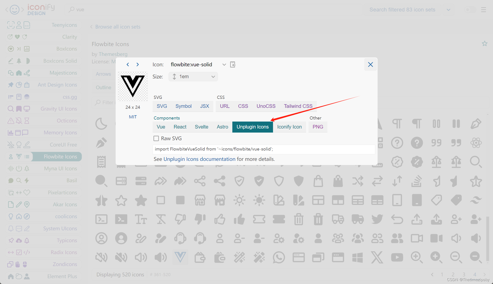
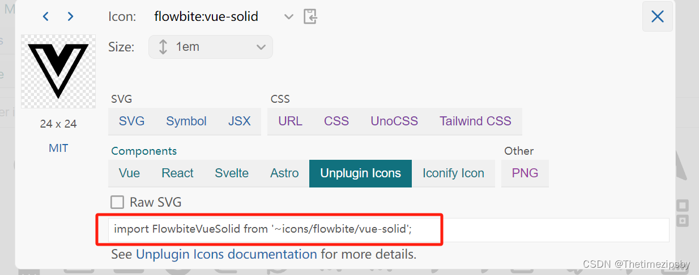

# 前言

iconify.design 是一个超过20万个开源矢量图标库。
官网 👉 [https://iconify.design/（英）](https://iconify.design/)
官网图标集 👉 [https://icon-sets.iconify.design/](https://icon-sets.iconify.design/)

# 安装

安装图标相关包 这里使用pnpm

```bash
pnpm add -D @iconify/iconify @iconify/json unplugin-icons/vite
```

# 配置vite.config

```javascript
import Icons from 'unplugin-icons/vite'
// ...


export default ({ mode, command }) => {
  // const env = loadEnv(mode, process.cwd())
  return defineConfig({
   // ...
    plugins: [
      // ...
      Icons({}),
      // ...
    ],
    // ...
}
```

# 在图标集中选择图标使用

搜索 只支持英文

1. 找到对应图标选择自动导入


2. 复制下面代码

3. 在项目中引入使用

 ```javascript
 <script setup>
 import FlowbiteVueSolid from '~icons/flowbite/vue-solid';
 
 </script>
 
 <template>
   <FlowbiteVueSolid color="#f00" width="100" height="100"/>
 </template>
 ```

4. 结果


><font color=red size=4>将电脑网络关闭刷新页面也可以正常显示

# 归纳整理项目图标

创建**全局组件 Icon.vue**

Icon.vue

```javascript
<template>
  <component :is="iconCom"></component>
</template>
<script setup>
import FlowbiteVueSolid from '~icons/flowbite/vue-solid'
import WpfPanorama from '~icons/wpf/panorama'
// ...


const props = defineProps({
  icon: {
    type: String
  }
})

const iconCom = shallowRef(null)
onMounted(() => {
  switch (props.icon) {
    case 'flowbite:vue-solid':
      iconCom.value = FlowbiteVueSolid
      break
    case 'simple-icons:insta360':
      iconCom.value = SimpleIconsInsta360
      break
    // ...
    default:
      console.error(`${props.icon}需要到 src/components/Icon.vue 中配置改图标`)
      break
  }
})
</script>
```

使用

```html
<Icon color="#f00" width="100" height="100"/>
```

<br/><br/>

**！！！如有更好的归纳方式和方案，欢迎在下面评论！！！**

<br/><br/><br/><br/>
**到这里就结束了，后续还会更新 前端 系列相关，还请持续关注！**
**感谢阅读，若有错误可以在下方评论区留言哦！！！**


