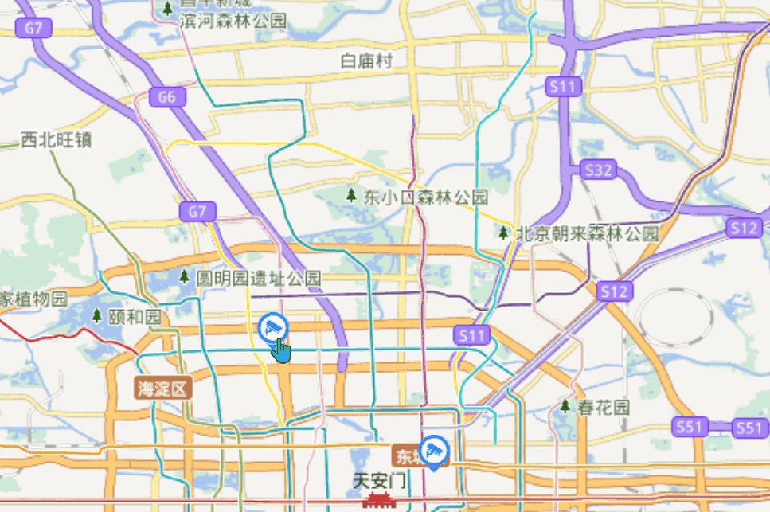

>无人扶我青云志，我自踏雪至山巅

>作者GitHub：[https://github.com/gitboyzcf](https://github.com/gitboyzcf)  有兴趣可关注！！！
>

## 目录

## 效果图



## 准备

[天地图](https://www.tianditu.gov.cn/) 国家地理信息公共服务平台（天地图），开发需要[申请key](https://console.tianditu.gov.cn/api/key)
[OpenLayers](https://github.com/openlayers/openlayers?tab=readme-ov-file#openlayers) 是一个高性能、功能丰富的库，用于在 Web 上创建交互式地图。它可以在任何网页上显示从任何来源加载的地图图块。

```bash
pnpm install ol
```

去[iconfont](https://www.iconfont.cn/search/index?searchType=icon&q=%E8%A7%86%E9%A2%91%E7%82%B9%E4%BD%8D)网站中下载点位图标，方便下面使用

## 代码实现

`Map.vue`组件

```html
<template>
  <div id="Map" ref="mapCon"></div>
  <VideoDialog ref="videoDialogRef" :map="map" :point-data="pointData" />
</template>

<script lang="ts" setup>
  import 'ol/ol.css';
  import { ref, onMounted } from 'vue';
  import { Map, View } from 'ol';
  import TileLayer from 'ol/layer/Tile';
  import XYZ from 'ol/source/XYZ';
  import { get } from 'ol/proj';
  import {
    defaults as Defaults,
    ScaleLine,
    FullScreen,
    ZoomSlider,
    // MousePosition,
  } from 'ol/control';
  // 显示一个小icon、多边形、线之类的需要使用矢量对象Feature;
  import Feature from 'ol/Feature';
  import Point from 'ol/geom/Point';
  import { vector, source } from './feature';
  import { Vector as VectorLayer } from 'ol/layer';
  import { Vector as VectorSource } from 'ol/source';
  import { Style, Icon } from 'ol/style';
  // 点位图标
  import position from '@/assets/images/position-icon.png';
  // 弹窗
  import VideoDialog from './videoDialog.vue';


  const videoDialogRef = ref();
  const mapCon = ref();
  const token = '你自己申请的key';
  const projection = get('EPSG:4326');

  const map = ref();
  const pointData = ref({});
 
 

  const initMap = () => {
    const tdtVectorLayer = new TileLayer({
      title: '天地图矢量图层',
      source: new XYZ({
        url: `http://t0.tianditu.gov.cn/vec_c/wmts?SERVICE=WMTS&REQUEST=GetTile&VERSION=1.0.0&LAYER=vec&STYLE=default&TILEMATRIXSET=c&FORMAT=tiles&TILEMATRIX={z}&TILEROW={y}&TILECOL={x}&tk=${token}`,
        projection,
      }),
    });
    const tdtVectorLabelLayer = new TileLayer({
      title: '天地图矢量注记图层',
      source: new XYZ({
        url: `http://t0.tianditu.gov.cn/cva_c/wmts?SERVICE=WMTS&REQUEST=GetTile&VERSION=1.0.0&LAYER=cva&STYLE=default&TILEMATRIXSET=c&FORMAT=tiles&TILEMATRIX={z}&TILEROW={y}&TILECOL={x}&tk=${token}`,
        projection,
      }),
    });
    const view = new View({
      center: [116.406393, 39.909006],
      projection,
      zoom: 12,
      maxZoom: 17,
      minZoom: 4,
    });
    map.value = new Map({
      layers: [tdtVectorLayer, tdtVectorLabelLayer],
      target: mapCon.value,
      view,
      controls: Defaults({ zoom: true }).extend([
        new ScaleLine({
          className: 'ol-scale-line custom-zoom-line',
        }),
        new ZoomSlider(),
        new FullScreen(),
        // new MousePosition({
        //   coordinateFormat(coordinate) {
        //     return `东经${coordinate?.[0]} 北纬${coordinate?.[1]}`;
        //   },
        // }),
      ]),
    });
    // 矢量源
 const source = new VectorSource({
   features: [],
 });
 // 矢量图层
    const vector = new VectorLayer({
   source,
   style: new Style({
     image: new Icon({
       anchor: [0.5, 1], // 显示位置
       size: [32, 32], // 尺寸
       src: position, // 图片url
     }),
   }),
 });
    // 模拟接口
 setTimeout(() => {
    // 点位数据
    const points = [
      [116.34281566666665, 39.9748055],
      [116.416393, 39.919006]
    ]
    points.forEach(item => {
   const feature = new Feature({
             geometry: new Point(item), // 地理几何图形选用点几何
         });

   // 存入当前点位信息 弹窗内部根据点位去判断点击的哪个点
         const key = feature?.getGeometry()?.getCoordinates().join(',') || '';
         pointData.value[key] = item;
         source.addFeatures([feature]);
       })
    }, 10000)
    map.value.addLayer(vector);

    videoDialogRef.value.addOverlay(map.value);
    videoDialogRef.value.singleclick(map.value);
    videoDialogRef.value.pointermove(map.value);
  };
  onMounted(() => {
    initMap();
  });
</script>

<style scoped lang="scss">
  .container {
    height: 100%;
    #Map {
      height: 100%;
    }
  }
</style>

```

`VideoDialog.vue`组件

```html
<template>
  <div ref="popupRef" class="popup">
    <transition name="fade">
      <div v-if="shopPopup" class="popup-content">
        <div v-if="loading" class="loading"><span>加载中...</span></div>
        <video style="width: 100%; height: 100%" autoplay muted poster loop
          ><source
            src="https://interactive-examples.mdn.mozilla.net/media/cc0-videos/flower.webm"
            type="video/webm"
          />

          <source
            src="https://interactive-examples.mdn.mozilla.net/media/cc0-videos/flower.mp4"
            type="video/mp4"
          />

          Download the
          <a href="/media/cc0-videos/flower.webm">WEBM</a>
          or
          <a href="/media/cc0-videos/flower.mp4">MP4</a>
          video.
        </video>
        <!-- 关闭按钮 -->
        <div class="popup-close" @click="shopPopup = false">
          <svg
            t="1729667484813"
            class="icon"
            viewBox="0 0 1026 1024"
            version="1.1"
            xmlns="http://www.w3.org/2000/svg"
            p-id="7739"
            width="25"
            height="25"
          >
            <path
              d="M603.52 512l274.56-274.56a64 64 0 0 0 16.64-64 64 64 0 0 0-45.44-45.44 64 64 0 0 0-64 16.64L512 421.76l-273.28-275.2a64 64 0 0 0-90.88 90.88L423.04 512l-275.2 274.56a64 64 0 0 0 0 90.24A64 64 0 0 0 192 896a64 64 0 0 0 45.44-19.2L512 602.24l275.2 274.56a64 64 0 0 0 44.8 19.2 64 64 0 0 0 45.44-109.44L603.52 512z"
              fill="#445365"
              p-id="7740"
            ></path>
          </svg>
        </div>
      </div>
    </transition>
  </div>
</template>

<script setup lang="ts">
  import { Overlay } from 'ol';
  import { ref, nextTick, watch } from 'vue';
  import useWorker from '@/assets/js/video-lib/omnimatrix-video-player';
  import { useAppStore } from '@/store';
  import { getPreview } from '@/api/system';

  const app = useAppStore();
  const props = defineProps({
    map: Object,
    pointData: Object,
  });
  const shopPopup = ref(false);
  const popupRef = ref();
  const popupOverlay = ref();
  const loading = ref(false);
  const addOverlay = (map: any) => {
    // 创建Overlay
    popupOverlay.value = new Overlay({
      element: popupRef.value,
      positioning: 'bottom-center',
      stopEvent: false,
      offset: [0, -40],
    });
    map.addOverlay(popupOverlay.value);
  };
  const singleclick = (map: any) => {
    // 点击
    map.on('click', async (e: any) => {
      e.stopPropagation();

      // 判断是否点击在点上
      const feature = map.forEachFeatureAtPixel(e.pixel, (f) => f);
      if (feature) {
        shopPopup.value = true;
        loading.value = true;
        // 设置弹窗位置
        const coordinates = feature.getGeometry().getCoordinates();
        // 获取刚刚存入的点位信息
        const data = props.pointData?.[coordinates.join(',')];
     const video = document.querySelector("video");
     video.addEventListener("loadeddata", (event) => {
       loading.value = false;
       console.log(
         "Yay! readyState just increased to  " +
           "HAVE_CURRENT_DATA or greater for first time.",
       );
     }); 
        popupOverlay.value.setPosition(coordinates);
      }
    });
  };
  const pointermove = (map: any) => {
    map.on('pointermove', (e: any) => {
      if (props.map?.hasFeatureAtPixel(e.pixel)) {
        map.getViewport().style.cursor = 'pointer';
      } else {
        map.getViewport().style.cursor = 'inherit';
      }
    });
  };

  watch(shopPopup, (newV) => {
    if (!newV) {
      workerObj.value?.close();
    }
  });

  defineExpose({
    addOverlay,
    singleclick,
    pointermove,
  });
</script>

<style lang="scss" scoped>
  /* we will explain what these classes do next! */
  .fade-enter-active,
  .fade-leave-active {
    transition: opacity 0.5s ease;
  }

  .fade-enter-from,
  .fade-leave-to {
    opacity: 0;
  }
  .popup {
    width: 400px;
    aspect-ratio: 16/9;
    transition: all 0.5s;
    position: relative;
    color: #fff;
    font-size: 18px;
    .popup-content {
      width: 100%;
      height: 100%;
      display: flex;
      justify-content: center;
      align-items: center;
      background-color: #2e2a58;
    }
    .loading {
      position: absolute;
      top: 0;
      width: 100%;
      height: 100%;
      display: flex;
      justify-content: center;
      align-items: center;
    }
    &-close {
      position: absolute;
      top: 15px;
      right: 15px;
      cursor: pointer;
      color: #2f23da;
    }
  }
</style>

```

<br/><br/><br/><br/>
**到这里就结束了，后续还会更新 前端 系列相关，还请持续关注！**
**感谢阅读，若有错误可以在下方评论区留言哦！！！**


<br/><br/>

**推荐文章**👇

[Vue3-Composition API 快速上手（简单易懂）](https://blog.csdn.net/qq_43775179/article/details/121855938)
