>无人扶我青云志，我自踏雪至山巅

>作者GitHub：[https://github.com/gitboyzcf](https://github.com/gitboyzcf)  有兴趣可关注！！！
>

## 目录

# 特色

- ⚡️ [Vue 3](https://github.com/vuejs/core)、 [Vite 5](https://vite.dev/)、[pnpm](https://pnpm.io/)

- 📦 [组件自动化引入](https://github.com/unplugin/unplugin-vue-components)

- 🍍 [使用 Pinia 的状态管理](https://pinia.vuejs.org)

- 🌈 [Primevue](https://primevue.org/) - Vue.js UI 套件，提高开发效率

- 🎨 [UnoCSS](https://github.com/unocss/unocss) - 高性能且极具灵活性的即时原子化 CSS 引擎

- 😃 [各种图标集为你所用](https://icon-sets.iconify.design/)

- 🔥 使用 [新的 `<script setup>` 语法](https://github.com/vuejs/rfcs/pull/227)

- 📥 [API 自动加载](https://github.com/unplugin/unplugin-auto-import) - 直接使用 Composition API 无需引入

- 🌍 [API 采用模块化自动导入方式](https://blog.csdn.net/qq_43775179/article/details/134811292) 根据demo.js文件设置接口，以API_xxx_method的方式命名，在请求时无需导入 直接使用useRequest()函数返回参数以解构的方式获取，拿到即为写入的接口

- 💥 [Oxlint](https://oxc.rs/docs/guide/usage/linter.html)（英）+ [ESLint](https://eslint.org/)（英） - 双管齐下，享受高速度、强检查的代码格式化效果
- 🐶 [husky](https://typicode.github.io/husky/zh/) + [lint-staged](https://github.com/lint-staged/lint-staged?tab=readme-ov-file#-lint-staged) - Git提交自动检测格式化代码，解放双手
- 🎢 无TS，释放你的野性

# 进入正题

*node版本必须是 `>=18.18.0`*

## 创建基础模板

```bash
pnpm create vite my-vue-app --template vue
```

详细请看➡️[https://cn.vitejs.dev/guide/#scaffolding-your-first-vite-project](https://cn.vitejs.dev/guide/#scaffolding-your-first-vite-project)

得到以下目录结构⬇️
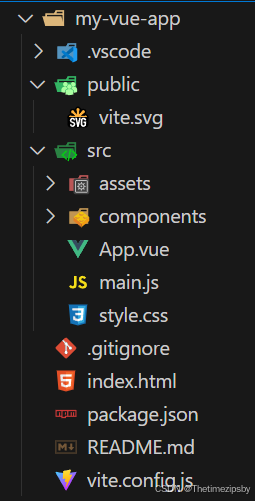

## 配置API自动化导入

**安装依赖**

```bash
pnpm i unplugin-auto-import -D
```

**在vite.config.js中配置**

```javascript
import { defineConfig } from 'vite'
import vue from '@vitejs/plugin-vue'
import AutoImport from 'unplugin-auto-import/vite'

// https://vite.dev/config/
export default defineConfig({
  plugins: [
   vue(),
   AutoImport({
        imports: [
          'vue',
          'vue-router',
          'pinia',
          '@vueuse/core',
          // 自动导入 自定义函数
          // {
           // '@/api': ['useRequest']
          // },
        ],
        eslintrc: {
          enabled: true, // Default `false`  启动项目后 会在根目录下生成 eslintrc-auto-import.json文件 生成后可改为false 避免每次生成 慢 
          filepath: './.eslintrc-auto-import.json', // Default `./.eslintrc-auto-import.json`
          globalsPropValue: true // Default `true`, (true | false | 'readonly' | 'readable' | 'writable' | 'writeable')
        }
      }),
  ],
})

```

此时在`App.vue`中不用引入直接可以使用Vue的api

```html
<script setup>
  const title = ref('Hello World!')
</script>
```

## 配置组件自动化导入

**安装依赖**

```bash
pnpm i unplugin-vue-components -D
```

**在vite.config.js中配置**

```javascript
import { defineConfig } from 'vite'
import vue from '@vitejs/plugin-vue'
import Components from 'unplugin-vue-components/vite'

// https://vite.dev/config/
export default defineConfig({
  plugins: [
   vue(),
   Components({
        dirs: ['src/components'],
        dts: false,
        resolvers: [],
        include: [/\.vue$/, /\.vue\?vue/, /\.jsx$/]
      }),
  ],
})

```

`src/components`下新建 的组件 ，此时在`App.vue`中不用引入直接可以使用
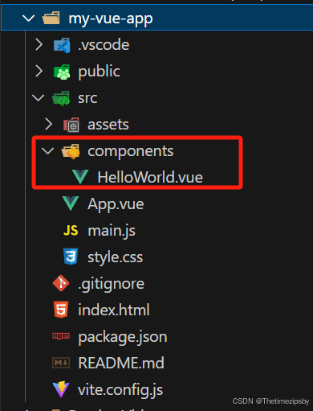

```html
<template>
  <div>
    <HelloWorld msg="Hello Vue 3.0 + Vite" />
  </div>
</template>

<script setup></script>
```

## 配置UnoCss

**安装依赖**

```bash
pnpm i unocss -D
```

**直接插入以下代码**⬇️（没有对应文件的自行创建）

`unocss.config.js`

```javascript
import {
  defineConfig,
  presetAttributify,
  presetIcons,
  presetTypography,
  presetUno,
  presetWebFonts,
  transformerDirectives,
  transformerVariantGroup
} from 'unocss'

// https://unocss.dev/guide/config-file
export default defineConfig({
  shortcuts: [
    // ...
  ],
  theme: {
    colors: {
      // ...
    }
  },
  presets: [
    presetUno(),
    presetAttributify(),
    presetIcons(),
    presetTypography(),
    presetWebFonts({
      fonts: {
        // ...
      }
    })
  ],
  transformers: [transformerDirectives(), transformerVariantGroup()]
})
```

**在main.js中引入样式**

```javascript
import { createApp } from 'vue'
import App from './App.vue'

import './style.css'
import 'virtual:uno.css'

async function bootstrap() {
  const app = createApp(App)
  app.mount('#app')
}
bootstrap()
```

**在vite.config.js中配置**

```javascript
import { defineConfig } from 'vite'
import vue from '@vitejs/plugin-vue'
import Unocss from 'unocss/vite'

// https://vite.dev/config/
export default defineConfig({
  plugins: [
   vue(),
   // ...
   Unocss({}),
   // ...
  ],
})

```

## 接入Primevue

**安装依赖**

```bash
pnpm add primevue @primevue/themes
```

**在main.js中配置**

```javascript

import { createApp } from 'vue'
import App from './App.vue'
import PrimeVue from 'primevue/config' // +
import Nora from '@primevue/themes/nora' // +

import './style.css'
import 'virtual:uno.css'

async function bootstrap() {
  const app = createApp(App)
  // +
  app.use(PrimeVue, { 
    theme: {
      preset: Nora
    }
  })

  app.mount('#app')
}
bootstrap()
```

**在vite.config.js中配置组件自动导入**

```javascript
import { defineConfig } from 'vite'
import vue from '@vitejs/plugin-vue'
import Components from 'unplugin-vue-components/vite'
import { PrimeVueResolver } from '@primevue/auto-import-resolver' // +

// https://vite.dev/config/
export default defineConfig({
  plugins: [
   vue(),
   Components({
        dirs: ['src/components'],
        dts: false,
        resolvers: [PrimeVueResolver()], // +
        include: [/\.vue$/, /\.vue\?vue/, /\.jsx$/]
      }),
  ],
})
```

**此时在`App.vue`中不用引入直接可以使用**

```html
<!-- https://primevue.org/button/#severity -->
<div class="card flex justify-center flex-wrap gap-4">
  <Button label="Primary" />
  <Button label="Secondary" severity="secondary" />
  <Button label="Success" severity="success" />
  <Button label="Info" severity="info" />
  <Button label="Warn" severity="warn" />
  <Button label="Help" severity="help" />
  <Button label="Danger" severity="danger" />
  <Button label="Contrast" severity="contrast" />
</div>
```


*更多组件请看➡️ [https://primevue.org/button/](https://primevue.org/button/)*

## 接入VueRouter4

[https://router.vuejs.org/zh/](https://router.vuejs.org/zh/)

**安装依赖**

```bash
pnpm i vue-router@4
```

**创建以下文件夹以及文件**
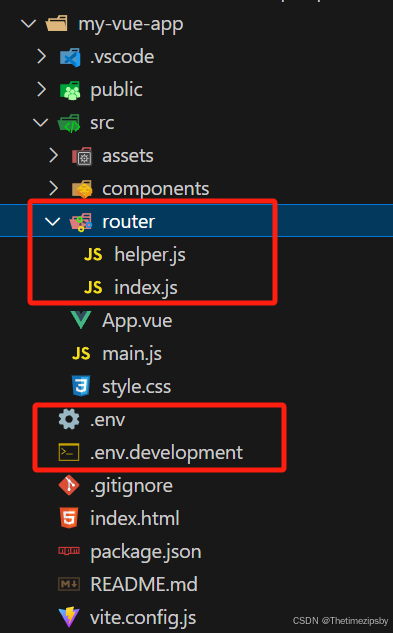

**直接插入以下代码**⬇️

`helper.js`

```javascript
/**
 * 设置页面标题
 * @param {Object} to 路由对象
 */
export const usePageTitle = (to) => {
  const projectTitle = import.meta.env.VITE_APP_TITLE
  const rawTitle = normalizeTitle(to.meta.title)
  const title = useTitle()
  title.value = rawTitle ? `${projectTitle} | ${rawTitle}` : projectTitle
  function normalizeTitle(raw) {
    return typeof raw === 'function' ? raw() : raw
  }
}
```

`index.js`

```javascript
import { createRouter, createWebHashHistory } from 'vue-router'
import { usePageTitle } from './helper'

// const whiteList = ['/login'] // 白名单
const router = createRouter({
  history: createWebHashHistory(import.meta.env.BASE_URL),
  routes: [
    {
      path: '/',
      name: 'Test',
      // 注意： 此组件自行创建引入！！！！！！！！！
      component: () => import('@/views/demo/index.vue'),
      meta: {
        title: '测试'
      }
    },
    {
      path: '/:pathMatch(.*)*',
      // 注意： 此组件自行创建引入！！！！！！！！！
      component: () => import('@/views/system/404/404.vue'),
      meta: {
        title: '找不到页面'
      }
    }
  ]
})

router.beforeEach((to, from, next) => {
  usePageTitle(to)
  next()
})

async function setupRouter(app) {
  app.use(router)
}

export { setupRouter }
```

### 配置项目全局环境变量

具体请看 ➡️[https://vite.dev/guide/env-and-mode.html#env-files](https://vite.dev/guide/env-and-mode.html#env-files)

`.env`

```bash
# 生产环境

# 页面名称
VITE_APP_TITLE = 演示项目

# 项目localStorage存储前缀
VITE_APP_PREFIX = demo

# 网络请求  -- 根据项目需求更改    下面⬇️配置axios需要用到
VITE_APP_API_BASEURL = /
```

`.env.development`

```bash
# 本地环境（开发环境）

# 页面名称
VITE_APP_TITLE = 演示项目

# 项目localStorage存储前缀
VITE_APP_PREFIX = demo

# 网络请求    -- 根据项目需求更改    下面⬇️配置axios需要用到
VITE_APP_API_BASEURL = /


```

**在main.js中引入**

```javascript

import { createApp } from 'vue'
import App from './App.vue'
import PrimeVue from 'primevue/config'
import Nora from '@primevue/themes/nora'
import { setupRouter } from './router' // +

import './style.css'
import 'virtual:uno.css'

async function bootstrap() {
  const app = createApp(App)

  app.use(PrimeVue, {
    theme: {
      preset: Nora
    }
  })

  await setupRouter(app) // +

  app.mount('#app')
}
bootstrap()
```

## 封装Axios

[Vite4、Vue3、Axios 针对请求模块化封装搭配自动化导入（简单易用）](https://blog.csdn.net/qq_43775179/article/details/134811292)

## 接入Pinia状态管理

**安装依赖**

```bash
pnpm i pinia
```

**创建以下文件夹以及文件**
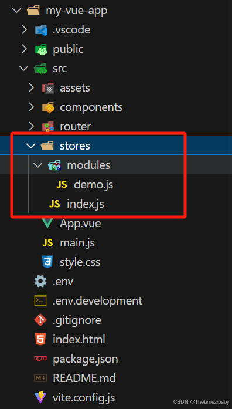

**直接插入以下代码**⬇️

`index.js`

```javascript
import { createPinia } from 'pinia'
export const piniaStore = createPinia()
export function setupStore(app) {
  app.use(piniaStore)
}
```

`demo.js`

```javascript
import { piniaStore } from '@/stores'
export const useCounterStore = defineStore('counter', () => {
  const count = ref(0)
  const doubleCount = computed(() => count.value * 2)
  function increment() {
    count.value++
  }

  return { count, doubleCount, increment }
})

export function useOutsideCounterStore() {
  return useCounterStore(piniaStore)
}
```

## 接入Prerttier + OXLint + ESLint

**安装依赖**

```bash
pnpm i oxlint prettier eslint-plugin-oxlint eslint-plugin-prettier -D
```

**安装并配置ESLint**

```bash
pnpm create @eslint/config@latest
```

根据响应提示选择，以下是我的选择⬇️

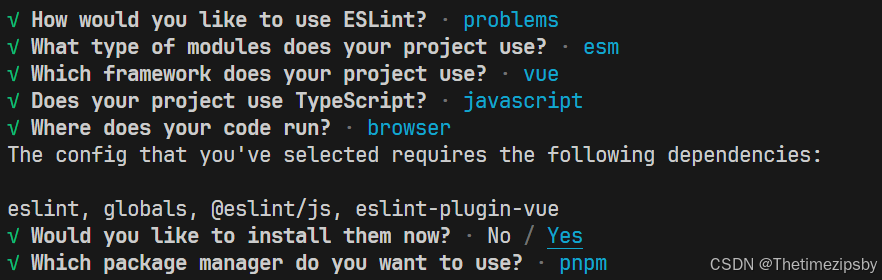
执行完后会自动创建`eslint.config.js`配置文件，以及对应依赖包🤩

**直接插入以下代码**⬇️（没有对应文件的自行创建）

`eslint.config.js`

```javascript
import path from 'path'
import globals from 'globals'
import pluginJs from '@eslint/js'
import pluginVue from 'eslint-plugin-vue'
import VueEslintParser from 'vue-eslint-parser'
import prettier from 'eslint-plugin-prettier'
import oxlint from 'eslint-plugin-oxlint'
import { FlatCompat } from '@eslint/eslintrc'
import { fileURLToPath } from 'url'

const __filename = fileURLToPath(import.meta.url)
const __dirname = path.dirname(__filename)

const compat = new FlatCompat({
  baseDirectory: __dirname
})

/** @type {import('eslint').Linter.Config[]} */
export default [
  {
    files: ['**/*.{js,mjs,cjs,vue}']
  },
  {
    languageOptions: {
      globals: {
        ...globals.browser,
        ...globals.node
      },
      parser: VueEslintParser
    }
  },
  /** js推荐配置 */
  pluginJs.configs.recommended,
  /** vue推荐配置 */
  ...pluginVue.configs['flat/essential'],
  /** 继承自动导入配置 */
  ...compat.extends('./.eslintrc-auto-import.json'),
  /** oxlint推荐配置 */
  oxlint.configs['flat/recommended'],
  /** 自定义eslint配置 */
  {
    rules: {
      'no-var': 'error', // 要求使用 let 或 const 而不是 var
      'no-multiple-empty-lines': ['warn', { max: 1 }], // 不允许多个空行
      'no-unexpected-multiline': 'error', // 禁止空余的多行
      'no-useless-escape': 'off', // 禁止不必要的转义字符

      'vue/multi-word-component-names': 0
    }
  },
  /**
   * prettier 配置
   * 会合并根目录下的prettier.config.js 文件
   * @see https://prettier.io/docs/en/options
   * https://github.com/prettier/eslint-plugin-prettier/issues/634
   */
  {
    plugins: {
      prettier
    },
    rules: {
      ...prettier.configs.recommended.rules
    }
  },
  // 忽略文件
  {
    ignores: [
      '**/dist',
      './src/main.ts',
      '.vscode',
      '.idea',
      '*.sh',
      '**/node_modules',
      '*.md',
      '*.woff',
      '*.woff',
      '*.ttf',
      'yarn.lock',
      'package-lock.json',
      '/public',
      '/docs',
      '**/output',
      '.husky',
      '.local',
      '/bin',
      'Dockerfile'
    ]
  }
]
```

`prettier.config.js`

```javascript
export default {
  // 一行的字符数，如果超过会进行换行，默认为80，官方建议设100-120其中一个数
  printWidth: 100,
  // 一个tab代表几个空格数，默认就是2
  tabWidth: 2,
  // 启用tab取代空格符缩进，默认为false
  useTabs: false,
  // 行尾是否使用分号，默认为true(添加理由:更加容易复制添加数据,不用去管理尾行)
  semi: false,
  vueIndentScriptAndStyle: true,
  // 字符串是否使用单引号，默认为false，即使用双引号，建议设true，即单引号
  singleQuote: true,
  // 给对象里的属性名是否要加上引号，默认为as-needed，即根据需要决定，如果不加引号会报错则加，否则不加
  quoteProps: 'as-needed',
  // 是否使用尾逗号，有三个可选值"<none|es5|all>"
  trailingComma: 'none',
  // 在jsx里是否使用单引号，你看着办
  jsxSingleQuote: true,
  // 对象大括号直接是否有空格，默认为true，效果：{ foo: bar }
  bracketSpacing: true,
  proseWrap: 'never',
  htmlWhitespaceSensitivity: 'strict',
  endOfLine: 'auto'
}
```

`.editorconfig`

```bash
# 顶层editorconfig文件标识
root = true

########## 针对所有文件适用的规则 ##########
[*]
# 编码格式
charset = utf-8
# 缩进符使用的风格 （tab ｜ space）
indent_style = space
# 缩进大小
indent_size = 2
# 控制换行类型(lf | cr | crlf)
end_of_line = lf
# 文件最后添加空行
insert_final_newline = true
# 行开始是不是清除空格
trim_trailing_whitespace = true

############# 针对md的规则 ###############
[*.md]
trim_trailing_whitespace = false
```

**配置package.json文件**

```json
"scripts": {
  "dev": "vite --host",
  "build": "vite build",
  "preview": "vite preview",
  "lint": "oxlint && eslint", 
  "lint:fix": "oxlint --fix && eslint --fix"
},
```

此时终端中执行 `pnpm lint` 或者 `pnpm lint:fix` 就会检测并修复代码 🤩

检测结果以 oxlint形式展现⬇️
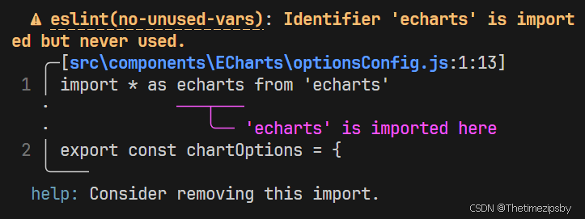

## 接入 husky + lint-staged（可选）

**安装依赖**

```bash
pnpm i husky lint-staged -D
```

执行 `pnpm exec husky init` 并且在 **package.json**的 **scripts**里面增加 `"prepare": "husky init"`,（其他人安装后会自动执行） 根目录会生成 .hushy 文件夹。

**直接插入以下代码**⬇️（没有对应文件的自行创建）

`lint-staged.config.js`

```javascript
export default {
  '**/*.{html,vue,ts,cjs,json,md}': ['prettier --write'],
  '**/*.{js,mjs,cjs,jsx,ts,mts,cts,tsx,vue,astro,svelte}': ['oxlint --fix && eslint --fix']
}
```

通过下面命令在钩子文件中添加内容⬇️

```bash
echo "npx --no-install -- lint-staged" > .husky/pre-commit
echo "npx --no-install commitlint --edit $1" > .husky/commit-msg
```

>**注意⚠️⚠️⚠️** ：
> 上面命令钩子不会执行 当进行git提交时会出现下面问题⬇️
> 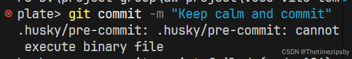
> 说是无法执行这个二进制文件 ，解决方案如下⬇️
> 在vscode编辑器底部操作栏 会显示当前文件编码格式 默认为➡️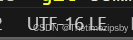
> 点击后选择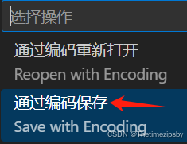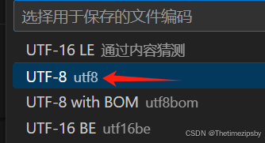
> 然后再次执行git提交命令就可以了🤙

## 接入commitizen + commitlint + cz-git（可选）

**安装依赖**

```bash
pnpm i commitizen commitlint @commitlint/cli @commitlint/config-conventional cz-git -D
```

 [commitizen](https://github.com/commitizen/cz-cli) 基于Node.js的 git commit 命令行工具，辅助生成标准化规范化的 commit message

[committlint](https://github.com/conventional-changelog/commitlint#config) 检查你的提交消息是否符合常规的提交格式。

 [cz-git](https://cz-git.qbb.sh/zh/) 标准输出格式的 commitizen 适配器

**直接插入以下代码**⬇️（没有对应文件的自行创建）

`commitlint.config.js`

```javascript
/** @type { import('cz-git').UserConfig } */
export default {
  extends: ['@commitlint/config-conventional'],
  rules: {
    'type-enum': [
      2,
      'always',
      [
        'feat',
        'fix',
        'perf',
        'style',
        'docs',
        'test',
        'refactor',
        'build',
        'ci',
        'init',
        'chore',
        'revert',
        'wip',
        'workflow',
        'types',
        'release'
      ]
    ],
    'subject-case': [0]
  },
  prompt: {
    alias: { fd: 'docs: fix typos' },
    messages: {
      type: '选择你要提交的类型 :',
      scope: '选择一个提交范围（可选）:',
      customScope: '请输入自定义的提交范围 :',
      subject: '填写简短精炼的变更描述 :\n',
      body: '填写更加详细的变更描述（可选）。使用 "|" 换行 :\n',
      breaking: '列举非兼容性重大的变更（可选）。使用 "|" 换行 :\n',
      footerPrefixesSelect: '选择关联issue前缀（可选）:',
      customFooterPrefix: '输入自定义issue前缀 :',
      footer: '列举关联issue (可选) 例如: #31, #I3244 :\n',
      confirmCommit: '是否提交或修改commit ?'
    },
    types: [
      { value: 'feat', name: 'feat:  🤩 新增功能 | A new feature', emoji: ':sparkles:' },
      { value: 'fix', name: 'fix:   🐛 修复缺陷 | A bug fix', emoji: ':bug:' },
      { value: 'docs', name: 'docs:  📝 文档更新 | Documentation only changes', emoji: ':memo:' },
      {
        value: 'style',
        name: 'style: 🎨 代码格式 | Changes that do not affect the meaning of the code',
        emoji: ':lipstick:'
      },
      {
        value: 'refactor',
        name: 'refactor:  ♻️  代码重构 | A code change that neither fixes a bug nor adds a feature',
        emoji: ':recycle:'
      },
      {
        value: 'perf',
        name: 'perf:  ⚡ 性能提升 | A code change that improves performance',
        emoji: ':zap:'
      },
      {
        value: 'test',
        name: 'test:  ✅ 测试相关 | Adding missing tests or correcting existing tests',
        emoji: ':white_check_mark:'
      },
      {
        value: 'build',
        name: 'build:  📦️ 构建相关 | Changes that affect the build system or external dependencies',
        emoji: ':package:'
      },
      {
        value: 'ci',
        name: 'ci:  🎡 持续集成 | Changes to our CI configuration files and scripts',
        emoji: ':ferris_wheel:'
      },
      { value: 'revert', name: 'revert:  ⏪️ 回退代码 | Revert to a commit', emoji: ':rewind:' },
      {
        value: 'chore',
        name: 'chore:  🔨 其他修改 | Other changes that do not modify src or test files',
        emoji: ':hammer:'
      }
    ],
    useEmoji: true,
    emojiAlign: 'center',
    useAI: false,
    aiNumber: 1,
    themeColorCode: '',
    scopes: [],
    allowCustomScopes: true,
    allowEmptyScopes: true,
    customScopesAlign: 'bottom',
    customScopesAlias: 'custom',
    emptyScopesAlias: 'empty',
    upperCaseSubject: false,
    markBreakingChangeMode: false,
    allowBreakingChanges: ['feat', 'fix'],
    breaklineNumber: 100,
    breaklineChar: '|',
    skipQuestions: [],
    issuePrefixes: [
      // 如果使用 gitee 作为开发管理
      { value: 'link', name: 'link:     链接 ISSUES 进行中' },
      { value: 'closed', name: 'closed:   标记 ISSUES 已完成' }
    ],
    customIssuePrefixAlign: 'top',
    emptyIssuePrefixAlias: 'skip',
    customIssuePrefixAlias: 'custom',
    allowCustomIssuePrefix: true,
    allowEmptyIssuePrefix: true,
    confirmColorize: true,
    scopeOverrides: undefined,
    defaultBody: '',
    defaultIssues: '',
    defaultScope: '',
    defaultSubject: ''
  }
}
```

**配置package.json文件**

```json
"scripts": {
  "dev": "vite --host",
  "build": "vite build",
  "preview": "vite preview",
  "lint": "oxlint && eslint", 
  "lint:fix": "oxlint --fix && eslint --fix",
  "cz": "git-cz"
},
"config": {
   "commitizen": {
     "path": "node_modules/cz-git"
   }
 }
```

### 测试

在终端命令行中输入⬇️

```bash
git add .

pnpm cz
```

然后会出现本次git提交选项
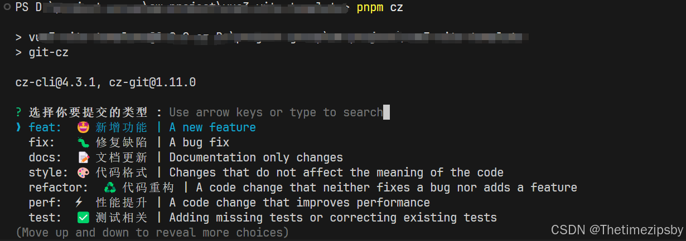

根据需求选择

`ctrl + c`  终止当前提交
`Enter` 下一步操作

# 模板

拉取后 **开箱即用** 模板地址➡️  [https://github.com/gitboyzcf/vue3-vite-template](https://github.com/gitboyzcf/vue3-vite-template)

# 样例

此模板开发大屏模板样例➡️ [https://github.com/gitboyzcf/vue3-simple-screen](https://github.com/gitboyzcf/vue3-simple-screen)


# 敬请期待

后续还会有**新功能**接入当前模板，敬请期待......

<br/><br/><br/><br/>
**到这里就结束了，后续还会更新 前端 系列相关，还请持续关注！**
**感谢阅读，若有错误可以在下方评论区留言哦！！！**


<br/><br/>

**推荐文章**👇

[Eslint 会被 Oxlint 干掉吗？](https://juejin.cn/post/7312374060435030053)
[uniapp-vue3-vite 搭建小程序、H5 项目模板](https://juejin.cn/post/7391746098682527782)
