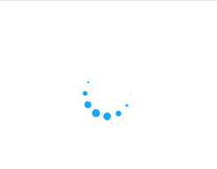
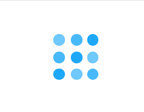
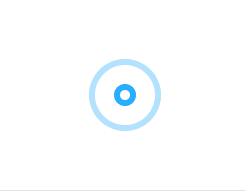
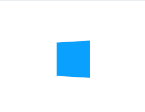
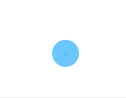
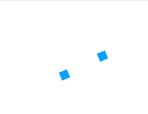
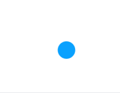
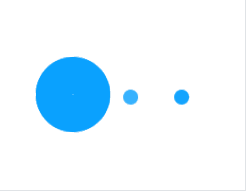
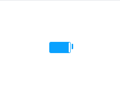
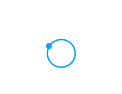

# Loading1



```html
<div class="sk-circle">
 <div class="sk-circle1 sk-child"></div>
 <div class="sk-circle2 sk-child"></div>
 <div class="sk-circle3 sk-child"></div>
 <div class="sk-circle4 sk-child"></div>
 <div class="sk-circle5 sk-child"></div>
 <div class="sk-circle6 sk-child"></div>
 <div class="sk-circle7 sk-child"></div>
 <div class="sk-circle8 sk-child"></div>
 <div class="sk-circle9 sk-child"></div>
 <div class="sk-circle10 sk-child"></div>
 <div class="sk-circle11 sk-child"></div>
 <div class="sk-circle12 sk-child"></div>
</div>

<style>
.sk-circle {
 display: inline-block;
 width: 40px;
 height: 40px;
 position: relative;
}
.sk-circle .sk-child {
 width: 100%;
 height: 100%;
 position: absolute;
 left: 0;
 top: 0;
}
.sk-circle .sk-child:before {
 content: '';
 display: block;
 margin: 0 auto;
 width: 15%;
 height: 15%;
 background-color: #0AA1FF;
 border-radius: 100%;
 -webkit-animation: sk-circleBounceDelay 1.2s infinite ease-in-out both;
 animation: sk-circleBounceDelay 1.2s infinite ease-in-out both;
}
.sk-circle .sk-circle2 {
 -webkit-transform: rotate(30deg);
 -ms-transform: rotate(30deg);
 transform: rotate(30deg);
}
.sk-circle .sk-circle3 {
 -webkit-transform: rotate(60deg);
 -ms-transform: rotate(60deg);
 transform: rotate(60deg);
}
.sk-circle .sk-circle4 {
 -webkit-transform: rotate(90deg);
 -ms-transform: rotate(90deg);
 transform: rotate(90deg);
}
.sk-circle .sk-circle5 {
 -webkit-transform: rotate(120deg);
 -ms-transform: rotate(120deg);
 transform: rotate(120deg);
}
.sk-circle .sk-circle6 {
 -webkit-transform: rotate(150deg);
 -ms-transform: rotate(150deg);
 transform: rotate(150deg);
}
.sk-circle .sk-circle7 {
 -webkit-transform: rotate(180deg);
 -ms-transform: rotate(180deg);
 transform: rotate(180deg);
}
.sk-circle .sk-circle8 {
 -webkit-transform: rotate(210deg);
 -ms-transform: rotate(210deg);
 transform: rotate(210deg);
}
.sk-circle .sk-circle9 {
 -webkit-transform: rotate(240deg);
 -ms-transform: rotate(240deg);
 transform: rotate(240deg);
}
.sk-circle .sk-circle10 {
 -webkit-transform: rotate(270deg);
 -ms-transform: rotate(270deg);
 transform: rotate(270deg);
}
.sk-circle .sk-circle11 {
 -webkit-transform: rotate(300deg);
 -ms-transform: rotate(300deg);
 transform: rotate(300deg);
}
.sk-circle .sk-circle12 {
 -webkit-transform: rotate(330deg);
 -ms-transform: rotate(330deg);
 transform: rotate(330deg);
}
.sk-circle .sk-circle2:before {
 -webkit-animation-delay: -1.1s;
 animation-delay: -1.1s;
}
.sk-circle .sk-circle3:before {
 -webkit-animation-delay: -1s;
 animation-delay: -1s;
}
.sk-circle .sk-circle4:before {
 -webkit-animation-delay: -0.9s;
 animation-delay: -0.9s;
}
.sk-circle .sk-circle5:before {
 -webkit-animation-delay: -0.8s;
 animation-delay: -0.8s;
}
.sk-circle .sk-circle6:before {
 -webkit-animation-delay: -0.7s;
 animation-delay: -0.7s;
}
.sk-circle .sk-circle7:before {
 -webkit-animation-delay: -0.6s;
 animation-delay: -0.6s;
}
.sk-circle .sk-circle8:before {
 -webkit-animation-delay: -0.5s;
 animation-delay: -0.5s;
}
.sk-circle .sk-circle9:before {
 -webkit-animation-delay: -0.4s;
 animation-delay: -0.4s;
}
.sk-circle .sk-circle10:before {
 -webkit-animation-delay: -0.3s;
 animation-delay: -0.3s;
}
.sk-circle .sk-circle11:before {
 -webkit-animation-delay: -0.2s;
 animation-delay: -0.2s;
}
.sk-circle .sk-circle12:before {
 -webkit-animation-delay: -0.1s;
 animation-delay: -0.1s;
}
@-webkit-keyframes sk-circleBounceDelay {
 0%,80%,100% {
  -webkit-transform: scale(0);
  transform: scale(0);
 }
 40% {
  -webkit-transform: scale(1);
  transform: scale(1);
 }
}
@keyframes sk-circleBounceDelay {
 0%,80%,100% {
  -webkit-transform: scale(0);
  transform: scale(0);
 }
 40% {
  -webkit-transform: scale(1);
  transform: scale(1);
 }
}
</style>
```

# Loading2


```html
<div class="load_1"></div>

<style>
.load_1 {
 display: inline-block;
 width: 64px;
 height: 64px;
}
.load_1:after {
 content: ' ';
 display: block;
 width: 46px;
 height: 46px;
 margin: 1px;
 border-radius: 50%;
 border: 5px solid #0AA1FF;
 border-color: #0AA1FF transparent #0AA1FF transparent;
 animation: load_1 1.2s linear infinite;
}
@keyframes load_1 {
 0% {
  transform: rotate(0deg);
 }
 100% {
  transform: rotate(360deg);
 }
}
</style>
```

# Loading3


```html
<div class="load_2">
 <div></div><div></div><div></div>
</div>

<style>
.load_2 {
  display: inline-block;
  position: relative;
  width: 64px;
  height: 64px;
}
.load_2 div {
  display: inline-block;
  position: absolute;
  left: 6px;
  width: 13px;
  background: #0AA1FF;
  animation: load_2 1.2s cubic-bezier(0, 0.5, 0.5, 1) infinite;
}
.load_2 div:nth-child(1) {
  left: 6px;
  animation-delay: -0.24s;
}
.load_2 div:nth-child(2) {
  left: 26px;
  animation-delay: -0.12s;
}
.load_2 div:nth-child(3) {
  left: 45px;
  animation-delay: 0;
}
@keyframes load_2 {
  0% {
    top: 6px;
    height: 51px;
  }
  50%, 100% {
    top: 19px;
    height: 26px;
  }
}
</style>
```

# Loading4


```html
<div class="load_3">
 <div></div><div></div><div></div><div></div>
</div>

<style>
.load_3 {
  display: inline-block;
  position: relative;
  width: 64px;
  height: 64px;
}
.load_3 div {
  box-sizing: border-box;
  display: block;
  position: absolute;
  width: 51px;
  height: 51px;
  margin: 6px;
  border: 6px solid #0AA1FF;
  border-radius: 50%;
  animation: load_3 1.2s cubic-bezier(0.5, 0, 0.5, 1) infinite;
  border-color: #0AA1FF transparent transparent transparent;
}
.load_3 div:nth-child(1) {
  animation-delay: -0.45s;
}
.load_3 div:nth-child(2) {
  animation-delay: -0.3s;
}
.load_3 div:nth-child(3) {
  animation-delay: -0.15s;
}
@keyframes load_3 {
  0% {
    transform: rotate(0deg);
  }
  100% {
    transform: rotate(360deg);
  }
}
</style>
```

# Loading5


```html
<div class="load_4">
 <div></div><div></div><div></div><div></div>
</div>
 
<style>
.load_4 {
  display: inline-block;
  position: relative;
  width: 64px;
  height: 64px;
}
.load_4 div {
  position: absolute;
  top: 27px;
  width: 11px;
  height: 11px;
  border-radius: 50%;
  background: #0AA1FF;
  animation-timing-function: cubic-bezier(0, 1, 1, 0);
}
.load_4 div:nth-child(1) {
  left: 6px;
  animation: load_41 0.6s infinite;
}
.load_4 div:nth-child(2) {
  left: 6px;
  animation: load_42 0.6s infinite;
}
.load_4 div:nth-child(3) {
  left: 26px;
  animation: load_42 0.6s infinite;
}
.load_4 div:nth-child(4) {
  left: 45px;
  animation: load_43 0.6s infinite;
}
@keyframes load_41 {
  0% {
    transform: scale(0);
  }
  100% {
    transform: scale(1);
  }
}
@keyframes load_43 {
  0% {
    transform: scale(1);
  }
  100% {
    transform: scale(0);
  }
}
@keyframes load_42 {
  0% {
    transform: translate(0, 0);
  }
  100% {
    transform: translate(19px, 0);
  }
}
</style>
```

# Loading6



```html
<div class="load_5">
 <div></div><div></div><div></div><div></div><div></div><div></div><div></div><div></div><div></div>
</div>
 
<style>
.load_5 {
  display: inline-block;
  position: relative;
  width: 64px;
  height: 64px;
}
.load_5 div {
  position: absolute;
  width: 13px;
  height: 13px;
  border-radius: 50%;
  background: #0AA1FF;
  animation: load_5 1.2s linear infinite;
}
.load_5 div:nth-child(1) {
  top: 6px;
  left: 6px;
  animation-delay: 0s;
}
.load_5 div:nth-child(2) {
  top: 6px;
  left: 26px;
  animation-delay: -0.4s;
}
.load_5 div:nth-child(3) {
  top: 6px;
  left: 45px;
  animation-delay: -0.8s;
}
.load_5 div:nth-child(4) {
  top: 26px;
  left: 6px;
  animation-delay: -0.4s;
}
.load_5 div:nth-child(5) {
  top: 26px;
  left: 26px;
  animation-delay: -0.8s;
}
.load_5 div:nth-child(6) {
  top: 26px;
  left: 45px;
  animation-delay: -1.2s;
}
.load_5 div:nth-child(7) {
  top: 45px;
  left: 6px;
  animation-delay: -0.8s;
}
.load_5 div:nth-child(8) {
  top: 45px;
  left: 26px;
  animation-delay: -1.2s;
}
.load_5 div:nth-child(9) {
  top: 45px;
  left: 45px;
  animation-delay: -1.6s;
}
@keyframes load_5 {
  0%, 100% {
    opacity: 1;
  }
  50% {
    opacity: 0.5;
  }
}
</style>
```

# Loading7


```html
<div class="load_6"></div>
 
<style>
.load_6 {
  display: inline-block;
  position: relative;
  width: 64px;
  height: 64px;
}
.load_6:after {
  content: " ";
  display: block;
  border-radius: 50%;
  width: 0;
  height: 0;
  margin: 6px;
  box-sizing: border-box;
  border: 26px solid #0AA1FF;
  border-color: #0AA1FF transparent #0AA1FF transparent;
  animation: load_6 1.2s infinite;
}
@keyframes load_6 {
  0% {
    transform: rotate(0);
    animation-timing-function: cubic-bezier(0.55, 0.055, 0.675, 0.19);
  }
  50% {
    transform: rotate(900deg);
    animation-timing-function: cubic-bezier(0.215, 0.61, 0.355, 1);
  }
  100% {
    transform: rotate(1800deg);
  }
}
</style>
```

# Loading8



```html
<div class="load_7">
 <div></div><div></div>
</div>
 
<style>
.load_7{
  display: inline-block;
  position: relative;
  width: 64px;
  height: 64px;
}
.load_7 div{
  position: absolute;
  border: 4px solid #0AA1FF;
  opacity: 1;
  border-radius: 50%;
  animation: load_7 1s cubic-bezier(0, 0.2, 0.8, 1) infinite;
}
.load_7 div:nth-child(2) {
  animation-delay: -0.5s;
}
@keyframes load_7{
  0% {
    top: 28px;
    left: 28px;
    width: 0;
    height: 0;
    opacity: 1;
  }
  100% {
    top: -1px;
    left: -1px;
    width: 58px;
    height: 58px;
    opacity: 0;
  }
}
</style>
```

# Loading9


```html
<div class="load_8">
 <div></div><div></div><div></div><div></div><div></div><div></div><div></div><div></div><div></div><div></div><div></div><div></div>
</div>
 
<style>
.load_8 {
  color: official;
  display: inline-block;
  position: relative;
  width: 64px;
  height: 64px;
}
.load_8 div {
  transform-origin: 32px 32px;
  animation: load_8 1.2s linear infinite;
}
.load_8 div:after {
  content: " ";
  display: block;
  position: absolute;
  top: 3px;
  left: 29px;
  width: 5px;
  height: 14px;
  border-radius: 20%;
  background: #0AA1FF;
}
.load_8 div:nth-child(1) {
  transform: rotate(0deg);
  animation-delay: -1.1s;
}
.load_8 div:nth-child(2) {
  transform: rotate(30deg);
  animation-delay: -1s;
}
.load_8 div:nth-child(3) {
  transform: rotate(60deg);
  animation-delay: -0.9s;
}
.load_8 div:nth-child(4) {
  transform: rotate(90deg);
  animation-delay: -0.8s;
}
.load_8 div:nth-child(5) {
  transform: rotate(120deg);
  animation-delay: -0.7s;
}
.load_8 div:nth-child(6) {
  transform: rotate(150deg);
  animation-delay: -0.6s;
}
.load_8 div:nth-child(7) {
  transform: rotate(180deg);
  animation-delay: -0.5s;
}
.load_8 div:nth-child(8) {
  transform: rotate(210deg);
  animation-delay: -0.4s;
}
.load_8 div:nth-child(9) {
  transform: rotate(240deg);
  animation-delay: -0.3s;
}
.load_8 div:nth-child(10) {
  transform: rotate(270deg);
  animation-delay: -0.2s;
}
.load_8 div:nth-child(11) {
  transform: rotate(300deg);
  animation-delay: -0.1s;
}
.load_8 div:nth-child(12) {
  transform: rotate(330deg);
  animation-delay: 0s;
}
@keyframes load_8 {
  0% {
    opacity: 1;
  }
  100% {
    opacity: 0;
  }
}
</style>
```

# Loading10



```html
<div class="load_9"></div>
 
<style>
.load_9 {
 display: inline-block;
 width: 40px;
 height: 40px;
 background-color: #0AA1FF;
 -webkit-animation: sk-rotateplane 1.2s infinite ease-in-out;
 animation: sk-rotateplane 1.2s infinite ease-in-out;
}
@-webkit-keyframes sk-rotateplane {
 0% {
  -webkit-transform: perspective(120px)
 }
 50% {
  -webkit-transform: perspective(120px) rotateY(180deg)
 }
 100% {
  -webkit-transform: perspective(120px) rotateY(180deg) rotateX(180deg)
 }
}
@keyframes sk-rotateplane {
 0% {
  transform: perspective(120px) rotateX(0deg) rotateY(0deg);
  -webkit-transform: perspective(120px) rotateX(0deg) rotateY(0deg)
 }
 50% {
  transform: perspective(120px) rotateX(-180.1deg) rotateY(0deg);
  -webkit-transform: perspective(120px) rotateX(-180.1deg) rotateY(0deg)
 }
 100% {
  transform: perspective(120px) rotateX(-180deg) rotateY(-179.9deg);
  -webkit-transform: perspective(120px) rotateX(-180deg) rotateY(-179.9deg);
 }
}
</style>
```

# Loading11



```html
<div class="load_10">
 <div class="bounce1"></div><div class="bounce2"></div>
</div>
 
<style>
.load_10 {
 width: 40px;
 height: 40px;
 display: inline-block;
 position: relative;
}
.load_10 .bounce1,.load_10 .bounce2 {
 width: 100%;
 height: 100%;
 border-radius: 50%;
 background-color: #0AA1FF;
 opacity: 0.6;
 position: absolute;
 top: 0;
 left: 0;
 -webkit-animation: sk-bounce 2.0s infinite ease-in-out;
 animation: sk-bounce 2.0s infinite ease-in-out;
}
.load_10 .bounce2 {
 -webkit-animation-delay: -1.0s;
 animation-delay: -1.0s;
}
@-webkit-keyframes sk-bounce {
 0%,100% {
  -webkit-transform: scale(0.0)
 }
 50% {
  -webkit-transform: scale(1.0)
 }
}
@keyframes sk-bounce {
 0%,100% {
  transform: scale(0.0);
  -webkit-transform: scale(0.0);
 }
 50% {
  transform: scale(1.0);
  -webkit-transform: scale(1.0);
 }
}
</style>
```

# Loading12


```html
<div class="load_11">
 <div class="rect1"></div>
 <div class="rect2"></div>
 <div class="rect3"></div>
 <div class="rect4"></div>
 <div class="rect5"></div>
</div>
 
<style>
.load_11 {
  width: 50px;
  height: 40px;
  display: inline-block;
  text-align: center;
  font-size: 10px;
}
.load_11 > div {
  background-color: #0AA1FF;
  height: 100%;
  width: 6px;
  display: inline-block;
  -webkit-animation: sk-stretchdelay 1.2s infinite ease-in-out;
  animation: sk-stretchdelay 1.2s infinite ease-in-out;
}
.load_11 .rect2 {
  -webkit-animation-delay: -1.1s;
  animation-delay: -1.1s;
}
.load_11 .rect3 {
  -webkit-animation-delay: -1.0s;
  animation-delay: -1.0s;
}
.load_11 .rect4 {
  -webkit-animation-delay: -0.9s;
  animation-delay: -0.9s;
}
.load_11 .rect5 {
  -webkit-animation-delay: -0.8s;
  animation-delay: -0.8s;
}
@-webkit-keyframes sk-stretchdelay {
  0%, 40%, 100% { -webkit-transform: scaleY(0.4) }  
  20% { -webkit-transform: scaleY(1.0) }
}
@keyframes sk-stretchdelay {
  0%, 40%, 100% { 
    transform: scaleY(0.4);
    -webkit-transform: scaleY(0.4);
  }  20% { 
    transform: scaleY(1.0);
    -webkit-transform: scaleY(1.0);
  }
}
</style>
```

# Loading13



```html
<div class="load_12">
 <div class="cube1"></div>
 <div class="cube2"></div>
</div>
 
<style>
.load_12 {
 display: inline-block;
 width: 40px;
 height: 40px;
 position: relative;
}
.load_12 .cube1,.load_12 .cube2 {
 background-color: #0AA1FF;
 width: 15px;
 height: 15px;
 position: absolute;
 top: 0;
 left: 0;
 -webkit-animation: sk-cubemove 1.8s infinite ease-in-out;
 animation: sk-cubemove 1.8s infinite ease-in-out;
}
.load_12 .cube2 {
 -webkit-animation-delay: -0.9s;
 animation-delay: -0.9s;
}
@-webkit-keyframes sk-cubemove {
 25% {
  -webkit-transform: translateX(42px) rotate(-90deg) scale(0.5)
 }
 50% {
  -webkit-transform: translateX(42px) translateY(42px) rotate(-180deg)
 }
 75% {
  -webkit-transform: translateX(0px) translateY(42px) rotate(-270deg) scale(0.5)
 }
 100% {
  -webkit-transform: rotate(-360deg)
 }
}
@keyframes sk-cubemove {
 25% {
  transform: translateX(42px) rotate(-90deg) scale(0.5);
  -webkit-transform: translateX(42px) rotate(-90deg) scale(0.5);
 }
 50% {
  transform: translateX(42px) translateY(42px) rotate(-179deg);
  -webkit-transform: translateX(42px) translateY(42px) rotate(-179deg);
 }
 50.1% {
  transform: translateX(42px) translateY(42px) rotate(-180deg);
  -webkit-transform: translateX(42px) translateY(42px) rotate(-180deg);
 }
 75% {
  transform: translateX(0px) translateY(42px) rotate(-270deg) scale(0.5);
  -webkit-transform: translateX(0px) translateY(42px) rotate(-270deg) scale(0.5);
 }
 100% {
  transform: rotate(-360deg);
  -webkit-transform: rotate(-360deg);
 }
}
</style>
```

# Loading14



```html
<div class="load_13">
 <div class="dot1"></div>
 <div class="dot2"></div>
</div>
 
<style>
.load_13 {
 display: inline-block;
 width: 40px;
 height: 40px;
 position: relative;
 text-align: center;
 -webkit-animation: sk-rotate 2.0s infinite linear;
 animation: sk-rotate 2.0s infinite linear;
}
.load_13 .dot1,.load_13 .dot2 {
 width: 60%;
 height: 60%;
 display: inline-block;
 position: absolute;
 top: 0;
 background-color: #0AA1FF;
 border-radius: 100%;
 -webkit-animation: sk-bounce 2.0s infinite ease-in-out;
 animation: sk-bounce 2.0s infinite ease-in-out;
}
.load_13 .dot2 {
 top: auto;
 bottom: 0;
 -webkit-animation-delay: -1.0s;
 animation-delay: -1.0s;
}
@-webkit-keyframes sk-rotate {
 100% {
  -webkit-transform: rotate(360deg)
 }
}
@keyframes sk-rotate {
 100% {
  transform: rotate(360deg);
  -webkit-transform: rotate(360deg)
 }
}
@-webkit-keyframes sk-bounce {
 0%,100% {
  -webkit-transform: scale(0.0)
 }
 50% {
  -webkit-transform: scale(1.0)
 }
}
@keyframes sk-bounce {
 0%,100% {
  transform: scale(0.0);
  -webkit-transform: scale(0.0);
 }
 50% {
  transform: scale(1.0);
  -webkit-transform: scale(1.0);
 }
}
</style>
```

# Loading15


```html
<div class="load_14">
 <div class="bounce1"></div>
 <div class="bounce2"></div>
 <div class="bounce3"></div>
</div>
 
<style>
.load_14 {
  display: inline-block;
  width: 70px;
  text-align: center;
}
.load_14 > div {
  width: 18px;
  height: 18px;
  background-color: #0AA1FF;
  border-radius: 100%;
  display: inline-block;
  -webkit-animation: sk-bouncedelay 1.4s infinite ease-in-out both;
  animation: sk-bouncedelay 1.4s infinite ease-in-out both;
}
.load_14 .bounce1 {
  -webkit-animation-delay: -0.32s;
  animation-delay: -0.32s;
}
.load_14 .bounce2 {
  -webkit-animation-delay: -0.16s;
  animation-delay: -0.16s;
}
@-webkit-keyframes sk-bouncedelay {
  0%, 80%, 100% { -webkit-transform: scale(0) }
  40% { -webkit-transform: scale(1.0) }
}
@keyframes sk-bouncedelay {
  0%, 80%, 100% { 
    -webkit-transform: scale(0);
    transform: scale(0);
  } 40% { 
    -webkit-transform: scale(1.0);
    transform: scale(1.0);
  }
}
</style>
```

# Loading16


```html
<div class="load_15">
 <div class="sk-cube sk-cube1"></div>
 <div class="sk-cube sk-cube2"></div>
 <div class="sk-cube sk-cube3"></div>
 <div class="sk-cube sk-cube4"></div>
 <div class="sk-cube sk-cube5"></div>
 <div class="sk-cube sk-cube6"></div>
 <div class="sk-cube sk-cube7"></div>
 <div class="sk-cube sk-cube8"></div>
 <div class="sk-cube sk-cube9"></div>
</div>
 
<style>
.load_15 {
 width: 40px;
 height: 40px;
 display: inline-block;
}
.load_15 .sk-cube {
 width: 33%;
 height: 33%;
 background-color: #0AA1FF;
 float: left;
 -webkit-animation: sk-cubeGridScaleDelay 1.3s infinite ease-in-out;
    animation: sk-cubeGridScaleDelay 1.3s infinite ease-in-out; 
}
.load_15 .sk-cube1 {
 -webkit-animation-delay: 0.2s;
 animation-delay: 0.2s; 
}
.load_15 .sk-cube2 {
 -webkit-animation-delay: 0.3s;
 animation-delay: 0.3s; 
}
.load_15 .sk-cube3 {
 -webkit-animation-delay: 0.4s;
 animation-delay: 0.4s; 
}
.load_15 .sk-cube4 {
 -webkit-animation-delay: 0.1s;
 animation-delay: 0.1s; 
}
.load_15 .sk-cube5 {
 -webkit-animation-delay: 0.2s;
 animation-delay: 0.2s; 
}
.load_15 .sk-cube6 {
 -webkit-animation-delay: 0.3s;
 animation-delay: 0.3s; 
}
.load_15 .sk-cube7 {
 -webkit-animation-delay: 0s;
 animation-delay: 0s; 
}
.load_15 .sk-cube8 {
 -webkit-animation-delay: 0.1s;
 animation-delay: 0.1s; 
}
.load_15 .sk-cube9 {
 -webkit-animation-delay: 0.2s;
 animation-delay: 0.2s; 
}
@-webkit-keyframes sk-cubeGridScaleDelay {
  0%, 70%, 100% {
    -webkit-transform: scale3D(1, 1, 1);
    transform: scale3D(1, 1, 1);
  } 35% {
    -webkit-transform: scale3D(0, 0, 1);
    transform: scale3D(0, 0, 1); 
  }
}
@keyframes sk-cubeGridScaleDelay {
  0%, 70%, 100% {
    -webkit-transform: scale3D(1, 1, 1);
    transform: scale3D(1, 1, 1);
  } 35% {
    -webkit-transform: scale3D(0, 0, 1);
    transform: scale3D(0, 0, 1);
  } 
}
</style>
```

# Loading17


```html
<div class="load_16">Loading...</div>
 
<style>
.load_16 {
  color: #0AA1FF;
  font-size: 40px;
  text-indent: -9999em;
  overflow: hidden;
  width: 1em;
  height: 1em;
  border-radius: 50%;
  margin: 72px auto;
  position: relative;
  -webkit-transform: translateZ(0);
  -ms-transform: translateZ(0);
  transform: translateZ(0);
  -webkit-animation: load16 1.7s infinite ease, round 1.7s infinite ease;
  animation: load16 1.7s infinite ease, round 1.7s infinite ease;
}
@-webkit-keyframes load16 {
  0% {
    box-shadow: 0 -0.83em 0 -0.4em, 0 -0.83em 0 -0.42em, 0 -0.83em 0 -0.44em, 0 -0.83em 0 -0.46em, 0 -0.83em 0 -0.477em;
  }
  5%,95% {
    box-shadow: 0 -0.83em 0 -0.4em, 0 -0.83em 0 -0.42em, 0 -0.83em 0 -0.44em, 0 -0.83em 0 -0.46em, 0 -0.83em 0 -0.477em;
  }
  10%,59% {
    box-shadow: 0 -0.83em 0 -0.4em, -0.087em -0.825em 0 -0.42em, -0.173em -0.812em 0 -0.44em, -0.256em -0.789em 0 -0.46em, -0.297em -0.775em 0 -0.477em;
  }
  20% {
    box-shadow: 0 -0.83em 0 -0.4em, -0.338em -0.758em 0 -0.42em, -0.555em -0.617em 0 -0.44em, -0.671em -0.488em 0 -0.46em, -0.749em -0.34em 0 -0.477em;
  }
  38% {
    box-shadow: 0 -0.83em 0 -0.4em, -0.377em -0.74em 0 -0.42em, -0.645em -0.522em 0 -0.44em, -0.775em -0.297em 0 -0.46em, -0.82em -0.09em 0 -0.477em;
  }
  100% {
    box-shadow: 0 -0.83em 0 -0.4em, 0 -0.83em 0 -0.42em, 0 -0.83em 0 -0.44em, 0 -0.83em 0 -0.46em, 0 -0.83em 0 -0.477em;
  }
}
@keyframes load16 {
  0% {
    box-shadow: 0 -0.83em 0 -0.4em, 0 -0.83em 0 -0.42em, 0 -0.83em 0 -0.44em, 0 -0.83em 0 -0.46em, 0 -0.83em 0 -0.477em;
  }
  5%,95% {
    box-shadow: 0 -0.83em 0 -0.4em, 0 -0.83em 0 -0.42em, 0 -0.83em 0 -0.44em, 0 -0.83em 0 -0.46em, 0 -0.83em 0 -0.477em;
  }
  10%,59% {
    box-shadow: 0 -0.83em 0 -0.4em, -0.087em -0.825em 0 -0.42em, -0.173em -0.812em 0 -0.44em, -0.256em -0.789em 0 -0.46em, -0.297em -0.775em 0 -0.477em;
  }
  20% {
    box-shadow: 0 -0.83em 0 -0.4em, -0.338em -0.758em 0 -0.42em, -0.555em -0.617em 0 -0.44em, -0.671em -0.488em 0 -0.46em, -0.749em -0.34em 0 -0.477em;
  }
  38% {
    box-shadow: 0 -0.83em 0 -0.4em, -0.377em -0.74em 0 -0.42em, -0.645em -0.522em 0 -0.44em, -0.775em -0.297em 0 -0.46em, -0.82em -0.09em 0 -0.477em;
  }
  100% {
    box-shadow: 0 -0.83em 0 -0.4em, 0 -0.83em 0 -0.42em, 0 -0.83em 0 -0.44em, 0 -0.83em 0 -0.46em, 0 -0.83em 0 -0.477em;
  }
}
@-webkit-keyframes round {
  0% {
    -webkit-transform: rotate(0deg);
    transform: rotate(0deg);
  }
  100% {
    -webkit-transform: rotate(360deg);
    transform: rotate(360deg);
  }
}
@keyframes round {
  0% {
    -webkit-transform: rotate(0deg);
    transform: rotate(0deg);
  }
  100% {
    -webkit-transform: rotate(360deg);
    transform: rotate(360deg);
  }
}
</style>
```

# Loading18


```html
<div class="load_17">Loading...</div>
 
<style>
.load_17 {
  font-size: 10px;
  margin: 50px auto;
  text-indent: -9999em;
  width: 60px;
  height: 60px;
  border-radius: 50%;
  background: #0AA1FF;
  background: -moz-linear-gradient(left, #0AA1FF 10%, rgba(255, 255, 255, 0) 42%);
  background: -webkit-linear-gradient(left, #0AA1FF 10%, rgba(255, 255, 255, 0) 42%);
  background: -o-linear-gradient(left, #0AA1FF 10%, rgba(255, 255, 255, 0) 42%);
  background: -ms-linear-gradient(left, #0AA1FF 10%, rgba(255, 255, 255, 0) 42%);
  background: linear-gradient(to right, #0AA1FF 10%, rgba(255, 255, 255, 0) 42%);
  position: relative;
  -webkit-animation: load17 1.4s infinite linear;
  animation: load17 1.4s infinite linear;
  -webkit-transform: translateZ(0);
  -ms-transform: translateZ(0);
  transform: translateZ(0);
}
.load_17:before {
  width: 50%;
  height: 50%;
  background: #0AA1FF;
  border-radius: 100% 0 0 0;
  position: absolute;
  top: 0;
  left: 0;
  content: '';
}
.load_17:after {
  background: #FFFFFF;
  width: 75%;
  height: 75%;
  border-radius: 50%;
  content: '';
  margin: auto;
  position: absolute;
  top: 0;
  left: 0;
  bottom: 0;
  right: 0;
}
@-webkit-keyframes load17 {
  0% {
    -webkit-transform: rotate(0deg);
    transform: rotate(0deg);
  }
  100% {
    -webkit-transform: rotate(360deg);
    transform: rotate(360deg);
  }
}
@keyframes load17 {
  0% {
    -webkit-transform: rotate(0deg);
    transform: rotate(0deg);
  }
  100% {
    -webkit-transform: rotate(360deg);
    transform: rotate(360deg);
  }
}
</style>
```

# Loading19


```html
<div class="load18">
 <div></div><div></div><div></div><div></div><div></div><div></div><div></div><div></div>
</div>
 
<style>

<div class="load18"><div></div><div></div><div></div><div></div><div></div><div></div><div></div><div></div></div>@-webkit-keyframes line-spin-fade-loader {
 50% {
  opacity: 0.3;
 }

 100% {
  opacity: 1;
 }
}

@keyframes line-spin-fade-loader {
 50% {
  opacity: 0.3;
 }

 100% {
  opacity: 1;
 }
}

.load18 {
 position: relative;
 top: -10px;
 left: -4px;
}
.load18>div:nth-child(1) {
 top: 20px;
 left: 0;
 -webkit-animation: line-spin-fade-loader 1.2s -0.84s infinite ease-in-out;
 animation: line-spin-fade-loader 1.2s -0.84s infinite ease-in-out;
}
.load18>div:nth-child(2) {
 top: 13.63636px;
 left: 13.63636px;
 -webkit-transform: rotate(-45deg);
 transform: rotate(-45deg);
 -webkit-animation: line-spin-fade-loader 1.2s -0.72s infinite ease-in-out;
 animation: line-spin-fade-loader 1.2s -0.72s infinite ease-in-out;
}
.load18>div:nth-child(3) {
 top: 0;
 left: 20px;
 -webkit-transform: rotate(90deg);
 transform: rotate(90deg);
 -webkit-animation: line-spin-fade-loader 1.2s -0.6s infinite ease-in-out;
 animation: line-spin-fade-loader 1.2s -0.6s infinite ease-in-out;
}
.load18>div:nth-child(4) {
 top: -13.63636px;
 left: 13.63636px;
 -webkit-transform: rotate(45deg);
 transform: rotate(45deg);
 -webkit-animation: line-spin-fade-loader 1.2s -0.48s infinite ease-in-out;
 animation: line-spin-fade-loader 1.2s -0.48s infinite ease-in-out;
}
.load18>div:nth-child(5) {
 top: -20px;
 left: 0;
 -webkit-animation: line-spin-fade-loader 1.2s -0.36s infinite ease-in-out;
 animation: line-spin-fade-loader 1.2s -0.36s infinite ease-in-out;
}
.load18>div:nth-child(6) {
 top: -13.63636px;
 left: -13.63636px;
 -webkit-transform: rotate(-45deg);
 transform: rotate(-45deg);
 -webkit-animation: line-spin-fade-loader 1.2s -0.24s infinite ease-in-out;
 animation: line-spin-fade-loader 1.2s -0.24s infinite ease-in-out;
}
.load18>div:nth-child(7) {
 top: 0;
 left: -20px;
 -webkit-transform: rotate(90deg);
 transform: rotate(90deg);
 -webkit-animation: line-spin-fade-loader 1.2s -0.12s infinite ease-in-out;
 animation: line-spin-fade-loader 1.2s -0.12s infinite ease-in-out;
}
.load18>div:nth-child(8) {
 top: 13.63636px;
 left: -13.63636px;
 -webkit-transform: rotate(45deg);
 transform: rotate(45deg);
 -webkit-animation: line-spin-fade-loader 1.2s 0s infinite ease-in-out;
 animation: line-spin-fade-loader 1.2s 0s infinite ease-in-out;
}
.load18>div {
 background-color: #0AA1FF;
 width: 4px;
 height: 35px;
 border-radius: 2px;
 margin: 2px;
 -webkit-animation-fill-mode: both;
 animation-fill-mode: both;
 position: absolute;
 width: 5px;
 height: 15px;
}
</style>
```

# Loading20


```html
<div class="load19">
 <div></div><div></div>
</div>
 
<style>
.load19 {
 position: relative;
}
.load19>div {
 -webkit-animation-fill-mode: both;
 animation-fill-mode: both;
 position: absolute;
 left: -20px;
 top: -20px;
 border: 2px solid #0AA1FF;
 border-bottom-color: transparent;
 border-top-color: transparent;
 border-radius: 100%;
 height: 35px;
 width: 35px;
 -webkit-animation: rotate 1s 0s ease-in-out infinite;
 animation: rotate 1s 0s ease-in-out infinite;
}
.load19>div:last-child {
 display: inline-block;
 top: -10px;
 left: -10px;
 width: 15px;
 height: 15px;
 -webkit-animation-duration: 0.5s;
 animation-duration: 0.5s;
 border-color: #0AA1FF transparent #0AA1FF transparent;
 -webkit-animation-direction: reverse;
 animation-direction: reverse;
}
@-webkit-keyframes rotate {
 0% {
  -webkit-transform: rotate(0deg);
  transform: rotate(0deg);
 }
 50% {
  -webkit-transform: rotate(180deg);
  transform: rotate(180deg);
 }
 100% {
  -webkit-transform: rotate(360deg);
  transform: rotate(360deg);
 }
}
@keyframes rotate {
 0% {
  -webkit-transform: rotate(0deg);
  transform: rotate(0deg);
 }
 50% {
  -webkit-transform: rotate(180deg);
  transform: rotate(180deg);
 }
 100% {
  -webkit-transform: rotate(360deg);
  transform: rotate(360deg);
 }
}
</style>
```

# Loading21



```html
<div class="load20">
 <div></div><div></div><div></div><div></div><div></div>
</div>
 
<style>
.load20 {
 position: relative;
}
.load20>div:nth-child(2) {
 -webkit-animation: pacman-balls 1s -0.99s infinite linear;
 animation: pacman-balls 1s -0.99s infinite linear;
}
.load20>div:nth-child(3) {
 -webkit-animation: pacman-balls 1s -0.66s infinite linear;
 animation: pacman-balls 1s -0.66s infinite linear;
}
.load20>div:nth-child(4) {
 -webkit-animation: pacman-balls 1s -0.33s infinite linear;
 animation: pacman-balls 1s -0.33s infinite linear;
}
.load20>div:nth-child(5) {
 -webkit-animation: pacman-balls 1s 0s infinite linear;
 animation: pacman-balls 1s 0s infinite linear;
}
.load20>div:first-of-type {
 width: 0px;
 height: 0px;
 border-right: 25px solid transparent;
 border-top: 25px solid #0AA1FF;
 border-left: 25px solid #0AA1FF;
 border-bottom: 25px solid #0AA1FF;
 border-radius: 25px;
 -webkit-animation: rotate_pacman_half_up 0.5s 0s infinite;
 animation: rotate_pacman_half_up 0.5s 0s infinite;
 position: relative;
 left: -30px;
}
.load20>div:nth-child(2) {
 width: 0px;
 height: 0px;
 border-right: 25px solid transparent;
 border-top: 25px solid #0AA1FF;
 border-left: 25px solid #0AA1FF;
 border-bottom: 25px solid #0AA1FF;
 border-radius: 25px;
 -webkit-animation: rotate_pacman_half_down 0.5s 0s infinite;
 animation: rotate_pacman_half_down 0.5s 0s infinite;
 margin-top: -50px;
 position: relative;
 left: -30px;
}
.load20>div:nth-child(3),.load20>div:nth-child(4),.load20>div:nth-child(5),.load20>div:nth-child(6) {
 background-color: #0AA1FF;
 width: 15px;
 height: 15px;
 border-radius: 100%;
 margin: 2px;
 width: 10px;
 height: 10px;
 position: absolute;
 -webkit-transform: translate(0, -6.25px);
 transform: translate(0, -6.25px);
 top: 25px;
 left: 70px;
}
@-webkit-keyframes cube-transition {
 25% {
  -webkit-transform: translateX(50px) scale(0.5) rotate(-90deg);
  transform: translateX(50px) scale(0.5) rotate(-90deg);
 }
 50% {
  -webkit-transform: translate(50px, 50px) rotate(-180deg);
  transform: translate(50px, 50px) rotate(-180deg);
 }
 75% {
  -webkit-transform: translateY(50px) scale(0.5) rotate(-270deg);
  transform: translateY(50px) scale(0.5) rotate(-270deg);
 }
 100% {
  -webkit-transform: rotate(-360deg);
  transform: rotate(-360deg);
 }
}
@keyframes cube-transition {
 25% {
  -webkit-transform: translateX(50px) scale(0.5) rotate(-90deg);
  transform: translateX(50px) scale(0.5) rotate(-90deg);
 }
 50% {
  -webkit-transform: translate(50px, 50px) rotate(-180deg);
  transform: translate(50px, 50px) rotate(-180deg);
 }
 75% {
  -webkit-transform: translateY(50px) scale(0.5) rotate(-270deg);
  transform: translateY(50px) scale(0.5) rotate(-270deg);
 }
 100% {
  -webkit-transform: rotate(-360deg);
  transform: rotate(-360deg);
 }
}
@-webkit-keyframes pacman-balls {
 75% {
  opacity: 0.7;
 }
 100% {
  -webkit-transform: translate(-100px, -6.25px);
  transform: translate(-100px, -6.25px);
 }
}
@keyframes pacman-balls {
 75% {
  opacity: 0.7;
 }
 100% {
  -webkit-transform: translate(-100px, -6.25px);
  transform: translate(-100px, -6.25px);
 }
}
@-webkit-keyframes rotate_pacman_half_down {
 0% {
  -webkit-transform: rotate(90deg);
  transform: rotate(90deg);
 }
 50% {
  -webkit-transform: rotate(0deg);
  transform: rotate(0deg);
 }
 100% {
  -webkit-transform: rotate(90deg);
  transform: rotate(90deg);
 }
}
@keyframes rotate_pacman_half_down {
 0% {
  -webkit-transform: rotate(90deg);
  transform: rotate(90deg);
 }
 50% {
  -webkit-transform: rotate(0deg);
  transform: rotate(0deg);
 }
 100% {
  -webkit-transform: rotate(90deg);
  transform: rotate(90deg);
 }
}
@-webkit-keyframes rotate_pacman_half_up {
 0% {
  -webkit-transform: rotate(270deg);
  transform: rotate(270deg);
 }
 50% {
  -webkit-transform: rotate(360deg);
  transform: rotate(360deg);
 }
 100% {
  -webkit-transform: rotate(270deg);
  transform: rotate(270deg);
 }
}
@keyframes rotate_pacman_half_up {
 0% {
  -webkit-transform: rotate(270deg);
  transform: rotate(270deg);
 }
 50% {
  -webkit-transform: rotate(360deg);
  transform: rotate(360deg);
 }
 100% {
  -webkit-transform: rotate(270deg);
  transform: rotate(270deg);
 }
}
</style>
```

# Loading22


```html
<div class="timer"></div>
 
<style>

.timer{
    width: 36px;
    height: 36px;
    background-color: transparent;
    box-shadow: inset 0px 0px 0px 2px #0AA1FF;
    border-radius: 50%;
    position: relative;
    margin: 38px auto;   
 }
.timer:after, .timer:before{
    position: absolute;
    content:"";
    background-color: #0AA1FF;
}
.timer:after{
    width: 15px;
    height: 2px;
    top: 17px;
    left: 17px;
 transform-origin: 1px 1px;
 animation: minhand 2s linear infinite;
}
.timer:before{
    width: 12px;
    height: 2px;
    top: 17px;
    left: 17px;
 transform-origin: 1px 1px;
 animation: hrhand 8s linear infinite;
}
@keyframes minhand{
    0%{transform:rotate(0deg)}
    100%{transform:rotate(360deg)}
}
@keyframes hrhand{
    0%{transform:rotate(0deg)}
    100%{transform:rotate(360deg)}
}

</style>
```

# Loading23



```html
<div class="battery"></div>
 
<style>

.battery{
    width: 28px;
    height: 14px;
    border: 1px #0AA1FF solid;
    border-radius: 2px;
    position: relative;
    animation: charge 5s linear infinite;
    margin: 0 auto;
}
.battery:after{
    width: 2px;
    height: 7px;
    background-color: #0AA1FF;
    border-radius: 0px 1px 1px 0px;
    position: absolute;
    content: "";
    top: 2px;
    right: -4px;
}
@keyframes charge{
    0%{box-shadow: inset 0px 0px 0px #0AA1FF;}
    100%{box-shadow: inset 30px 0px 0px #0AA1FF;}
}

</style>
```

# Loading24



```html
<div class="help"></div>
 
<style>

.help{
    width: 35px;
    height: 35px;
    border: 2px #0AA1FF solid;
    border-radius: 50%;
    animation: rotation 1s ease-in-out infinite;
    margin: 30px auto;
}
.help:after{
    width: 8px;
    height: 8px;
    background-color: #0AA1FF;
    border-radius: 100%;
    position: absolute;
    content: "";
}
@keyframes rotation{
    0%{transform: rotate(0deg);}
    100%{transform: rotate(360deg);}
}

</style>
```
