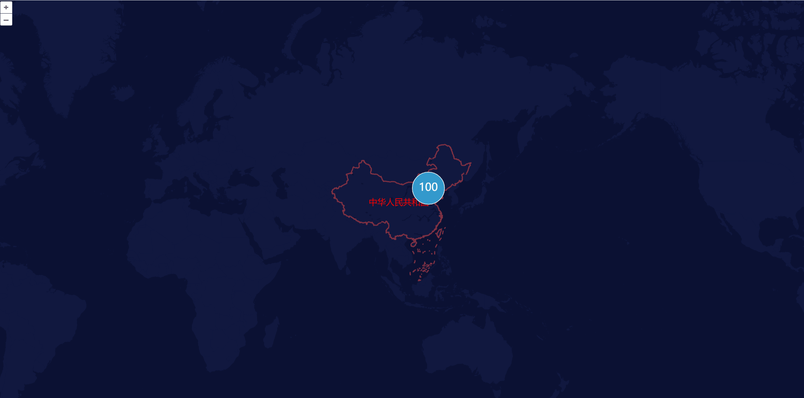
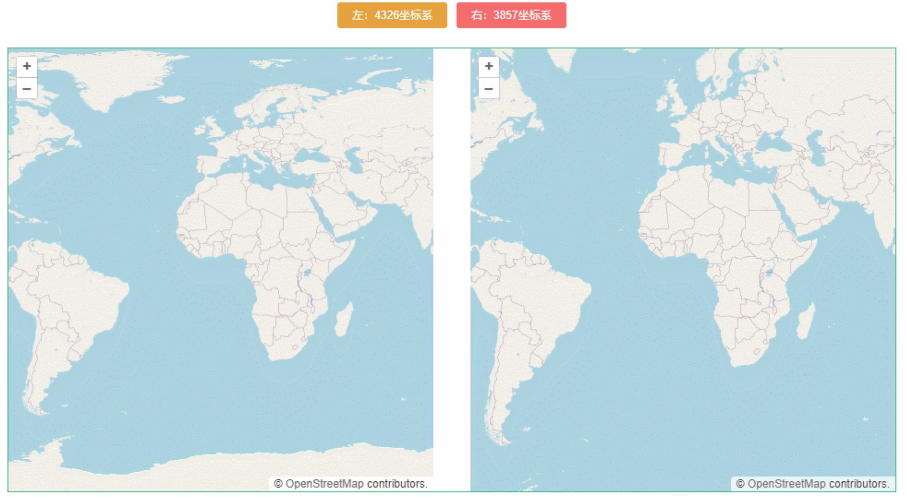
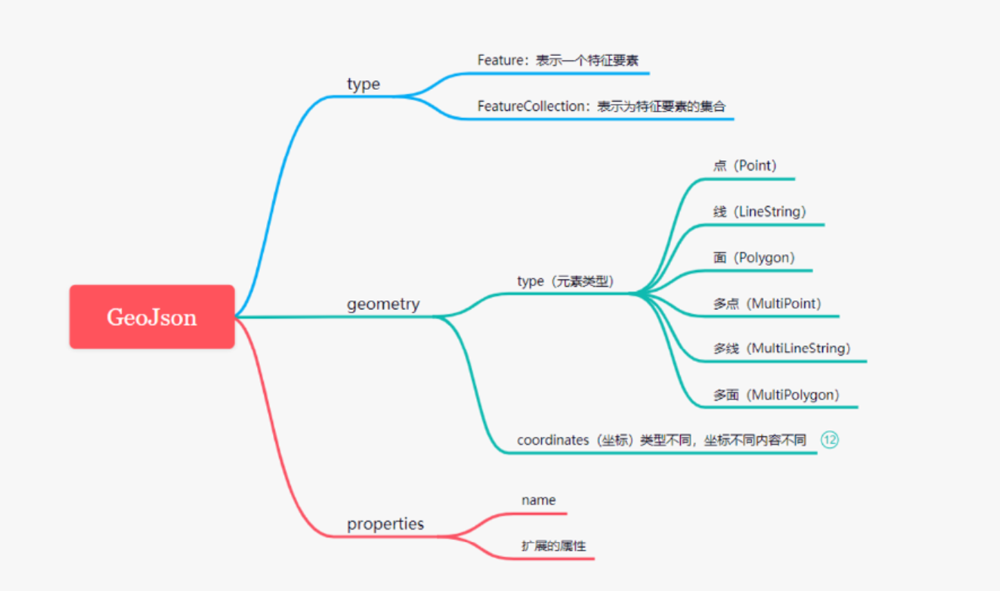
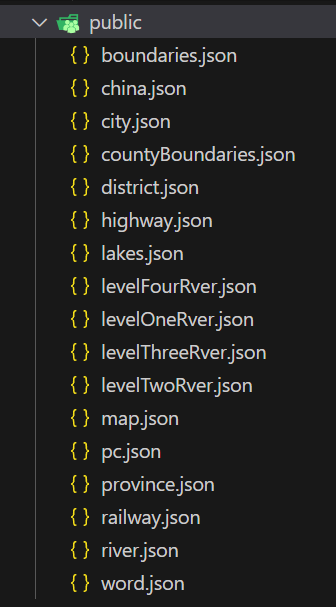

>作者GitHub：[https://github.com/gitboyzcf](https://github.com/gitboyzcf)  有兴趣可关注！！！
>

## 目录

# 效果



# 术语解析

## OpenLayers

OpenLayers 开源的**处理二维地图**的JavaScript库 的，开发旨在进一步利用各种地理信息。
OpenLayers 可让您**轻松地在任何网页中放置动态地图**。它可以显示从任何来源加载的地图图块、矢量数据和标记。

（**就是更方便的加载、配置网页地图**）

官网➡️ [https://openlayers.org/](https://openlayers.org/)（英） 加载较慢 建议[下载文档](https://openlayers.org/download/)本地启动查看

**具有以下优点**：

- 多种图层支持：包括矢量图层、栅格图层、瓦片图层等，开发者可以根据需要添加和管理不同类型的图层
- 的地图控件：如缩放、导航、比例尺等控件
- 地图交互功能：如平移、旋转、标记、测量等
- 数据可视化：点、线、面、标注、弹窗等
- 地图投影：支持多种地图投影
- 可定制性：提供了丰富的API和插件，开发者可以根据自己的需求进行定制和扩展

**核心组件​**：

- Map 类：地图容器，最核心的部件，用于装载图层与各种控件。
- Layer 类：地图图层类， 地图数据通过 Layer 图层进行渲染，数据源可以分为：
- Image：单一图像数据。
- Tile：瓦片数据，可以联想下站在金字塔顶一层一层往下看，越来越详细。
- Vector：矢量数据
- View 类：地图视图类，用于提供人机交互的控件，如缩放移动旋转等等操作。

### 坐标系

openlayers 支持两种坐标系，分别是 `EPSG:S4326` 和 `EPSG:3857` ,如果不指定坐标系`projection`，那么它默认的是 `EPSG:3857`。

- EPSG:4326 是一种全球通用的地理坐标系，它是**椭球体的坐标系**（3D）
  - 数据格式：一般是这种的`[22.37，114.05]`；
  - 坐标范围：-180到+180的经度和-90到+90的纬度。
  - 特点：利于存储，可读性高。
  - 缺点：会导致页面变形。
- EPSG:3857 是**平面坐标系**，也正因为如此，它是一种web地图专用的坐标系。
  - 数据格式：一般是这种`[12914838.35，4814529.9]`；
  - 坐标范围是-20026376.39到20026376.39（西经到东经），以及-20048966.10到20048966.10（南纬到北纬）。
  - 对墨卡托投影来说，越到高纬度，大小扭曲越严重，到两极会被放到无限大，所以，墨卡托投影无法显示极地地区。WGS84范围：-180.0 ，-85.06，180.0， 85.06。
  - 特点：用于分析，显示数据。
  - 缺点：数据的可读性差和数值大存储比较占用内存。

就是说`EPSG:4326`地图以**球形展示** ；`EPSG:3857`把球形进行**平铺展开**； 可以在脑子🧠里想象一下

因此，如果将openlayers坐标系指定为`EPSG:4326`，那么得到的地图可能会有些扭曲，观感不好。

修改openlayers坐标系可通过下面代码

```javascript
new View({
    projection:'EPSG:3857',//坐标系类型，默认是'EPSG:3857'，还可设置为'EPSG:4326'
    center: fromLonLat([104.912777, 34.730746]), //地图中心坐标, 数组中 第一个值表示经度值，第二个值是纬度值
});
```

### 其他工具

- **Leaflet**

  - 官网: [leafletjs.com](https://leafletjs.com)

  - 特点: 轻量级、简单易用，适合 2D 地图基础渲染。

- **MapLibre GL JS**

  - 官网: [maplibre.org](https://maplibre.org/)

  - 特点: Mapbox GL JS 的开源分支，支持矢量切片和动态样式。

  - 支持: 3D 地图、自定义图层、高性能渲染。

- **CesiumJS**

  - 官网: [cesium.com](https://cesium.com)
  - 特点: 专业 3D 地球可视化，支持时间动态数据。
  - 支持: 3D Tiles、全球地形、卫星影像。

- **Deck.gl**

  - 官网: [deck.gl](https://deck.gl)

  - 特点: 基于 WebGL 的大规模地理数据可视化，适合科学数据。

  - 支持: 点云、路径、热力图、3D 模型。

## GeoJson

GeoJson 是一种基于 JSON 的**地理空间数据交换格式**。 它定义了几种类型的 JSON 对象，以及将它们组合起来表示**有关地理特征、属性和空间范围的数据的方式**。（就用于生成地图的一种数据结构）
官网： [https://geojson.org/](https://geojson.org/)（英）

格式样例⬇️

```json
{
  "type": "FeatureCollection",
    "features": [
  {
    "type": "Feature",
    "geometry": {
      "type": "Point",
      "coordinates": [125.6, 10.1]
    },
    "properties": {
      "name": "Dinagat Islands"
    }
  }
 ]
}
```



这些数据可以直接用OpenLayers加载生成地图，先搞懂这些概念，下面代码就不会摸不着头脑

相关工具：

- [http://geojson.io](http://geojson.io) GeoJson 数据在线查看,编辑,可视化工具。
- [https://mapshaper.org/](https://mapshaper.org/)  根据Geojso文件解析数据生成地图

除了GeoJson还有其他数据存储方式，shapefile（shp）、ToPOJSON、KML和CSV格式等 ，具体自行查找相关资料

# 代码实现

## 准备

npx下载openlayers提供的模板包或者去[github下载](https://github.com/openlayers/ol-vite)

首先运行以下命令（需要 Node 14+）：

```bash
npx create-ol-app my-app --template vite
```

然后进入新my-app目录并启动开发服务器（可通过`http://localhost:5173`访问）：

```bash
cd my-app
npm start
```

要生成可用于生产的版本，请执行以下操作：

```bash
npm run build
```

然后将目录的内容部署dist到您的服务器。您也可以运行`npm run serve`以提供目录的结果dist以供预览。

## 实现

在根目录中的public文件夹下放入geojson文件


修改`App.vue`文件，插入以下代码⬇️

```html
<template>
  <div id="map"></div>
</template>

<script setup>
import { onMounted, ref, useTemplateRef } from "vue";
import { Map, View, Overlay } from "ol";
import TileLayer from "ol/layer/Tile";
import SourceVector from "ol/source/Vector";
import LayerVector from "ol/layer/Vector";
import Cluster from "ol/source/Cluster.js";
import { boundingExtent } from "ol/extent.js";
// import OSM from "ol/source/OSM";
import { Circle, Fill, Stroke, Style, Text, Icon } from "ol/style";
import { fromLonLat } from "ol/proj";
import { toStringXY } from "ol/coordinate";
import Feature from "ol/Feature";
import Point from "ol/geom/Point";
import GeoJSON from "ol/format/GeoJSON";
import videoIcon from "./assets/images/video-icon.png";
import VideoDialog from "./components/VideoDialog.vue";

const map = ref(null);
const dialogRef = useTemplateRef("dialogRef");

const labelStyle = new Style({
  text: new Text({
    font: "12px Calibri,sans-serif",
    overflow: true,
    // 填充色
    fill: new Fill({
      color: "#64B2DC",
    }),
    // // 描边色
    stroke: new Stroke({
      color: "#64B2DC",
      width: 0.5,
    }),
  }),
});
// GeoJson图层列表
const vectorsJson = [
  // 世界线
  {
    file: "word",
    style: new Style({
      fill: new Fill({
        color: "#101840",
      }),
      // stroke: new Stroke({
      //   color: "#813244",
      //   width: 2,
      // }),
    }),
  },
  // 国界线
  {
    file: "china",
    style: new Style({
      fill: new Fill({
        color: "#101840",
      }),
      stroke: new Stroke({
        color: "#813244",
        width: 2,
      }),
    }),
  },
  // 铁路
  {
    file: "railway",
    style: new Style({
      stroke: new Stroke({
        color: "#868F9A",
        width: 1,
      }),
    }),
  },
  // 湖域
  {
    file: "lakes",
    style: new Style({
      fill: new Fill({
        color: "#0B1133",
      }),
    }),
  },
  // 1河流
  {
    file: "levelOneRver",
    style: new Style({
      stroke: new Stroke({
        color: "#0B1133",
        width: 1,
      }),
      fill: new Fill({
        color: "#0B1133",
      }),
    }),
  },
  // 2河流
  {
    file: "levelTwoRver",
    style: new Style({
      stroke: new Stroke({
        color: "#0B1133",
        width: 1,
      }),
      fill: new Fill({
        color: "#0B1133",
      }),
    }),
  },
  // 3河流
  {
    file: "levelThreeRver",
    style: new Style({
      stroke: new Stroke({
        color: "#0B1133",
        width: 1,
      }),
      fill: new Fill({
        color: "#0B1133",
      }),
    }),
  },
  // 4河流
  {
    file: "levelFourRver",
    style: new Style({
      stroke: new Stroke({
        color: "#0B1133",
        width: 1,
      }),
      fill: new Fill({
        color: "#0B1133",
      }),
    }),
  },
  // 省份
  {
    file: "province",
    style: new Style({
      stroke: new Stroke({
        color: "#969CA5",
        width: 1,
      }),
    }),
  },
  // 县级边界
  {
    file: "countyBoundaries",
    style: new Style({
      stroke: new Stroke({
        color: "#969CA5",
        width: 1,
      }),
    }),
  },
  // 公路
  {
    file: "highway",
    style: new Style({
      stroke: new Stroke({
        color: "#0D1638",
        width: 4,
      }),
    }),
  },
  // 市级城市
  {
    file: "city",
    style: function (feature) {
      const label = feature.get("name").split(" ").join("\n");
      labelStyle.getText().setText(label);
      return [labelStyle];
    },
  },
  // 省会城市
  {
    file: "pc",
    style: function (feature) {
      const label = feature.get("name").split(" ").join("\n");
      labelStyle.getText().setText(label);
      return [labelStyle];
    },
  },
  // 区县名
  {
    file: "district",
    style: function (feature) {
      const label = feature.get("NAME").split(" ").join("\n");
      labelStyle.getText().setText(label);
      return [labelStyle];
    },
  },
];

const mapData = ref([
  {
    name: "坐标点1",
    longitude: 116.06764901057994,
    latitude: 39.891928821865775,
  },
  {
    name: "坐标点2",
    longitude: 114.06764901057994,
    latitude: 39.59583,
  },
]);

const geojsonSource = () => {
  const result = [];
  for (let i = 0; i < vectorsJson.length; i++) {
    const { type, file, style } = vectorsJson[i];
    if (type === "text") {
      console.log(result);
    } else {
      result.push(
        new SourceVector({
          url: `/ol-vite-vue3/${file}.json`, // 第一个 GeoJSON 文件的路径
          format: new GeoJSON({
            dataProjection: "EPSG:4326",
            featureProjection: "EPSG:3857",
          }),
        })
      );
    }
  }
  return result;
};

/**
 *
 * @param index 第几个图层 0 1 2 3 4 5
 * @param bool 显示或隐藏
 */
const toggleLayer = (index, bool) => {
  let layers = map.value.getLayers();
  let layer = layers.getArray()[index];
  layer.setVisible(bool);
};

// 获取图层
const getLayers = () => {
  const layers = [];
  const sources = geojsonSource();
  for (let i = 0; i < sources.length; i++) {
    layers.push(
      new LayerVector({
        source: sources[i],
        style: vectorsJson[i].style,
      })
    );
  }
  return layers;
};

/**
 * 在地图上设置一个标注。
 *
 * @param {string} type - 要设置的标注类型。
 * @param {Object} [config={src|text color}] - 标注的其他配置选项。
 * @param {Array<number>} [lonLat] - 标注的经纬度坐标。默认为 [104.24199, 35.21163]。
 * @param {Array<Object>} [data] - 点击标注的数据数
 * @returns {Array<LayerVector>} - 返回一个包含标注图层的数组。
 */
const setMark = (type, config = {}, lonLat = [103.24199, 35.21163], data) => {
  const vectorSource = new SourceVector();
  const vectorLayer = new LayerVector({
    source: vectorSource,
  });

  // 用于充当标注的要素
  const labelFeature = new Feature({
    geometry: new Point(fromLonLat(lonLat)),
    data,
  });
  let style = null;
  switch (type) {
    case "img":
      style = new Style({
        image: new Icon({
          // anchor: [0.5, 0.5],//图标的锚点,经纬度点所对应的图标的位置，默认是[0.5, 0.5]，即为标注图标的中心点位置
          // anchorOrigin: "top-right", //锚点的偏移位置，默认是top-left，
          // anchorXUnits: "fraction", //锚点X的单位，默认为百分比，也可以使用px
          // anchorYUnits: "pixels", //锚点Y的单位，默认为百分比，也可以使用px
          offsetOrigin: "bottom-right", //原点偏移bottom-left, bottom-right, top-left, top-right,默认 top-left
          // offset:[0,10],
          //图标缩放比例
          scale: 0.8, //可以设置该比例实现，图标跟随地图层级缩放
          //透明度
          opacity: 0.75, //如果想隐藏某个图标，可以单独设置该值，透明度为0时，即可隐藏，此为隐藏元素的方法之一。
          //图标的url
          src:
            config.src ||
            "https://openlayers.org/en/latest/examples/data/icon.png",
        }),
      });
      break;
    case "text":
      style = new Style({
        text: new Text({
          font: "16px Calibri,sans-serif",
          text: config.text || "标注",
          fill: new Fill({
            // color: "rgba(255, 0, 0, 1)",
            color: config.color || "rgba(255, 0, 0, 1)",
          }),
        }),
      });
      break;
    default:
      style = new Style({
        image: new Icon({
          // anchor: [0.5, 0.5],//图标的锚点,经纬度点所对应的图标的位置，默认是[0.5, 0.5]，即为标注图标的中心点位置
          // anchorOrigin: "top-right", //锚点的偏移位置，默认是top-left，
          // anchorXUnits: "fraction", //锚点X的单位，默认为百分比，也可以使用px
          // anchorYUnits: "pixels", //锚点Y的单位，默认为百分比，也可以使用px
          // offsetOrigin: "top-right", //原点偏移bottom-left, bottom-right, top-left, top-right,默认 top-left
          // offset:[0,10],
          //图标缩放比例
          scale: 0.5, //可以设置该比例实现，图标跟随地图层级缩放
          //透明度
          opacity: 0.75, //如果想隐藏某个图标，可以单独设置该值，透明度为0时，即可隐藏，此为隐藏元素的方法之一。
          //图标的url
          src:
            config.src ||
            "https://openlayers.org/en/latest/examples/data/icon.png",
        }),
        text: new Text({
          font: "16px Calibri,sans-serif",
          text: config.text || "标注",
          fill: new Fill({
            // color: "rgba(255, 0, 0, 1)",
            color: config.color || "rgba(255, 0, 0, 1)",
          }),
        }),
      });
      break;
  }

  // 设置标注的样式
  labelFeature.setStyle(style);

  // 将标注要素添加到矢量图层中
  vectorSource.addFeature(labelFeature);
  map.value.addLayer(vectorLayer);

  return vectorLayer;
};

// 创建标注弹窗
const addMarker = (xy) => {
  console.log(xy);
  // const popup = dialogRef.value;
  popup.showPopup = true;
  var marker = new Overlay({
    position: xy,
    element: document.querySelector("#popup"),
    stopEvent: false,
    autoPan: false, // 定义弹出窗口在边缘点击时候可能不完整 设置自动平移效果
    autoPanAnimation: {
      duration: 250, //自动平移效果的动画时间 9毫秒）
    },
  });
  map.value.addOverlay(marker);
};

/**
 * ============== start 聚合点位
 */

// 基础样式
const basePointStyle = new Style({
  image: new Icon({
    src: videoIcon,
    scale: 1,
    anchor: [0.5, 0.5],
    rotateWithView: true,
    rotation: 0,
    opacity: 1,
  }),
  count: 1,
});

// 根据范围随机生成经纬度点位 rangeArr = [minLat, maxLat, minLon, maxLon]
const createPointsByRange = (
  num,
  rangeArr = [39.9037, 40.9892, 115.2, 117.4]
) => {
  const [minLat, maxLat, minLon, maxLon] = rangeArr;
  const points = [];
  for (var i = 0; i < num; i++) {
    var lat = Math.random() * (maxLat - minLat) + minLat;
    var lon = Math.random() * (maxLon - minLon) + minLon;
    points.push([lon, lat]);
  }
  return points;
};

const currentDis = ref(150);
// 根据数据创建聚合图层
const createCluster = (points, zindex) => {
  const features = points.map((e) => {
    // ol.proj.fromLonLat用于将经纬度坐标从 WGS84 坐标系转换为地图投影坐标系
    const feature = new Feature({
      geometry: new Point(fromLonLat(e)),
      custom: {
        id: Math.ceil(Math.random() * 100000),
      },
    });
    return feature;
  });
  // 根据points创建一个新的数据源和要素数组，
  const vectorSource = new SourceVector({
    features,
  });

  // 根据点位创建聚合资源
  const clusterSource = new Cluster({
    distance: currentDis.value, // 设置多少像素以内的点位进行聚合
    source: vectorSource,
  });
  // 创建带有数据源的矢量图层，将创建的聚合字段作为source
  const clusters = new LayerVector({
    source: clusterSource,
    style: (feature) => {
      return setFeatureStyle(feature); // 设置聚合点的样式
    },
  });
  // 将矢量图层添加到地图上
  map.value.addLayer(clusters);
  // sv.setZIndex(zindex) // 设置层级
  return clusters;
};

const countStyles = {};
// 生成点位聚合显示的数字样式
const createCountPointStyle = (size) => {
  // 计算一个动态的 radius
  const radius = 20 + Math.max(0, String(size).length - 2) * 10;
  // const rcolor =
  //   '#' +
  //   parseInt(Math.random() * 0xffffff)
  //     .toString(16)
  //     .padStart(6, '0')
  return new Style({
    image: new Circle({
      radius,
      stroke: new Stroke({
        color: "#fff",
      }),
      fill: new Fill({
        color: "#3399CC",
      }),
    }),
    text: new Text({
      text: size.toString(),
      fill: new Fill({
        color: "#fff",
      }),
      scale: 2,
      textBaseline: "middle",
    }),
  });
};

// 设置聚合点的样式
const setFeatureStyle = (feature) => {
  // 获取聚合点小有几个点位
  const size = feature.get("features").length;
  // 设置聚合点的count参数
  feature.set("count", size);
  // 如果是1，直接展示点位的样式
  if (size === 1) {
    return basePointStyle;
  } else {
    // 如果是聚合点，查看countStyles是否存储了这个聚合点的数字样式，如果不存在，生成一个并存储
    if (!countStyles[size]) {
      countStyles[size] = createCountPointStyle(size);
    }
    return countStyles[size];
  }
};

/**
 * ============== end
 */

const initMap = () => {
  map.value = new Map({
    target: "map",
    layers: getLayers(),
    view: new View({
      // projection:'EPSG:3857',
      center: fromLonLat([104.912777, 34.730746]),
      zoom: 2,
    }),
  });
  const vlText = setMark("text", { text: "中华人民共和国" });
  const vlImg = [];
  // mapData.value.forEach((item) => {
  //   vlImg.push(
  //     setMark("img", { src: videoIcon }, [item.longitude, item.latitude], item)
  //   );
  // });
  // 缩放显示隐藏层级
  const zoomChange = function (e) {
    var zoom = parseInt(map.value.getView().getZoom()); //获取当前地图的缩放级别
    if (zoom <= 3) {
      vlText.setVisible(true);
      vectorsJson.forEach((item, i) => {
        if ([0, 1, 4].includes(i)) {
          toggleLayer(i, true);
        } else {
          toggleLayer(i, false);
        }
      });
    } else if (zoom > 3 && zoom < 7) {
      vlText.setVisible(false);
      vectorsJson.forEach((item, i) => {
        if ([0, 1, 5, 8, 12].includes(i)) {
          toggleLayer(i, true);
        } else {
          toggleLayer(i, false);
        }
      });
    } else if (zoom >= 7 && zoom < 9) {
      vlText.setVisible(false);
      vectorsJson.forEach((item, i) => {
        if ([0, 1, 6, 8, 10, 11].includes(i)) {
          toggleLayer(i, true);
        } else {
          toggleLayer(i, false);
        }
      });
    } else if (zoom >= 9 && zoom < 10) {
      vlText.setVisible(false);
      vectorsJson.forEach((item, i) => {
        if ([0, 1, 3, 7, 10, 11].includes(i)) {
          toggleLayer(i, true);
        } else {
          toggleLayer(i, false);
        }
      });
    } else if (zoom >= 10) {
      vlText.setVisible(false);
      vectorsJson.forEach((item, i) => {
        if ([0, 1, 3, 7, 9, 10, 12, 13].includes(i)) {
          toggleLayer(i, true);
        } else {
          toggleLayer(i, false);
        }
      });
    }
  };
  map.value.getView().on("change:resolution", zoomChange);
  zoomChange();

  const points = createPointsByRange(100);
  const clusters = createCluster(points);

  map.value.on("click", (e) => {
    clusters.getFeatures(e.pixel).then((clickedFeatures) => {
      if (clickedFeatures.length) {
        // Get clustered Coordinates
        const features = clickedFeatures[0].get("features");
        console.log(features);
        if (features.length > 1) {
          const extent = boundingExtent(
            features.map((r) => r.getGeometry().getCoordinates())
          );
          map.value
            .getView()
            .fit(extent, { duration: 1000, padding: [50, 50, 50, 50] });
        } else {
          console.log("点击了坐标点");
        }
      }
    });
  });

  // 监听鼠标移动事件，鼠标移动到feature区域时变为手形
  // map.value.on("pointermove", function (e) {
  //   var pixel = map.value.getEventPixel(e.originalEvent);
  //   var hit = map.value.hasFeatureAtPixel(pixel);
  //   map.value.getTargetElement().style.cursor = hit ? "pointer" : "";
  // });
};

onMounted(() => {
  initMap();
});
</script>

<style scoped>
#map {
  background-color: #0b1133;
}
</style>

```

# 示例

[https://github.com/gitboyzcf/ol-vite-vue3](https://github.com/gitboyzcf/ol-vite-vue3) （内有预览效果）
该示例项目对你有用的话，麻烦点个start🌟🌟🌟

<br/><br/>
<font color=red size=5>🤩后续在此示例中接入地图新功能，还请持续关注🤩</font>

<br/><br/><br/><br/>
**到这里就结束了，后续还会更新 WebGIS 系列相关，还请持续关注！**
**感谢阅读，若有错误可以在下方评论区留言哦！！！**


<br/><br/>

**推荐文章**👇
[数据下载](https://www.naturalearthdata.com/downloads/)
[OpenLayers使用的坐标系](https://www.jianshu.com/p/f8b5b6557249)
[GeoJson数据下载](https://datav.aliyun.com/portal/school/atlas/area_selector)
[OpenLayers中map事件基础认识与实践详解](https://blog.csdn.net/whs15193553607/article/details/140082369)
[聚合点位](https://openlayers.org/en/latest/examples/cluster.html)
