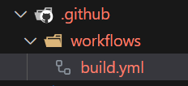
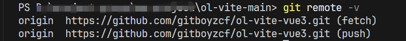
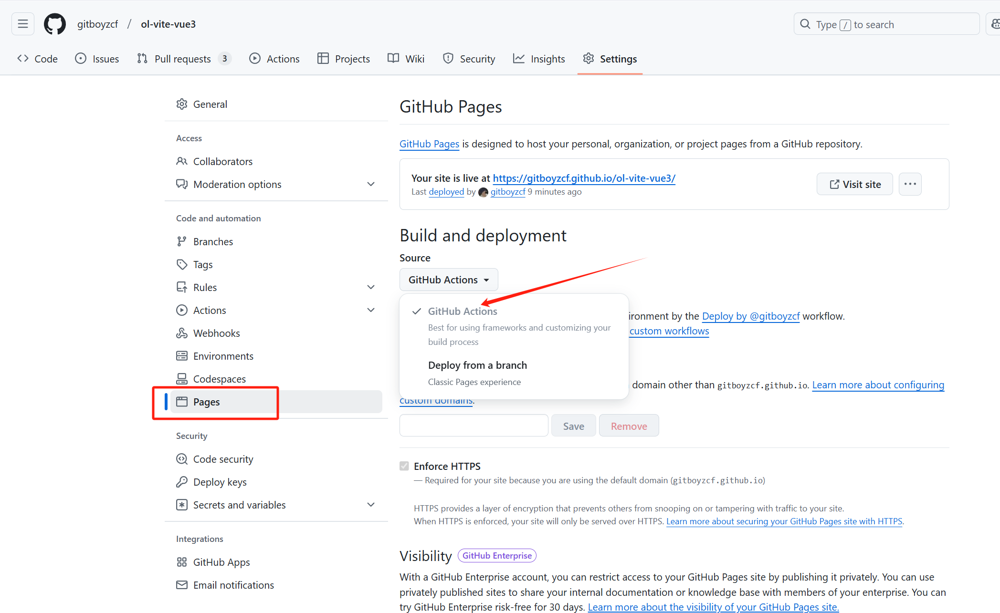

# 介绍

CI/CD 是**持续集成**（Continuous Integration，CI）、**持续交付**（Continuous Delivery，CD）或  **持续部署**（Continuous Deployment，CD）的简称
（就是全程自动化操作）

# 更改项目

在**项目根目录下**创建`.github/workflows/build.yml`等 **文件夹**📂以及**文件**


在`build.yml`文件夹中直接写入以下内容

```yaml
# 工作流的名称，如果省略，则使用当前文件名
name: Auto Deploy

# 从工作流生成的工作流运行的名称，如果省略，则使用提交时的commit信息
run-name: Deploy by @${{ github.actor }}

# 触发部署的条件
on:
  # 每当 push 到 main 分支时触发部署
  push:
    branches:
      - main

permissions:
  contents: read
  pages: write
  id-token: write

# 当前流程要执行的任务，可以是多个。[my_first_job]就是一个任务
jobs:
  build:
    name: build-and-deploy
    runs-on: ubuntu-latest

    steps:
      - uses: actions/checkout@v4
      - uses: pnpm/action-setup@v2
        with:
          version: 8.3.1 # pnpm版本
      - uses: actions/setup-node@v4
        with:
          node-version: '20' # node 版本  node和pnpm版本差异过大会导致报错
          cache: 'pnpm'

      - name: install
        run: pnpm install

      - name: Run Build Script
        run: pnpm build

      - name: Upload artifact
        uses: actions/upload-pages-artifact@v3
        with:
          path: ./dist
  # Deployment job
  deploy:
    environment:
      name: github-pages
      url: ${{ steps.deployment.outputs.page_url }}
    runs-on: ubuntu-latest
    needs: build
    steps:
      - name: Deploy to GitHub Pages
        id: deployment
        uses: actions/deploy-pages@v4

```

# 更改GitHub此项目的远程仓库配置

不知道自己项目github远程仓库地址的 可以在终端执行下面下面👇命令

```bash
git remote -v
```



点击`Settings》Pages》 Build and deployment` 选择GitHub Actions即可


# 收尾

执行代码上传GitHub一系列操作

```bash
git add .

git commit -m '提交信息'

git push    # 或者 git push --set-upstream origin main 
```

之后等待此处是☑️就代表部署成功 点进去就找到地址既可以访问


如果出现❌ 就是没通过 点进去可以看详细报错信息
