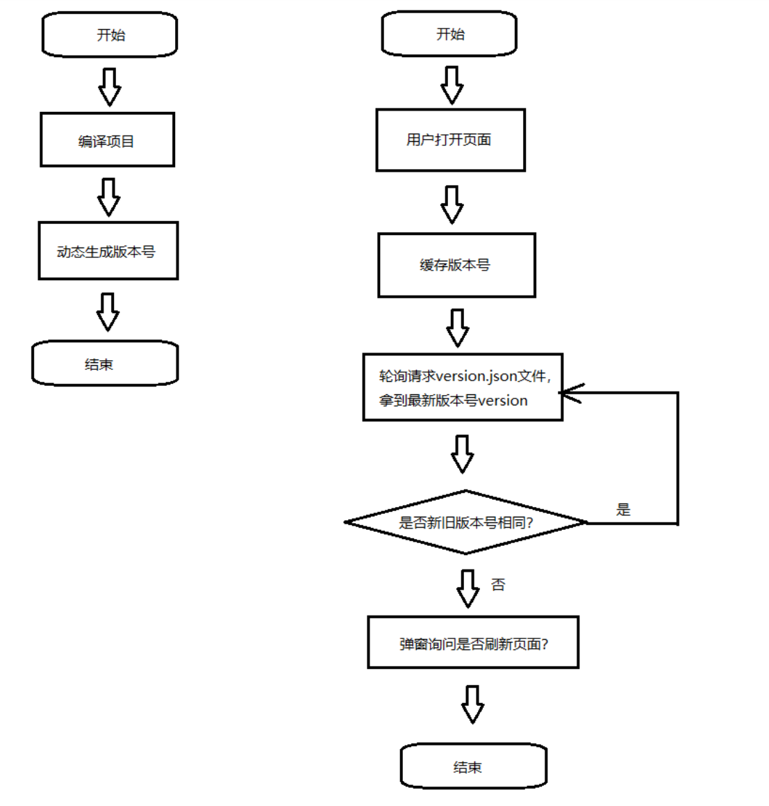
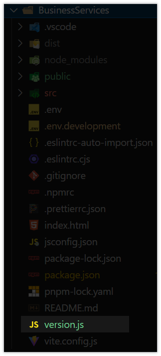
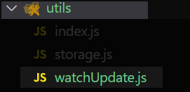

# 流程图



# 实现

1. **在项目的 **根目录下**  创建`version.js`文件内容写入以下代码⬇️**

 ```javascript
 // https://nodejs.org/docs/latest/api/fs.html#file-system
 import { writeFileSync } from 'node:fs'
 import { join, dirname } from 'node:path'
 import { fileURLToPath } from 'node:url'
 
 // 获取当前模块的目录名
 const __dirname = dirname(fileURLToPath(import.meta.url))
 // 构建文件路径，指向 'public' 目录下的 'version.json' 文件 没有则创建
 const filePath = join(__dirname, 'public', 'version.json')
 // 将当前时间戳作为版本号写入 'version.json' 文件中
 writeFileSync(filePath, `{"version":"${Date.now()}"}`)
 ```

例如：
 

2. **在项目中的创建此目录结构 ➡️ `utils》watchUpdate.js`，写入下面代码⬇️**

 ```javascript
 let time = 0 // 计算轮询次数
 let timer = null // 轮询定时器
 let version = localStorage.getItem('v') || '' // 本地存储版本号
 // 是否是生产环境
 let prodFlag = ['production'].includes(process.env.NODE_ENV)
 
 // 轮训检测方法
 let timerFunction = async () => {
   // 超过5次，清除定时器
   if (time >= 5) {
     clearInterval(timer)
     return (timer = null)
   }
 
   try {
     // 获取最新版本号
     let res = await fetch(`/version.json?v=${Date.now()}`)
     if (res.ok) {
       const vJson = await res.json()
       if (!version) {
         // 第一次没有 将存入
         version = vJson.version
         localStorage.setItem('v', vJson.version)
       } else if (version !== vJson.version) {
         // 版本号不同，提示刷新
         if (confirm('检测到版本更新，是否刷新？')) {
           localStorage.setItem('v', vJson.version)
           window.location.reload()
         } else {
           // 用户点击取消 清除定时器
           clearTimer()
         }
       }
     }
   } catch (error) {
     console.error(error)
     return clearTimer()
   }
   time++
 }
 
 // 监测鼠标是否移动 移动代表用户活跃中
 const moveFunction = () => {
   if (prodFlag) {
     console.log('===鼠标移动了===', prodFlag)
     time = 0
     if (!timer) {
       timer = setInterval(timerFunction, 1000)
     }
   }
 }
 
 // 引用的时候 开始轮询监并听鼠标移动事件
 if (prodFlag) {
   timer = setInterval(timerFunction, 3000)
   window.addEventListener('mousemove', moveFunction)
 }
 
 // 清除轮询 不监听鼠标事件
 const clearTimer = () => {
   clearInterval(timer)
   window.removeEventListener('mousemove', moveFunction)
   timer = null
 }
 ```

例如：
 
 
3. **在`main.js`文件中引入`watchUpdate.js`**
 
 ```javascript
 import './utils/watchUpdate'
 ```

4. **在`package.json`中修改 script 命令**
当在终端进行`npm run build`打包时会先执行`node version.js` 在**public目录下生成版本号**
**注意 ：根据自己项目中的`package.json 》 script`下的命令进行修改**
 
 ```bash
 "scripts": {
     "dev": "vite --host",
     "build": "node version.js && vite build",
     "preview": "vite preview",
     "lint": "eslint . --ext .vue,.js,.jsx,.cjs,.mjs --fix --ignore-path .gitignore",
     "format": "prettier --write src/"
   },
 ```

<br/><br/><br/><br/>
**🌟相关资料🌟**
[Date.now()   的理解](https://developer.mozilla.org/zh-CN/docs/Web/JavaScript/Reference/Global_Objects/Date/now)

[window Fetch的理解](https://www.cnblogs.com/lyraLee/p/12273941.html)
