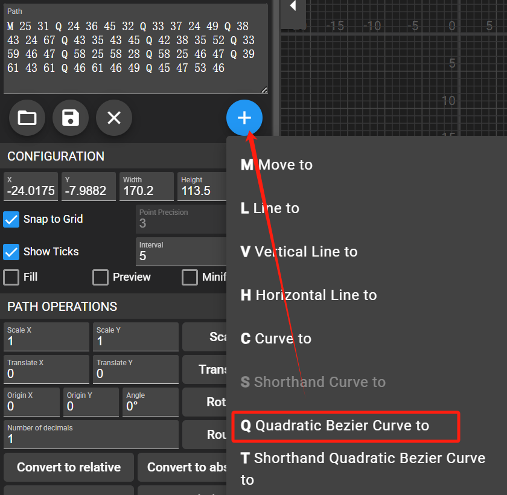

# 效果


# 工具

[英文签名设计免费版 https://www.kachayv.cn/yw/](https://www.kachayv.cn/yw/)
[SVG路径可视化编辑器 https://yqnn.github.io/svg-path-editor/](https://yqnn.github.io/svg-path-editor/)

工具使用步骤：

1. 先用`英文签名设计` 设计出自己想要的签名
2. 在根据`svg路径可视化编辑器` 使用贝塞尔曲线 一步步（别嫌麻烦） 绘制路径生成导出 svg


# 具体实现

```html
<svg xmlns="http://www.w3.org/2000/svg" viewBox="23.4 27.04 35.2 40.56">
  <path class="path1"
    d="M 25 31 Q 24 36 45 32 Q 33 37 24 49 Q 38 43 24 67 Q 43 35 43 45 Q 42 38 35 52 Q 33 59 46 47 Q 58 25 58 28 Q 58 25 46 47 Q 39 61 43 61 Q 46 61 46 49 Q 45 47 53 46"
    stroke="#000000" stroke-width="1" fill="none"></path>
</svg>

<style>
@keyframes grow-69a3f4dd {
    0% {
        stroke-dashoffset: 1px;
        stroke-dasharray: 0 350px;
        opacity: 0
    }

    10% {
        opacity: 1
    }

    40% {
        stroke-dasharray: 350px 0
    }

    85% {
        stroke-dasharray: 350px 0
    }

    95%,to {
        stroke-dasharray: 0 350px
    }
}

.path1 {
    stroke-dashoffset: 1px;
    stroke-dasharray: 350px 0;
    animation: grow-69a3f4dd 10s ease forwards infinite;
    transform-origin: center;
    stroke: #303030;
    animation-delay: 0s
}
</style>
```

具体可看 [https://code.juejin.cn/pen/7490863359114346505](https://code.juejin.cn/pen/7490863359114346505)
