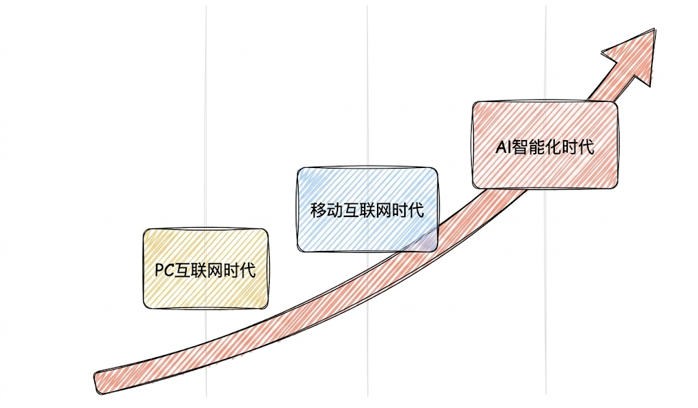
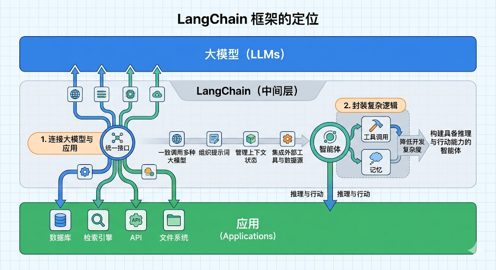
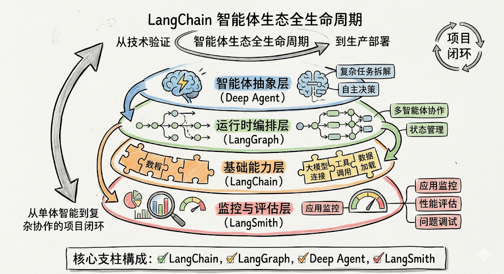
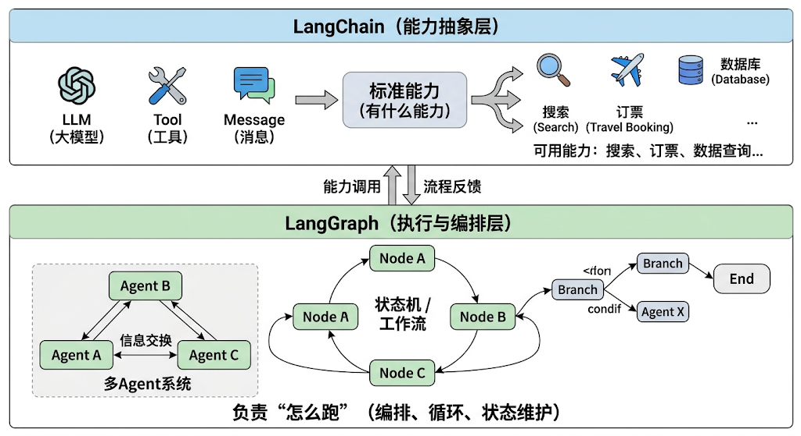
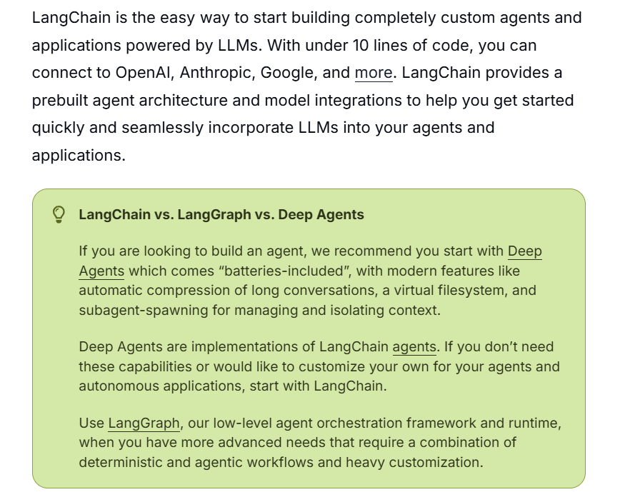
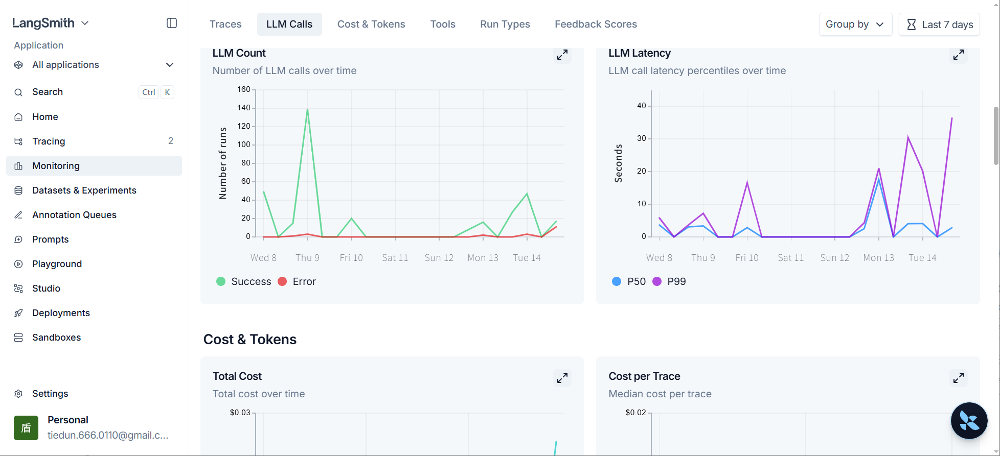
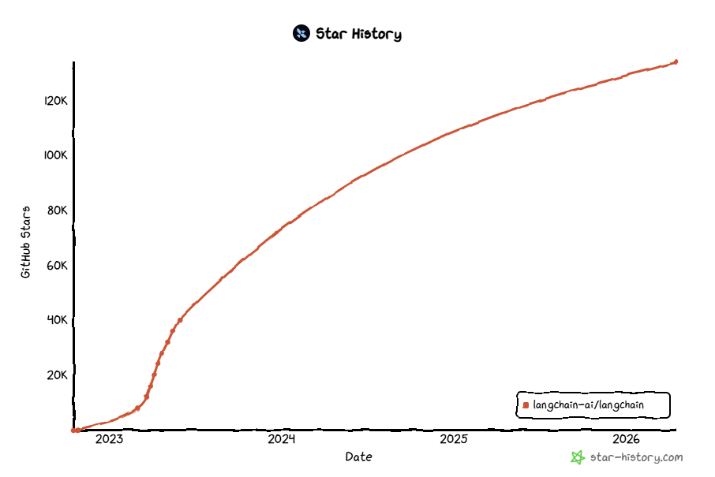
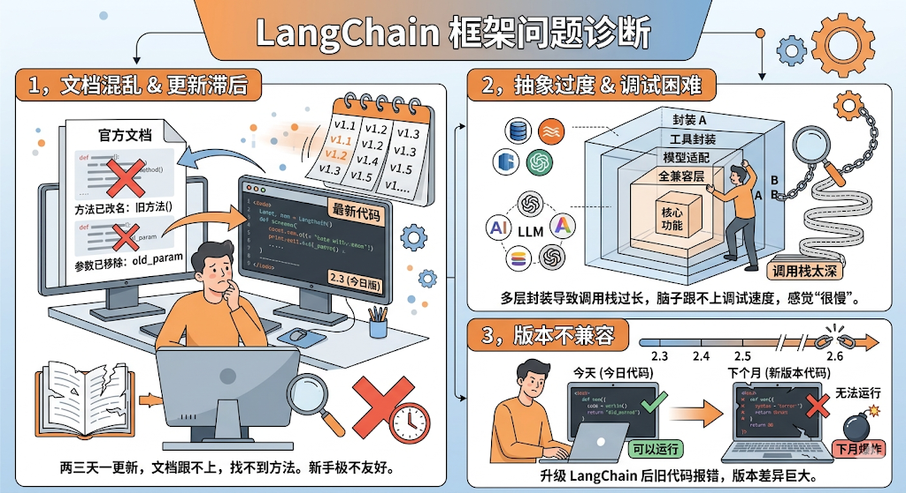
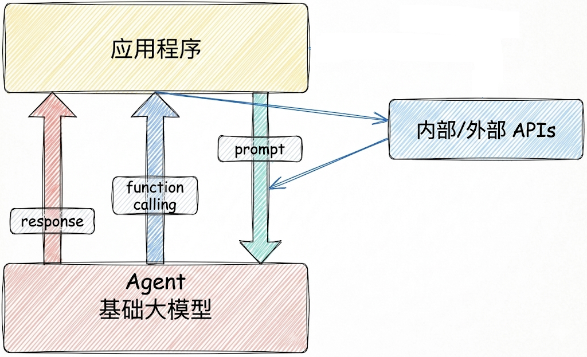

![[../../../assets/images/pub/rzyd.webp]]


# 初识 LangChain：给 AI 小白的第一本说明书

> 本文整理自 [尚硅谷 LangChain 1.2 概述课程](https://www.atguigu.com/)，是「初识 LangChain」系列连载第 1 篇。

---

## 🤔 先问自己一个问题

你有没有这样的体验：

> "我会用 ChatGPT 聊天、会问问题、甚至会写文案……但如果我想让它帮我做一个**真正有用的东西**——比如一个能查公司文档的客服、一个能自动订机票的助手、一个能帮我改代码的小弟——我完全不知道从哪里下手？"

如果你有这个困惑，那**恭喜你，来对地方了**。

今天这篇文章，我们不写一行代码，就用大白话聊聊：**LangChain 到底是什么？为什么它最近这么火？一个小白需要了解它到什么程度？**

---

## 一、LangChain 是什么？一句话说清楚

### 1.1 先上大白话

你可以把 **LangChain** 想象成 **AI 世界的"乐高积木底板"**。

大语言模型（比如 ChatGPT）就像一块块**形状各异的乐高积木**——它们很强大，但单块积木搭不出复杂的东西。

LangChain 就是那个**底板 + 说明书**：

- 它告诉你哪些积木能**拼在一起**
- 它提供了**标准化的连接口**，让不同品牌的积木（不同厂商的大模型）都能用
- 它还自带**很多现成的组件**（工具、记忆、检索……），你不用从零开始造轮子

**官方定义**：LangChain 是一个用于构建大模型应用的开源框架，它充当**大模型与外部资源之间的中间层**。



> 📌 **图1 解读**：这张图展示了 LangChain 的核心定位。最上层是你的 AI 应用，最底层是大模型（GPT、Claude、通义千问等），LangChain 夹在中间，一边统一对接各种大模型，一边提供工具、数据等能力。就像操作系统的"硬件抽象层"——你不需要知道硬件细节，只管用就行。

---

## 二、为什么需要 LangChain？大模型自己不够用吗？

好问题！让我们用一个生活场景来理解。

### 2.1 单一大模型的"三大死穴"

想象你请了一个**超级聪明的助理**（这就是大模型），他什么都懂：

- 💬 聊天没问题
- 📝 写文章没问题
- 🧮 做数学题也没问题

但如果你让他帮你**订明天的机票**……他傻眼了。为什么？

**死穴一：没有"手脚"**

大模型只会"想"和"说"，不会"做"。他不能打开浏览器、不能查航空公司网站、不能输入信用卡付款。

**死穴二：没有"记忆"**

你昨天跟他说"我下周要去杭州出差"，今天问他："我之前说过要去哪？"——他完全不记得。每次聊天都是"初次见面"。

**死穴三：知识是"过期"的**

大模型的知识停留在训练数据截止时间。你问他"今天天气怎么样？"他不知道，因为他看不到实时数据。

```
单一大模型的能力：

   ✅ 能聊天           ❌ 不能操作外部系统
   ✅ 能写代码         ❌ 不能记住过去
   ✅ 能回答问题       ❌ 知识不是实时的
```

### 2.2 LangChain 的"三板斧"

针对这三个问题，LangChain 提供了对应的解决方案：

| 大模型的问题 | LangChain 的解法 | 大白话 |
|------------|----------------|--------|
| 没有手脚 | **工具调用（Tools）** | 给模型装上手脚，让它能操作电脑、调API |
| 没有记忆 | **记忆管理（Memory）** | 给模型装个记事本，让它记得你们说过什么 |
| 知识过期 | **检索增强（RAG）** | 给模型配个图书馆，遇到不会的去查资料 |

**一句话总结**：

> LangChain 让大模型从"能聊天"进化成"能干活"。



> 📌 **图2 解读**：这张图列出了 LangChain 的六大应用场景。从左到右依次是：RAG 检索增强生成、Agent 智能体、对话系统、多模态应用、自动化写作、数据连接。每类都标注了解决的痛点和功能。**小白朋友注意：目前应用最广泛的是 RAG 和 Agent**，后面我们会重点介绍。

---

## 三、LangChain 的"超能力"：六大应用场景

LangChain 能做的事情，远远超出你的想象。下面用**大白话 + 真实场景**来解释：

### 🔍 场景一：RAG（检索增强生成）

**痛点**：大模型不知道你们公司的内部文档、产品手册、历史订单怎么办？

**解法**：把公司文档"喂"给 LangChain，让它代替模型先查资料，再把答案告诉模型。

**类比**：就像你考试时带了一本**小抄**——题目不会？先翻翻书，再结合题目作答。

```
  你的提问         LangChain 做了什么           结果
     ↓                   ↓                       ↓
"我们的退货   →   1. 找到《退货政策》文档   →  "根据公司第三版
政策是什么？"      2. 提取相关条款             退货政策第5条……”
                  3. 把政策+问题一起问模型
```

### 🤖 场景二：Agent（智能体）

**痛点**：你不想一步步吩咐 AI，你想让它**自己想办法完成复杂任务**。

**解法**：给 Agent 一个目标 + 一堆工具，让它自己**规划、执行、失败重试**。

**类比**：就像你给秘书发一条微信："帮我安排下周去杭州的出差"。然后秘书自己查机票、订酒店、安排行程，每一步都自己决定，做完再汇报你。

```
  Agent = 大脑（LLM）+ 规划能力 + 工具 + 记忆 + 行动力
  
  你说："帮我写一份上周的销售周报"
  Agent 自动做：
    1️⃣ 打开数据库，拉取上周销售数据
    2️⃣ 用 Python 分析数据趋势
    3️⃣ 生成图表
    4️⃣ 写成 Word 文档
    5️⃣ 通过邮件发给你
```

### 💬 场景三：智能对话系统

**痛点**：ChatGPT 聊完就忘，你每次都要重新介绍自己？

**解法**：给对话加上**长期记忆**——记住你是谁、你的偏好、你们之前聊过什么。

**类比**：ChatGPT 像个"每次见面的客服"，LangChain 像个"记得你喜好的老朋友"。

### 🎨 场景四：多模态应用

**痛点**：只想做文字应用？想多了，AI 还能"看"图、"听"音。

**解法**：LangChain 打通了文字、图片、音频的通道，让模型能综合理解多种信息。

**类比**：从只能"打电话"（文字），升级成能"视频通话"（图+音+文）。

### ✍️ 场景五：自动化写作与格式化输出

**痛点**：AI 写的内容格式不标准，每次都要手动调整？

**解法**：配合**提示词模板 + 输出解析器**，让 AI 直接产出符合规范的文档。

**类比**：AI 不再是"自由发挥的诗人"，而是"按模板填表的文员"。

### 🔗 场景六：数据连接与结构化处理

**痛点**：公司有一堆 PDF、Excel、数据库，AI 读不了？

**解法**：LangChain 能直接对接各种数据源，让模型能**自然语言查数据库**。

**类比**：你不用写 SQL 了，直接对 AI 说："帮我查一下上个月销量最高的产品"，它自动翻译成人话→SQL→查数据库→返回结果。

---

## 四、LangChain 的"四大家族"

随着 LangChain 的发展，它已经从一个单独的框架，**进化成了一个家族**。这四个成员分工明确：

### 🏠 家族全景图

```
┌──────────────────────────────────────────────────────┐
│                    你的 AI 应用                        │
├──────────────────────────────────────────────────────┤
│                      LangSmith                        │
│            （监控、调试、评估——"体检中心"）              │
├──────────────────────────────────────────────────────┤
│                     Deep Agent                        │
│          （高级智能体能力——"专家顾问团"）                │
├──────────────────────────────────────────────────────┤
│                     LangGraph                         │
│           （工作流编排——"项目管理软件"）                │
├──────────────────────────────────────────────────────┤
│                     LangChain                         │
│           （基础能力层——"操作系统内核"）                │
└──────────────────────────────────────────────────────┘
```



> 📌 **图3 解读**：这张图展示了 LangChain 家族的四大支柱。从下往上看：LangChain 是地基，提供统一模型调用和基础组件；LangGraph 在上面编排复杂工作流；Deep Agent 提供更强的自主规划能力；LangSmith 是顶层的监控平台。**它们不是四选一的关系，而是像搭积木一样可以组合使用。**

---

### 🧱 第一位成员：LangChain（基础能力层）

**一句话**：整个家族的"地基"。

它提供了：
- 统一的**模型调用**方式（GPT、Claude、国产大模型都能用）
- **消息、工具、中间件**等基础组件
- 丰富的**外部数据源集成**

**类比**：就像智能手机的**操作系统**，所有 App 都跑在它上面。

> 适合场景：构建简单的智能体应用，不需要复杂的流程编排。

### 🎼 第二位成员：LangGraph（工作流编排层）

**一句话**：让 AI 能处理**复杂的多步骤任务**。

它把任务抽象成一张"有向图"：
- **节点（Node）**：每个步骤做一个事
- **边（Edge）**：决定下一步走哪里
- **状态（State）**：所有步骤共享的"记事本"



> 📌 **图4 解读**：这张图用"打车去西藏"的例子解释了 LangGraph 的图式结构。你可以看到：
> - **节点（Node）**：每个圆圈就是一个具体步骤（规划路线、订饭店、订酒店……）
> - **边（Edge）**：连接线表示步骤之间的流转关系
> - **状态（State）**：贯穿全程的"旅行计划"，保存了所有中间结果
> 
> 这种方式的好处是：**流程看得见、改得了、回得去**——出错了可以直接定位到某个节点，不用从头再来。

**通俗理解**：

```
LangChain = 能力层（有什么能力）→ 负责"有什么"
LangGraph = 编排层（怎么跑）    → 负责"怎么做"
```

> 适合场景：多步骤、有循环、需要精确控制的复杂工作流。

### 🧠 第三位成员：Deep Agent（智能体执行框架）

**一句话**：让 AI 不仅能做，还能**自己规划、自己调整**。

它的核心能力：
- **显式规划**：自己制定任务计划，失败了还能改
- **虚拟文件系统**：暂时存中间结果，不占用大脑内存
- **子智能体**：遇到复杂问题，**派小弟去干**
- **长期记忆**：跨对话积累经验



> 📌 **图5 解读**：这张图展示了三者的层级关系。最底层是 LangChain（基础能力），中间是 LangGraph（编排引擎），最上层是 Deep Agent（智能体框架）。箭头表示"构建于之上"——Deep Agent 依赖 LangGraph 的编排能力，LangGraph 依赖 LangChain 的基础能力。**就像盖房子：LangChain 是地基，LangGraph 是框架，Deep Agent 是装修。**

**类比**：一个**自带秘书团的CEO**——它会分解任务、分配下属、追踪进度、总结经验。

> 适合场景：需要深度规划、长期记忆、多专家协作的复杂智能体。

### 🔭 第四位成员：LangSmith（监控与评估层）

**一句话**：让你能**"看见" AI 是怎么想的**。

当 AI 越来越复杂时，你总不能靠猜它在干什么吧？LangSmith 提供了：
- **全链路追踪**：模型每一步做了什么，清清楚楚
- **调试工具**：找到 AI 犯错的原因
- **评测系统**：量化 AI 的表现好坏



> 📌 **图6 解读**：这张图展示了 LangSmith 的监控界面。你可以看到一次完整的 AI 调用链路：用户输入 → 模型思考 → 工具调用 → 结果返回。每一步的时间、输入输出、Token 消耗都记录在案。**就像 AI 的"行车记录仪"——出了问题可以回放，想优化可以看数据。**

**类比**：就像 AI 的**体检中心 + 行车记录仪**。出了问题，翻录像；想提效果，看数据。

### 四者关系总结

| 成员 | 角色 | 一句话 | 解决什么问题 |
|------|------|--------|------------|
| **LangChain** | 操作系统内核 | "有什么能力" | 基础模型调用、工具集成 |
| **LangGraph** | 项目管理软件 | "怎么跑" | 复杂工作流编排 |
| **Deep Agent** | 专家顾问团 | "怎么思考" | 规划、记忆、子Agent |
| **LangSmith** | 体检中心 | "跑得怎么样" | 监控、调试、评估 |

**重要提醒**：这四个不是竞争关系，**复杂项目可以同时用到它们**。官方建议：

> 快速起步用 LangChain → 复杂控制用 LangGraph → 更强能力用 Deep Agent → 监控调优用 LangSmith

---

## 五、LangChain 的"进化简史"

了解了现在，我们再来看看它**是怎么走到今天的**。



> 📌 **图7 解读**：这张图用时间轴展示了 LangChain 的五个发展阶段：
> 1. **诞生（2022.10）**：Harrison Chase 创建，专注 PromptTemplate 等基础模块
> 2. **探索期（2022Q4-2023Q1）**：GitHub Star 快速破万，社区走红
> 3. **体系化（2023Q2-Q4）**：引入 Tool、Agent、Retrieval，推出 LangSmith
> 4. **平台化（2024-2025H1）**：LangGraph + LangServe 发布，从框架到平台
> 5. **深层智能体（2025H2至今）**：Deep Agent 发布，进入多智能体时代
> 
> **小白重点记住**：2025 年 10 月发布的 v1.0 是里程碑——官方承诺 API 稳定，不再"版本碎钞"。

### 🚨 一个有趣的历史插曲：v0.3 的"黑暗时期"

在 2024 年，LangChain 经历了一次**痛苦转型**：

- 官方推出了 **LangGraph**，把之前的核心功能标记为"弃用"
- GPT-4 普及后，很多 LangChain 封装的功能（工具调用、结构化输出），模型自己就能做了
- 很多开发者觉得："我直接用模型就行了，干嘛还要 LangChain？"

结果就是：**开发者大规模流失**，社区一片吐槽。

但到了 2025 年，LangChain **彻底重构**，发布了 **v1.0**：
- 承诺 API 稳定，在 2.0 之前不再搞破坏性变更
- 完成 1.2 亿美元融资，估值超 12 亿美元
- 正式确立了 **LangChain + LangGraph** 的双引擎战略

**从 v0.3 到 v1.2 的进化**：



> 📌 **图8 解读**：这张表格对比了 v0.3 和 v1.2 的核心差异。注意看几个关键变化：
> - **Agent 构建**：从"硬编码"变成 `create_agent` 统一入口
> - **工具定义**：从"类型不安全"变成 Pydantic 强类型
> - **结构化输出**：从"靠正则匹配"变成模型底层保证
> - **扩展机制**：从"改源码"变成**中间件系统**（像装插件一样扩展）
> 
> **一句话**：v1.2 是一个更稳定、更强大、更适合企业用的版本。

**小白结论**：现在开始学 LangChain，选 **v1.x**，官方承诺稳定，不用怕学完就过时。

---

## 六、大模型应用开发的"四大招式"

作为小白，你可能会想："我想做个 AI 应用，第一步该干嘛？"

别急，开发界有**四大招式**，从易到难，你可以按需选择：

### 🥉 第一招：纯 Prompt（最简单）

**怎么做**：直接跟 AI 聊天，用自然语言提要求。

**类比**：就像你跟一个新员工说"帮我写个邮件"，他写你看，你看完再让他改。

**适合**：临时任务、单次使用

### 🥈 第二招：Agent + Function Calling（进阶）

**怎么做**：AI 遇到不会的事，会**主动调用外部工具**（查天气、查数据库、写文件）。

**类比**：就像你问天气，AI 说"等一下，我查一下天气预报"，然后打开一个天气网站，看完再告诉你。

**适合**：需要对接外部系统的场景

### 🥇 第三招：RAG（检索增强生成）

**怎么做**：先检索外部资料，再结合资料回答问题。

**类比**：就像开卷考试——题目不会？先翻书，找到了再答题。

**适合**：需要"领域知识"的场景（客服、文档问答、法律咨询）

### 🏅 第四招：Fine-tuning（微调/精调）

**怎么做**：用特定领域的数据训练模型，让模型本身变得更懂。

**类比**：就像学生努力学习考试内容，长期记住，活学活用。

**适合**：特殊场景、前三种解决不了的情况

---

### 📊 四大招式对比

| 招式 | 难度 | 成本 | 上手速度 | 适合场景 |
|------|------|------|---------|---------|
| 纯 Prompt | ⭐ | 免费 | 最快 | 临时、单次 |
| Agent + 工具 | ⭐⭐ | 低 | 较快 | 需要执行动作 |
| RAG | ⭐⭐⭐ | 中 | 中等 | 需要领域知识 |
| Fine-tuning | ⭐⭐⭐⭐⭐ | 高 | 慢 | 特殊定制需求 |

> 💡 **建议**：作为小白，先从 **Prompt → RAG → Agent** 的顺序学。Fine-tuning 等后面再说。



> 📌 **图9 解读**：这张图用四个象限展示了四种技术的适用场景：
> - **纯 Prompt**：最简单，适合"说一句答一句"的对话
> - **Agent + Function Calling**：AI 会主动要求调用外部工具
> - **RAG**：需要补充领域知识时使用（目前应用最广）
> - **Fine-tuning**：成本最高，前三种解决不了再考虑
> 
> **小白建议**：先掌握前三种，Fine-tuning 等工作有需求了再学。

---

## 七、想学 LangChain，我需要准备什么？

别被吓到，门槛**没有你想象的那么高**。

### 3.1 前置知识清单

| 需要了解 | 不需要精通 | 说明 |
|---------|----------|------|
| Python 基础语法 | ❌ 不用精通 | 变量、函数、类、列表字典就行 |
| 什么是 LLM、Prompt | ❌ 不用深究原理 | 用过 ChatGPT 就够了 |
| 什么是 Token、Embedding | ❌ 不用数学推导 | 知道概念就行 |
| OpenAI API 或国产大模型 | ❌ 不用全部会 | 随便选一个能用的就行 |

**一句话门槛**：会用 Python 写"Hello World"，用过 ChatGPT 聊天——够了。

### 3.2 开发环境

需要安装：
- **Python 3.10+**（推荐 3.13）
- 虚拟环境（推荐 **conda** 或 **uv**）
- **LangChain** 包
- 一个 IDE（推荐 **PyCharm**）

```
# 快速安装命令（给有基础的朋友看）
conda create --name langchain1.2 python=3.13
conda activate langchain1.2
pip install langchain==1.2.12
```

> 小白别慌，下一篇我们会手把手教你**从零搭建环境**，到时候跟着做就行。

### 3.3 心态准备

最重要的一条：

> **不要试图学完 LangChain 的所有 API，那是不可能的。**

把它当成一个**工具箱**，而不是教科书：

- 搞懂**核心逻辑**和**核心模块**
- 用到什么再查什么
- 先跑起来，再优化

---

## 🌰 举个完整的例子：用 LangChain 做一个"公司文档问答助手"

假设你在一家电商公司，老板让你做一个**能回答"退货政策"的智能客服**。

你会用到 LangChain 的哪些能力？

```
步骤1：【数据加载】把《退货政策.pdf》加载进来
          → LangChain 的 DocumentLoader

步骤2：【文本切分】把长文档切成小块
          → LangChain 的 TextSplitter

步骤3：【向量化】把文字转成"数字向量"
          → LangChain 的 Embeddings + 向量数据库

步骤4：【检索】用户提问时，先找到最相关的文档片段
          → LangChain 的 Retriever

步骤5：【生成回答】把"问题 + 文档片段"一起发给大模型
          → LangChain 的 LLM

步骤6：【输出】整理成友好的格式返回给用户
          → LangChain 的 OutputParser
```

**一句话串起来**：

> 这就是 **RAG** 的基本流程——让 AI "查资料后回答你"，而不是"自由发挥编答案"。

---

## 📝 总结：一分钟速成版

| 问题 | 答案 |
|------|------|
| LangChain 是什么？ | AI 应用的"操作系统"，让大模型能干活 |
| 为什么需要它？ | 大模型没手脚、没记忆、知识过期，LangChain 全补齐 |
| 它能干什么？ | 做智能客服、自动写报告、查数据库、操作电脑…… |
| 四大支柱是什么？ | LangChain（基础）+ LangGraph（编排）+ Deep Agent（智能体）+ LangSmith（监控） |
| 小白能学吗？ | 能！会用 Python 基础 + 用过 ChatGPT 就够了 |
| 怎么开始？ | 先学 Prompt → 再学 RAG → 最后学 Agent |

---

## 🎯 下节预告

在下一篇文章里，我们会进入**实战环节**：

> 🔧 **从零搭建 LangChain 开发环境**
> - 安装 Python 和 conda
> - 创建虚拟环境
> - 安装 LangChain
> - 跑通你的第一行代码

**不需要任何基础，跟着做就能成功。**

---

<br/><br/><br/><br/>

**到这里就结束了，后续还会更新 LangChain 系列相关，还请持续关注！**
**感谢阅读，若有错误可以在下方评论区留言哦！！！**

![[../../../assets/images/pub/clw.webp#pic_center)]]

<br/><br/>
