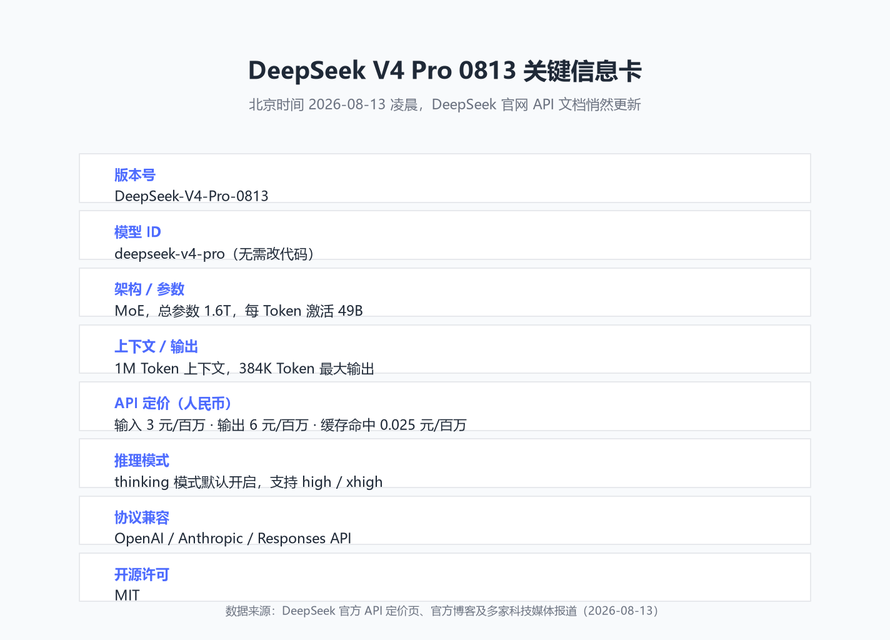
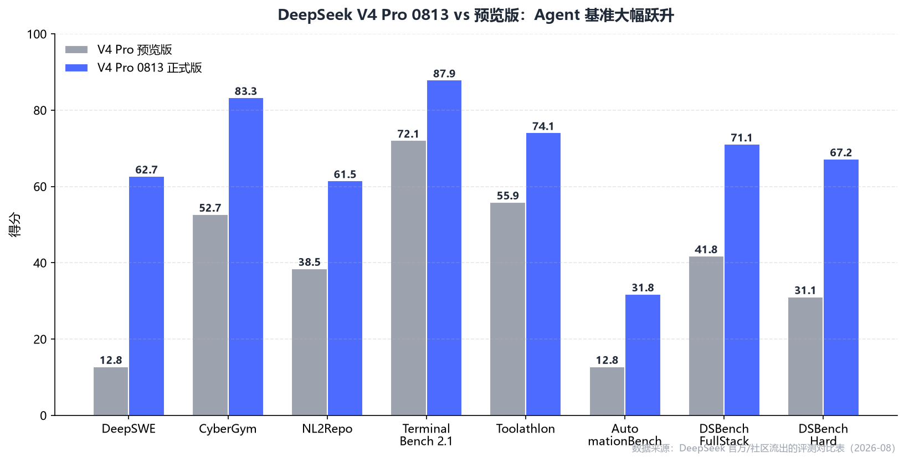
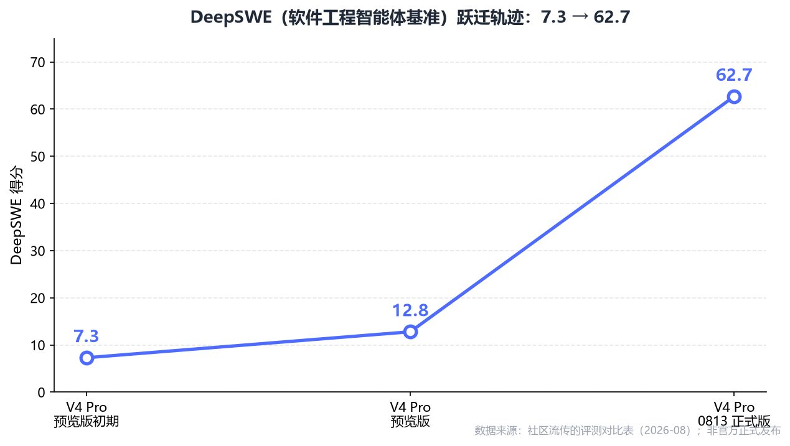
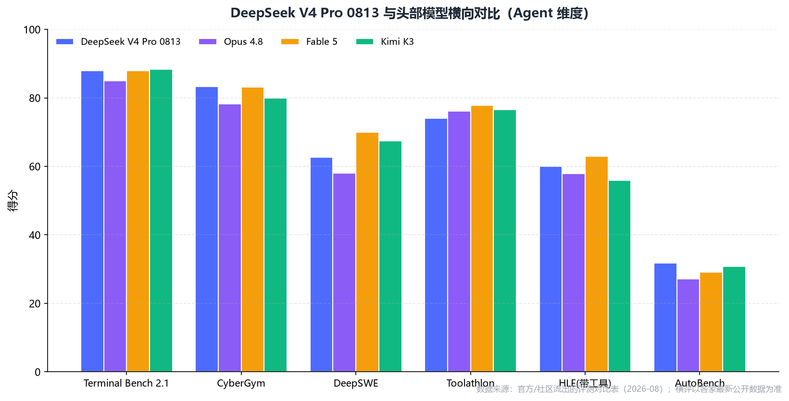
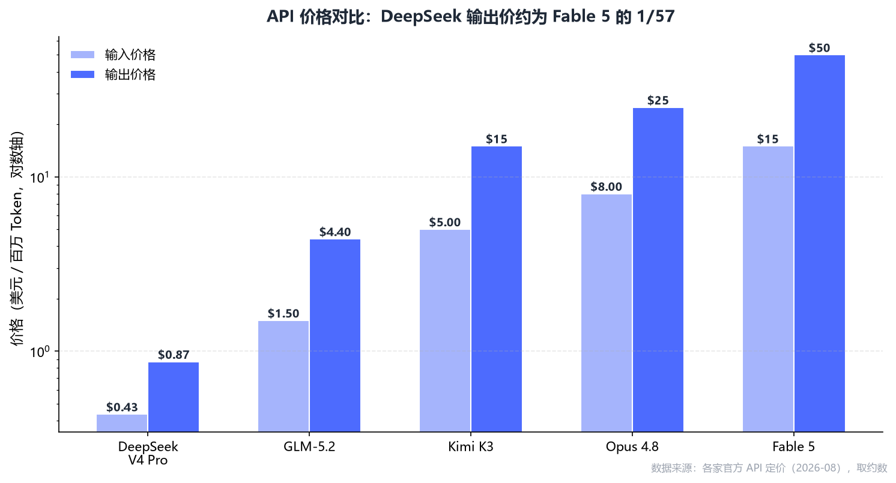

![[../../../assets/images/2026/deepseek-v4-pro/cover_blog.png]]

# 如何评价 DeepSeek V4 Pro

> 没有发布会，没有预告，DeepSeek 又一次在深夜把版本号切到了 `DeepSeek-V4-Pro-0813`。

---

## 先别急着接入，看一眼再说

昨晚睡前我刷到一条消息：DeepSeek 官网的 API 文档悄咪咪更新了，V4 Pro 从 preview 变成了正式版。

不是那种大张旗鼓的发布会，就是 Pricing 页和 API 文档里把模型版本号一换：`deepseek-v4-pro` 现在指向 `DeepSeek-V4-Pro-0813`。调用方式、base_url、模型名全都不变。昨天接入的程序，今天就已经跑在新模型上了。

这种"静默升级"很 DeepSeek。但也正因为没有预告，很多开发者早上醒来一脸懵：模型是不是变了？能力涨了多少？价格涨没涨？我的代码要不要改？

这篇文章就是把零散信息拢一拢，加上我个人的一点判断。如果你准备把它用在项目里，或者写进周报里吹一吹，希望能帮你少踩几个坑。

---

## 先放一张关键信息卡

我把最核心的参数和定价整理在了一张图里，懒得看长文的可以直接收藏：

> 核心就三点：**架构没动，后训练动了刀；模型 ID 不变；价格暂时没变，但官方已经预告要涨。**

---

## 这版到底升级了啥？

先说结论：**V4 Pro 0813 的模型结构和尺寸，跟预览版基本一致。提升主要来自后训练。**

根据 DeepSeek 7 月 31 日对 V4-Flash 正式版的说明，Flash 的 0731 构建"模型结构、尺寸和 preview 版保持一致，仅重新进行了后训练"。V4 Pro 0813 大概率也是同一套路——**基座没换，但训练目标的重心明显转向了 Agent、长流程任务和工具调用**。

这种路线的选择很聪明。比起从头训一个更大的模型，把已有模型在 Agent 轨迹数据上再强化一轮，性价比要高得多。

从官方和开发者社区流出的评测来看，这次后训练的效果相当激进：

- **DeepSWE**（软件工程智能体基准）：12.8 → 62.7，涨了将近 5 倍
- **CyberGym**（网络安全攻防）：52.7 → 83.3
- **NL2Repo**（自然语言生成代码仓库）：38.5 → 61.5
- **Terminal Bench 2.1**（终端操作）：72.1 → 87.9
- **DSBench-Hard**（困难全栈开发）：31.1 → 67.2

> 数据来源：DeepSeek 官方群及开发者社区流传的评测对比表（2026-08）。需要说明的是，截至发稿，官方尚未发布完整的正式版技术报告，因此这里的数字应理解为"目前能看到的最靠谱版本"。

最夸张的是 **DeepSWE**。如果把时间线拉长，这个数字从早期的 7.3 爬到预览版的 12.8，再到正式版的 62.7——不是线性进步，是跳台阶。

这基本上说明一件事：**DeepSeek 已经不满足于做一个"会聊天的模型"了，它在认真做一个能替你干活的 Agent。**

---

## 跟头部模型比，到什么位置了？

很多人关心的是：能不能干过 Fable 5、Opus 4.8、Kimi K3？

直接上对比：

从这张图能看出几个有意思的点：

1. **终端操作（Terminal Bench）**：V4 Pro 0813 得分 87.9，比 Opus 4.8 的 85.0 还高，离 Fable 5 只差 0.1。
2. **安全攻防（CyberGym）**：83.3，反超 Fable 5 的 83.1。
3. **软件工程（DeepSWE）**：62.7，还没追上 Fable 5 的 70.0，但已经超过了 Opus 4.8 的 58.0。
4. **高难推理（HLE 带工具）**：60.0，介于 Opus 4.8（57.9）和 Fable 5（63.0）之间。

综合几何平均分的话，目前业内流传的排名大致是：

| 模型 | 几何平均分 |
|---|---|
| GPT-5.6 Sol | 65.5 |
| Fable 5 | 64.5 |
| Opus 5 | 64.0 |
| **DeepSeek V4 Pro 0813** | **62.5** |
| Kimi K3 | 62.3 |

> 数据来源：社区流出的多维度 Agent 基准几何平均。

坦白讲，**62.5 和 64.5 之间还有距离，但这个距离已经小得可怕了**。考虑到后面的价格差距，这个性价比完全是另一个次元的事。

---

## 价格，才是这版最狠的地方

聊大模型不谈价格，就是耍流氓。

DeepSeek V4 Pro 0813 的人民币定价：

| 项目 | V4 Pro 0813 | V4 Flash |
|---|---|---|
| 缓存命中输入 | 0.025 元/百万 | 0.02 元/百万 |
| 缓存未命中输入 | 3 元/百万 | 1 元/百万 |
| 输出 | 6 元/百万 | 2 元/百万 |
| 并发上限 | 500 | 2500 |

单看 Pro 是 Flash 的 3 倍，好像不便宜。但跟海外旗舰一比：

- Fable 5：输出约 50 美元/百万，是 DeepSeek 的 **57 倍**
- Opus 4.8：输出约 25 美元/百万，是 DeepSeek 的 **29 倍**
- Kimi K3：输出约 15 美元/百万，是 DeepSeek 的 **17 倍**

这意味着什么？一位海外开发者 @CommandCodeAI 在 FlappyBench 测试里算过账：

- DeepSeek V4 Pro 0813：得分 8，成本约 **0.0005 美元**
- Kimi K3：得分 9.5，成本约 **0.074 美元**
- Opus 5：得分 9，成本约 **0.2539 美元**

质量不是每次都最好，但失败一次重试十次，总成本还是别人的零头。这就是 DeepSeek 真正可怕的地方：**它把整个 Agent 工作流的经济模型给改了。**

---

## 泼一盆冷水：它还没那么神

说完了亮点，必须说几个真实的问题。否则这篇文章就跟那些营销号没区别了。

**长流程任务会"提前下班"**

这是目前社区反馈最多的问题。X 用户 @Text1G 做了 50 轮测试，把 `reasoning_effort` 拉到 max，模型在第 42 轮就自己停了。小红书博主 karminski 测了三次长程编程任务，两次在 42-43 轮左右停下。

原因还不清楚。可能是强化学习阶段的奖励函数设计问题，也可能是超长上下文里的注意力衰减。但不管原因是什么，**这对需要稳定跑完全程的 Agent 工作流来说，都是个硬伤**。

**想得更久，不一定做得更好**

有用户实测，V4 Pro 0813 在一个任务上思考了 237 秒、执行了 25 步，而预览版只用了 105 秒、15 步，最终效果却没明显更好。

这提醒我们：**不要看见 thinking 模式默认开启，就觉得一定更强。** 简单任务建议手动关 thinking，能省不少时间和钱。

**纯文本模型，没有视觉**

DeepSeek 已经表态视觉不在路线图上。也就是说，如果你想做"看网页截图操作"、"读流程图写代码"这类多模态 Agent，V4 Pro 帮不了你。

**benchmark 不等于真实体验**

官方基准涨得很猛，但独立评测机构还没有完整复现。真实业务里，模型表现还取决于你外部的任务规划、工具调用、记忆、验证和重试机制。别把 Agent 跑分直接等同于"我的项目能跑通"。

---

## 一个坏消息：可能要涨价了

DeepSeek 官方 API 定价页下面有一行小字：

> "计划近期整体上调 DeepSeek API 服务的定价，预计涨幅较大，请合理安排您的使用。"

这意味着现在看到的 3 元/6 元/0.025 元，很可能是**阶段性价格**。如果你打算长期重度使用，建议提前做成本预估，别按当前价格把全年预算都给排了。

---

## 我的判断：适合谁用？

### 推荐用 Pro 0813 的场景

- 需要模型操作终端、改代码、跑测试的 Agent
- 一次调用要吐出几万到几十万 token 的长文档分析
- 对成本敏感、允许重试的批量任务
- 已经有 DeepSeek API 接入，想零成本升级

### 用 Flash 就够的场景

- 日常问答、轻量文案
- 高并发接口，Pro 的 500 并发可能顶不住
- 简单代码补全和对话类应用

### 仍需要海外旗舰兜底的场景

- 超高难度推理、复杂数学证明
- 对错误率零容忍的金融、医疗决策
- 需要视觉理解的多模态任务

我自己的用法大概是：**Flash 处理 80% 的日常请求，Pro 0813 啃 Agent 和 Coding 的硬骨头，最难的节点再用 Opus/Fable 兜底。**

---

## 最后说两句

DeepSeek V4 Pro 0813 算不上六边形战士。它在超高难度综合推理上还没超过 Fable 5，长流程稳定性还有 bug，多模态也直接缺席。

但它做了一件很重要的事：**把"接近第一梯队的 Agent 能力"拉到了一个以前不敢想的价格区间。**

对开发者和小团队来说，这不只是多了一个模型选项，而是意味着可以用更低的成本去试错、去搭建真正能干活的 Agent。这种"试错成本低"本身，就会催生出一大批新应用。

至于涨价之后还能不能维持这个优势，那是下一个故事。至少现在，这个价格和能力的组合，值得认真试一试。

---

## 参考来源

- DeepSeek 官方 API 文档与定价页
- 博客园《DeepSeek V4 Pro 0813 完全指南》（2026-08-13）
- 网易科技《DeepSeek V4 Pro 凌晨突然更新：性价比炸裂，但仍需打磨》（2026-08-13）
- 掘金《凌晨突袭！DeepSeek-V4-Pro-0813 正式版上手实测》（2026-08-13）
- 腾讯新闻《DeepSeek V4 Pro 正式版上线：1M 超大上下文 + 384K 输出》（2026-08-13）
- 搜狐科技《DeepSeek V4 Pro 正式版深夜"突袭"：多项测试逼近 Fable 5》（2026-08-12）

---

> 这篇文章首发于我的博客，后续会同步到公众号。如果你对 Agent 或大模型落地有任何想法，欢迎在评论区聊聊。
