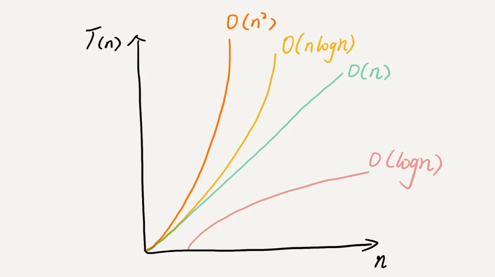

## 目录

# 数据结构和算法

大厂前端面试，先从算法开始。

>
1. 目标**不在**中大厂的同学，可以略过算法这一节。
2. 算法 0 基础的同学，可先略过这一节，临时准备根本来不及，需要日常积累。
3. 如果时间不够，每个分类刷 1-2 道，全刷完太多了。主要是掌握解题的套路。

## 算法基础 Basic

磨刀不误砍柴工，别着急刷 LeetCode 等算法题，先把基础巩固好，会事半功倍。

### 前端常见的数据结构有哪些？有什么基础算法？有什么应用场景？

#### 数组/字符串

基础算法：

- 排序：冒泡排序，快速排序等
- 查找：二分查找

#### 链表

应用场景：React fiber 结构

基础算法：遍历，反转

#### 栈

应用场景：

- 撤销/重做 undo/redo
- 内存堆栈模型

基础算法：

- 压栈 push
- 出栈 pop

#### 队列

应用场景：

- Event Loop 时间循环
- 消息队列服务

基础算法：

- 入队 enqueue
- 出队 dequeue

#### 树

应用场景：DOM 树，VDOM

基础算法：

- 深度优先搜索 DFS
- 广度优先搜索 BFS

#### 二叉树

应用场景：

- 基础的二叉树应用场景不多，主要用于学习和面试 😄
- 二叉树扩展出来的，平衡二叉树、AVL 树、红黑树、B+ 树、Trie 树，有大量的应用场景，如数据库管理、文件系统管理、虚拟内存管理等
- 前端使用的场景较少，了解其基础知识即可

基础算法：

- 前序遍历
- 中序遍历
- 后续遍历

#### 堆

应用场景：内存堆栈模型

基础算法：堆排序

#### 图

应用场景：前端流程图、关系图，社交网络模型，搜索引擎

基础算法：

- 深度优先搜索 DFS
- 广度优先搜索 BFS
- 最短路径，Dijkstra 算法

### 什么是时间复杂度？

算法的时间复杂度，**定性**（数量级）的描述算法运行的时间，用 `O` 符号表示。

常见的时间复杂度

- `O(1)` 常数级，无循环
- `O(n)` 线性，单层循环
- `O(logn)` 二分算法
- `O(n*logn)` 单层循环，嵌套二分算法
- `O(n^2)` 两层循环
- `O(n^3)` 三层循环，实际不可用

图示如下

### 什么是空间复杂度？

同时间复杂度，只是把时间换成空间。时间是 CPU 的消耗，空间是内存的消耗。

## 数组 Array

### 两数之和

- 题目 <https://leetcode.cn/problems/two-sum/description/>
- 解答 <https://leetcode.cn/problems/two-sum/solutions/>

### 买卖股票的最佳时机

- 题目 <https://leetcode.cn/problems/best-time-to-buy-and-sell-stock/description/>
- 解答 <https://leetcode.cn/problems/best-time-to-buy-and-sell-stock/solutions/>

### 盛水最多的容器

- 题目 <https://leetcode.cn/problems/container-with-most-water/description/>
- 解答 <https://leetcode.cn/problems/container-with-most-water/solutions/>

### 除自身以外数组的乘积

- 题目 <https://leetcode.cn/problems/product-of-array-except-self/description/>
- 解答 <https://leetcode.cn/problems/product-of-array-except-self/solutions/>

## 字符串 String

### 无重复字符的最长子串

- 题目 <https://leetcode.cn/problems/longest-substring-without-repeating-characters/description/>
- 解答 <https://leetcode.cn/problems/longest-substring-without-repeating-characters/solutions/>

### 验证回文串

- 题目 <https://leetcode.cn/problems/valid-palindrome/description/>
- 解答 <https://leetcode.cn/problems/valid-palindrome/solutions/>

### 反转字符串中的单词

- 题目 <https://leetcode.cn/problems/reverse-words-in-a-string/description/>
- 解答 <https://leetcode.cn/problems/reverse-words-in-a-string/solutions/>

### 最长回文子串

- 题目 <https://leetcode.cn/problems/longest-palindromic-substring/description/>
- 解答 <https://leetcode.cn/problems/longest-palindromic-substring/solutions/>

## 链表 Linked List

### 反转链表

- 题目 <https://leetcode.cn/problems/reverse-linked-list/description/>
- 解答 <https://leetcode.cn/problems/reverse-linked-list/solutions/>

### 合并两个有序链表

- 题目 <https://leetcode.cn/problems/merge-two-sorted-lists/description/>
- 解答 <https://leetcode.cn/problems/merge-two-sorted-lists/solutions/>

### 删除链表的倒数第 N 个结点

- 题目 <https://leetcode.cn/problems/remove-nth-node-from-end-of-list/description/>
- 解答 <https://leetcode.cn/problems/remove-nth-node-from-end-of-list/solutions/>

### 判断环形链表

- 题目 <https://leetcode.cn/problems/linked-list-cycle/description/>
- 解答 <https://leetcode.cn/problems/linked-list-cycle/solutions/>

### 相交链表

- 题目 <https://leetcode.cn/problems/intersection-of-two-linked-lists/description/>
- 解答 <https://leetcode.cn/problems/intersection-of-two-linked-lists/solutions/>

## 栈 Stack

### 有效的括号

- 题目 <https://leetcode.cn/problems/valid-parentheses/description/>
- 解答 <https://leetcode.cn/problems/valid-parentheses/solutions/>

### 最小栈

- 题目 <https://leetcode.cn/problems/min-stack/description/>
- 解答 <https://leetcode.cn/problems/min-stack/solutions/>

### 用栈实现队列

- 题目 <https://leetcode.cn/problems/implement-queue-using-stacks/description/>
- 解答 <https://leetcode.cn/problems/implement-queue-using-stacks/solutions/>

### 字符串解码

- 题目 <https://leetcode.cn/problems/decode-string/description/>
- 解答 <https://leetcode.cn/problems/decode-string/solutions/>

## 队列 Queue

### 用队列实现栈

- 题目 <https://leetcode.cn/problems/implement-stack-using-queues/description/>
- 解答 <https://leetcode.cn/problems/implement-stack-using-queues/solutions/>

### 最近的请求次数

- 题目 <https://leetcode.cn/problems/number-of-recent-calls/description/>
- 解答 <https://leetcode.cn/problems/number-of-recent-calls/>

## 二叉树 Binary Tree

### 二叉树的最大深度

- 题目 <https://leetcode.cn/problems/maximum-depth-of-binary-tree/description/>
- 解答 <https://leetcode.cn/problems/maximum-depth-of-binary-tree/solutions/>

### 验证二叉搜索树

- 题目 <https://leetcode.cn/problems/validate-binary-search-tree/description/>
- 解答 <https://leetcode.cn/problems/validate-binary-search-tree/solutions/>

### 二叉树的层序遍历

- 题目 <https://leetcode.cn/problems/binary-tree-level-order-traversal/description/>
- 解答 <https://leetcode.cn/problems/binary-tree-level-order-traversal/solutions/>

### 对称二叉树

- 题目 <https://leetcode.cn/problems/symmetric-tree/description/>
- 解答 <https://leetcode.cn/problems/symmetric-tree/solutions/>

## 动态规划 Dynamic Programming

### 第 N 个斐波那契数

- 题目 <https://leetcode.cn/problems/n-th-tribonacci-number/description/>
- 解答 <https://leetcode.cn/problems/n-th-tribonacci-number/solutions/>

### 爬楼梯

- 题目 <https://leetcode.cn/problems/climbing-stairs/description/>
- 解答 <https://leetcode.cn/problems/climbing-stairs/solutions/>

### 不同路径

- 题目 <https://leetcode.cn/problems/unique-paths/description/>
- 解答 <https://leetcode.cn/problems/unique-paths/solutions/>

### 最长递增子序列

- 题目 <https://leetcode.cn/problems/longest-increasing-subsequence/description/>
- 解答 <https://leetcode.cn/problems/longest-increasing-subsequence/solutions/>

### 零钱兑换

- 题目 <https://leetcode.cn/problems/coin-change/description/>
- 解答 <https://leetcode.cn/problems/coin-change/solutions/>

## 分治 Divide and Conquer

### 二分查找

- 题目 <https://leetcode.cn/problems/binary-search/description/>
- 解答 <https://leetcode.cn/problems/binary-search/solutions/>

### 快速排序

- 题目 <https://leetcode.cn/problems/sort-an-array/description/>
- 解答 <https://leetcode.cn/problems/sort-an-array/solutions/>

### 数组中的第 K 个最大元素

- 题目 <https://leetcode.cn/problems/kth-largest-element-in-an-array/description/>
- 解答 <https://leetcode.cn/problems/kth-largest-element-in-an-array/solutions/>

### 最大子数组和

- 题目 <https://leetcode.cn/problems/maximum-subarray/description/>
- 解答 <https://leetcode.cn/problems/maximum-subarray/solutions/>

## 双指针 Two Pointers

### 移动零

- 题目 <https://leetcode.cn/problems/move-zeroes/description/>
- 解答 <https://leetcode.cn/problems/move-zeroes/solutions/>

### 判断子序列

- 题目 <https://leetcode.cn/problems/is-subsequence/description/>
- 解答 <https://leetcode.cn/problems/is-subsequence/solutions/>

### 两数之和 II - 输入有序数组

- 题目 <https://leetcode.cn/problems/two-sum-ii-input-array-is-sorted/description/>
- 解答 <https://leetcode.cn/problems/two-sum-ii-input-array-is-sorted/solutions/>

### 接雨水

- 题目 <https://leetcode.cn/problems/trapping-rain-water/description/>
- 解答 <https://leetcode.cn/problems/trapping-rain-water/solutions/>
